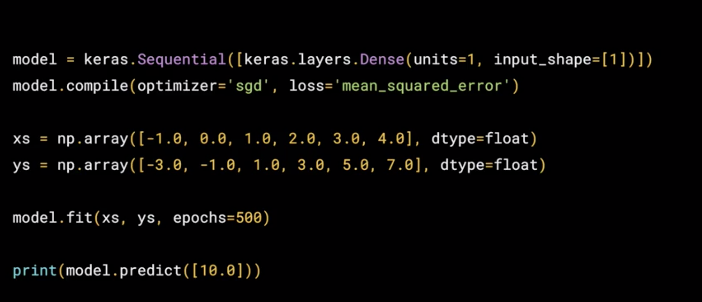

## A new programming paradigm

### 1.1.1 Difference between Machine Learning and Traditional Programming:


This is valuable for problems you cannot figure out rules yourself. It's more than just a new way of doing the same old thing. It opens up new possibilities that were infeasible to do before.  

### 1.1.2 Hello world of neural networks



#### Keras
**Keras**, an API in TensorFlow, makes it really easy to define neural networks. 

#### Neural Network
A **neural network** is basically a set of functions which can learn patterns.
The simplest possible neural network is one that has only one neuron in it, and that's what this line of code does. 

#### Keras -- dense/layer - unit
In keras, you use the word **dense** to define a **layer** of connected neurons. There's only one dense here. So there's only one layer and there's only one **unit** in it, so it's a single neuron. 

#### Keras -- sequential
Successive layers are defined in **sequence**, hence the word **sequential**. But as I've said, there's only one. So you have a single neuron. 

#### Keras -- input_shape
You define the **shape of what's input** to the neural network in the first and in this case the only layer, and you can see that our **input shape **is super simple. It's just one value. 

#### Optimizer & loss function
You've probably seen that for machine learning, you need to know and use a lot of math, calculus probability and the like. 

It's really good to understand that as you want to **optimize your models** but the nice thing for now about TensorFlow and keras is that a lot of that math is implemented for you in functions. There are two function roles that you should be aware of though and these are l**oss functions** and **optimizers**. 

The neural network has no idea of the relationship between X and Y, so i**t makes a guess**. Say it guesses Y equals 10X minus 10. It will then use the data that it knows about, that's the set of Xs and Ys that we've already seen to **measure** **how good or how bad its guess was**. The **loss function** *measures* this and then gives the data to the **optimizer** *which figures out the next guess*. 

So the **optimizer** thinks about how good or how badly the guess was done using the data from the loss function. 

#### Mean_squared_error & SGD
Then the logic is that each guess should be better than the one before. As the guesses get better and better, an accuracy approaches 100 percent, the term **convergence** is used. In this case, the loss is **mean squared error** and the optimizer is **SGD** which stands for **stochastic gradient descent**. 

*If you want to learn more about these particular functions, as well as the other options that might be better in other scenarios, check out the TensorFlow documentation.* 

#### Data
Our next step is to represent the known data. These are the Xs and the Ys that you saw earlier. The **np.array** is using a Python library called **numpy** that makes data representation particularly enlists much easier. So here you can see we have one list for the Xs and another one for the Ys. 

#### Training
The **training** takes place in the **fit** command. Here we're asking the model to figure out how to fit the X values to the Y values. The **epochs** equals 500 value means that it will go through the **training loop** 500 times. This training loop is what we described earlier. 

**Make a guess, measure how good or how bad the guesses with the loss function, then use the optimizer and the data to make another guess and repeat this. When the model has finished training, it will then give you back values using the predict method.** 

So it hasn't previously seen 10, and what do you think it will return when you pass it a 10? Now you might think it would return 19 because after all Y equals 2X minus 1, and you think it should be 19. 

```
// But when you try this in the workbook yourself, you'll see that it will return a value very close 
to 19 but not exactly 19. Now why do you think that would be? Ultimately there are two main reasons. 
he first is that you trained it using very little data. There's only six points. Those six points are 
linear but there's no guarantee that for every X, the relationship will be Y equals 2X minus 1. 
There's a very high probability that Y equals 19 for X equals 10, but the neural network isn't positive. 
So it will figure out a realistic value for Y. That's the second main reason. When using neural networks, 
as they try to figure out the answers for everything, they deal in probability. You'll see that a lot 
and you'll have to adjust how you handle answers to fit. Keep that in mind as you work through the code. 
Okay, enough theory. Now let's get hands-on and write the code that we just saw and then we can run it.
```