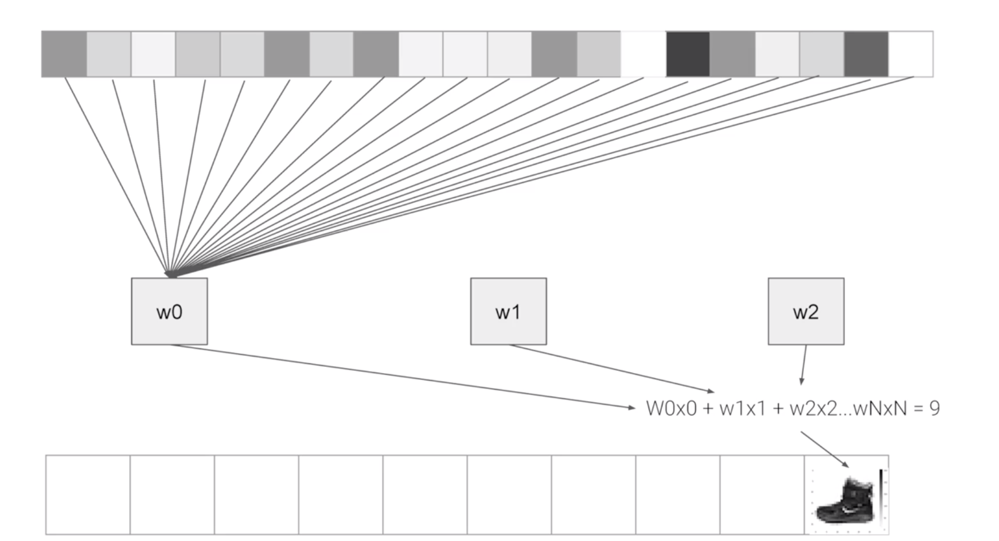

## Introduction to Computer vision

### 1.2.1 Fashion MNIST dataset

[Fashion MNIST dataset:](https://github.com/zalandoresearch/fashion-mnist)
- 70k images
- 10 categories
- Images are 28X28 in gray scale *
- Can train a neural net

\* Each pixel can be represented in values from zero to 255 and so it's only one byte per pixel. With 28 by 28 pixels in an image, only 784 bytes are needed to store the entire image. 


### 1.2.2 Load dataset

```python
fashion_mnist = keras.datasets.fashion_mnist
(train_images,train_labels),(test_images,test_labels)=fashion_minist.load_data()
```

\* Train/test is 60000/10000.


### 1.2.3 Normilizing
You'll notice that all of the values in the number are between 0 and 255. If we are training a neural network, for various reasons **it's easier if we treat all values as between 0 and 1**, a process called '**normalizing**'...and fortunately in Python it's easy to normalize a list like this without looping. You do it like this:

```python
training_images  = training_images / 255.0
test_images = test_images / 255.0
```
If you tri without normilizaing, the loss will be higher. See more in exercise jupyter notebook below "Exercise 7".

### 1.2.4 Code of Neural Network Definition 

```python
model = keras.Sequential([
    keras.layers.Flatten(input_shape(28,28)),
    keras.layers.Dense(128,activation=tf.nn.relu), #middle layer/ hidden layer#
    keras.layers.Dense(10,activation=tf.nn.softmax)
])
```
#### Flatten

**Flatten** takes this 28 by 28 square and turns it into a simple linear array.

Right now our data is 28x28 images, and 28 layers of 28 neurons would be infeasible, so it makes more sense to 'flatten' that 28,28 into a 784x1. 

Instead of wriitng all the code to handle that ourselves, we add the Flatten() layer at the begining, and when the arrays are loaded into the model later, they'll automatically be flattened for us.

#### Middle layer/ Hiddern layer

**Middle layer/ hiddern layer** has 128 neurons. And I'd like you to think about these as variables in a **function**. Maybe call them x1, x2 x3, etc. 

For example, if you then say the **function** was y equals w1 times x1, plus w2 times x2, plus w3 times x3, all the way up to a w128 times x128. 
$$y =w_1 * x_1 + w_2*x_2 + w_3*x_3 + ... + w_{128} * x_{128}$$
By figuring out the values of w, then y will be nine, when you have the input value of the shoe.




You can modify the 128 here. For example change it to 1024 neurons. By **adding more Neurons** we have to do more calculations, slowing down the process, but in this case they have a good impact -- we do get more accurate. That doesn't mean it's always a case of 'more is better', you can hit the law of diminishing returns very quickly!


#### Output layer
 The last layer has 10 neurons in it because we have ten classes of clothing in the dataset. They should always match.

**Rule of thumb**-- the **number of neurons** in the last layer should match the **number of classes** you are classifying for. In this case it's the digits 0-9, so there are 10 of them, hence you should have 10 neurons in your final layer.

#### More
More layers, more epochs, usually give us better accuracy. But not always.

Try 15 epochs -- you'll probably get a model with a much better loss than the one with 5.
 
Try 30 epochs -- you might see the loss value stops decreasing, and sometimes increases. This is a **side effect** of something called 'overfitting' which you can learn about [somewhere] and it's something you need to keep an eye out for when training neural networks. There's no point in wasting your time training if you aren't improving your loss, right! :)

```python
model.compile(optimizer = tf.train.AdamOptimizer(),
              loss = 'sparse_categorical_crossentropy',
              metrics=['accuracy'])

model.fit(training_images, training_labels, epochs=9)

model.evaluate(test_images, test_labels)
```

##### Callback
If you want to stop the training when I reach a desired value?' -- i.e. 95% accuracy might be enough for you. You can use callback, see example in exercise jupyter notebook "stop the training when I reach a desired value?' -- i.e. 95% accuracy might be enough for you"

*You can also tune the neural network by adding, removing and changing layer size to see the impact. If you want to go further, checkout this tutorial from Andrew on YouTube, which will clarify how dense connected layer's work from the theoretical and mathematical perspective. 
More, plz see Andrew's vedio in Youtube ["What is Neurual Network?"](https://youtu.be/fXOsFF95ifk)*

### 1.2.5 Try it yourself

[Official code](https://colab.research.google.com/github/lmoroney/dlaicourse/blob/master/Course%201%20-%20Part%204%20-%20Lesson%202%20-%20Notebook.ipynb?authuser=1)

[My code](./myExercise/Course_1_Part_4_Lesson_2_Notebook.ipynb)