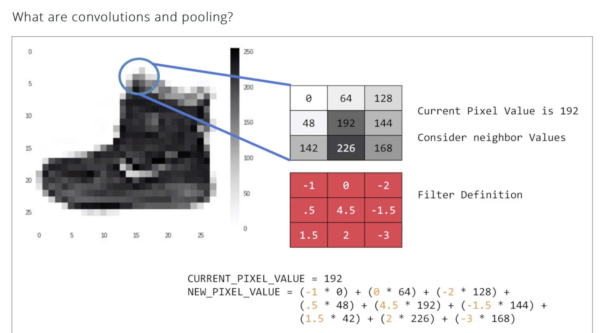
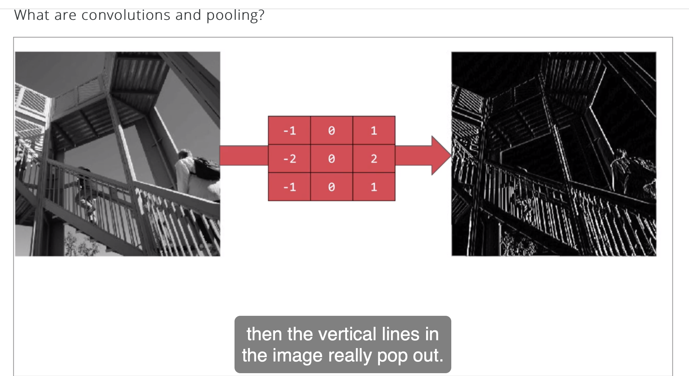
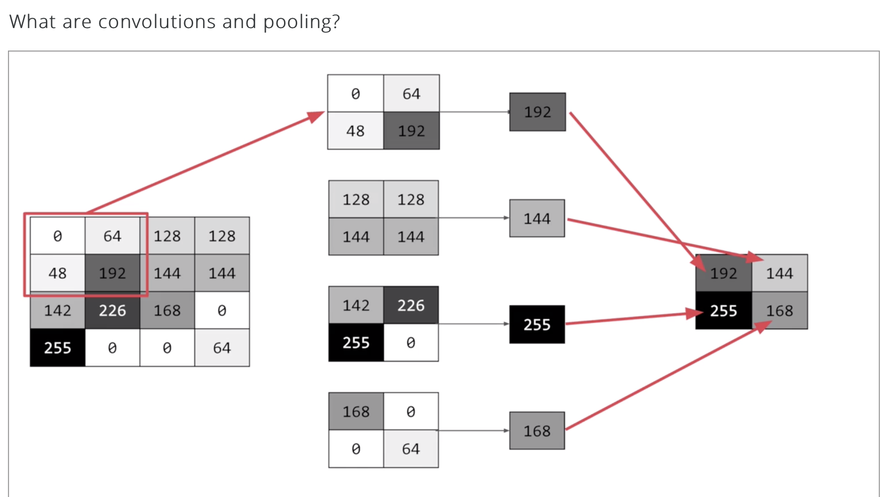
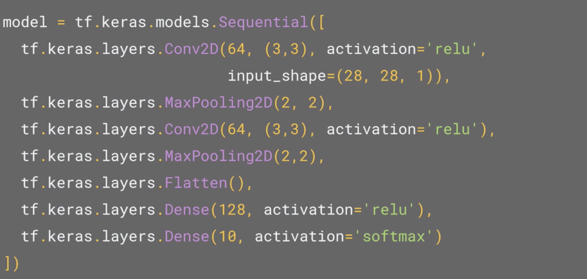
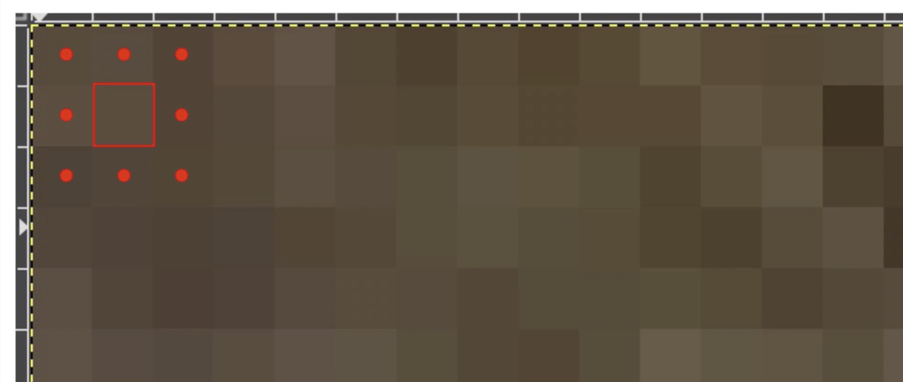

## Enhancing Vision with Convolutional Neural Networks

### 1.3.1 Convolution and pooling

#### Convolution

For every pixel, take its value, and take a look at the value of its neighbors. If our **filter** is 3x3, then we can take a look at the immediate neighbor, so that you have a corresponding 3x3 grid. Then to get the new value for the pixel, we simply multiply each neighbor by the corresponding value in the filter. 

So, for example, in this case, our pixel has the value 192, and its upper left neighbor has the value zero. The upper left value and the filter is negative one, so we multiply zero by negative one. Then we would do the same for the upper neighbor. Its value is 64 and the corresponding filter value was zero, so we'd multiply those out. Repeat this for each neighbor and each corresponding filter value, and would then have the new pixel with the sum of each of the neighbor values multiplied by the corresponding filter value, and that's a **convolution**. 

#### Convolution for emphasizing

The idea here is that some convolutions will change the image in such a way that certain features in the image get emphasized. 

So, for example, if you look at this filter, then the vertical lines in the image really pop out: 

With this filter, the horizontal lines pop out:

#### Convolution combined with pooling, they can become really powerful

#### Pooling

Simply, pooling is a way of compressing an image.

Of these four, pick the biggest value and keep just that.

This will preserve the features that were highlighted by the convolution, while simultaneously quartering the size of the image. We have the horizontal and vertical axes.

### 1.3.2 Convolution & pooling in code

For **convolution** and **pooling** in code, we just need to add few layers before flatterning layer.

**Conv2D** -- First **convolution layer**, asking keras to generate **64 filters** for us. Those filters are not random. They start with a set of **known good filters** in a similar way **to the pattern** (fitting that you saw earlier). The ones (that work) from that set (are learned over time). These **filters** are 3 by 3, their **activation** is **relu**, which means the negative values will be thrown way, and finally the **input shape** is as before, the **28 by 28**. That extra **1** just means that we are tallying(计数 理货) using a single byte for **color depth**. As we saw before our image is our gray scale, so we just use one byte.

**MaxPooling2D** -- First **pooling layer**. **Max-pooling**: take the maximum value. It's a **two-by-two pool**, so for every four pixels, the **biggest** one will survive as shown earlier. 

**Conv2D** -- Second **convolution layer**.

**MaxPooling2D** -- Second **pooling layer**.

So, by the time the image gets to the **flatten** to go into the **dense** layers, it's already much **smaller**. It's being quartered, and then quartered again. So, its content has been greatly simplified.

The **last 3 layers** are same as before in 1.2. 

#### model.summary()

Allows you to inspect the layers of the model, and see the journey of the image through the convolutions, and here is the output.

The **first** **line**, the output shape **isn't** the data 28 by 28, so *y* is the output, **26 by 26**. Because logically, the first pixel that you can do calculations on is this one, because this one of course has all eight neighbors that a three by three filter needs. 

So the output of the convolution will be two pixels smaller on x, and two pixels smaller on y. 

If your filter is **five-by-five** for similar reasons, your output will be **four** smaller on x, and **four** smaller on y. So, that's y with a **three by three** filter, our output from the 28 by 28 image, is now 26 by 26, we've removed that one pixel on x and y, and each of the borders.

For the **second** **line** (the first pooling layer), remember we specified it to be **two-by-two**, thus turning four pixels into one, and having our x and y. So, now our output gets reduced from **26 by 26**, to **13 by 13**.

For the **forth** **line**, input is **11 by 11**, add another two-by-two max-pooling to have this rounding down, and went down, down to **five-by-five** images **(pay attention is not 6x6)**.

For the **fifth line**, the input is not just **one** compress five-by-five image instead of the original 28 by 28, there are **a number of convolutions per image** that we specified, in this case **64**. So, there are 64 new images of five-by-five that had been fed in. 

Flatten that out and you have (5x5=)25 pixels times 64, which is **1600** , as opposed to the **784**(=28x28) that you had previously.

