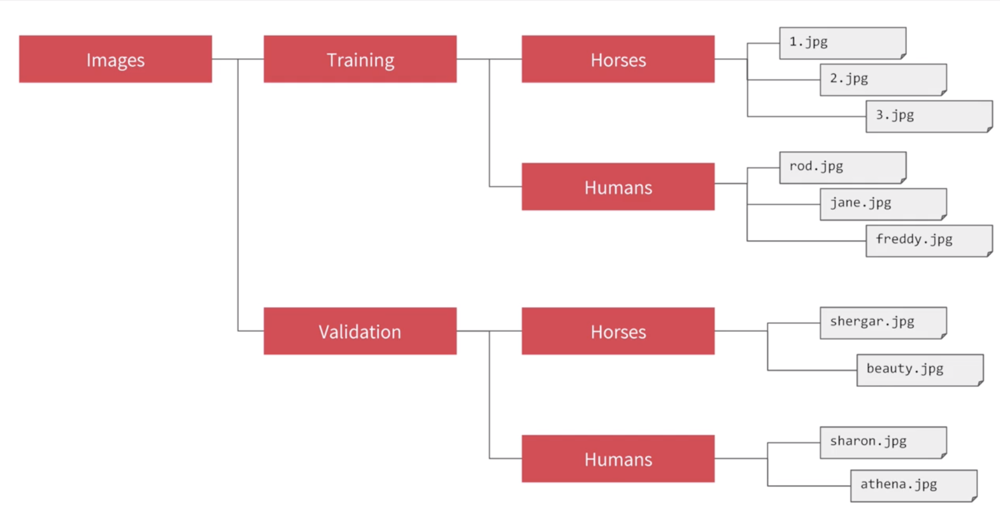
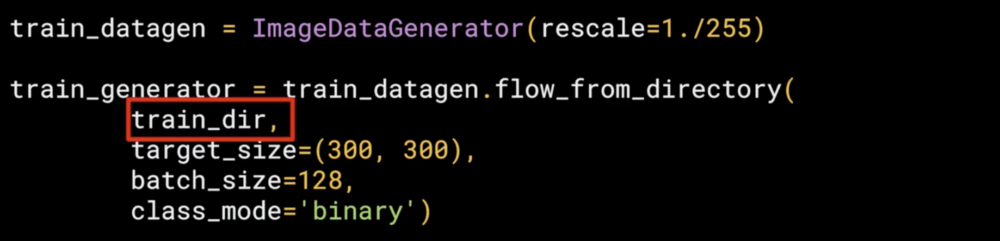
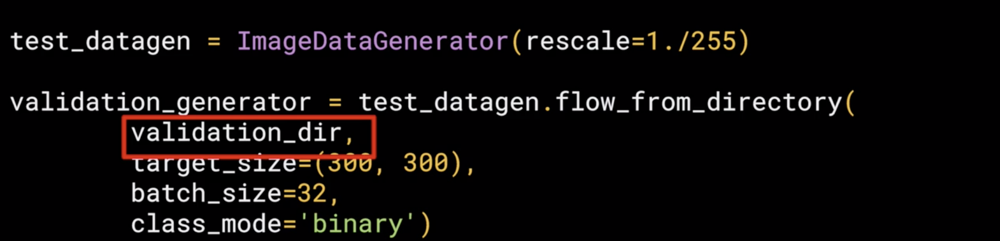
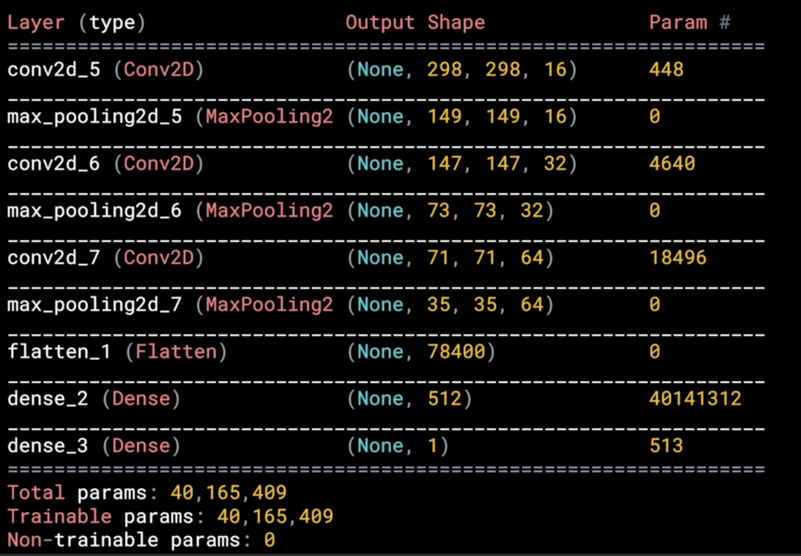

## Using Real-world Images

### 1.4.1 Understanding ImageGenerator

What if we use larger images and where the feature might be in different locations?
Like this:

**Difference**: They have different sizes and different aspect ratios纵横比. The subject can be in different locations. In some cases, there may even be multiple subjects. 

#### 1.4.1.1 ImageGenerator

**Feature**:

One **feature** of the **image generator** is that you can point it at a directory and then the sub-directories of that will automatically generate labels for you. 

You can use the image generator to automatically load and label your files based on their subdirectories. Images 'i.jpg', '2.jpg', '3.jpg' will be labelled with "Horses".



Be careful the **directory** must be correct. In this figure, the **train_dir** is "Training" and the **validation_dir** is "Validation". The **names of the sub-directories** will be the **labels** for your images that are contained within them. So the 'Horses' sub-directory should contain all horses images.

```python
from tensorflow.keras.preprocessing.image
import ImageDataGenerator

train_datagen = ImageDataGenerator(rescale=1./255) #pass rescale to it to normalize the data
```
```python
#call the flow from directory method on it to get it to load images from that directory and its sub-directories. 
train_generator = train_datagen.flow_from_directory(
    train_dir, 
```
You should always point it at the **directory** that contains sub-directories that contain your images. The **names of the sub-directories** will be the **labels** for your images that are contained within them.
```python
    target_size=(300, 300), 
```
Images might come in all shapes and sizes and unfortunately for training a neural network, the **input data all has to be the same size**, so the images will need to be **resized** to make them consistent. The nice thing about this code is that the images are resized for you as they're loaded. The advantage of doing it at runtime like this is that you can then experiment with different sizes **without impacting your source data**. 
```python
    batch_size=128,
```
The images will be loaded for training and validation in **batches** where it's more **efficient** than doing it one by one. You can try different batch size.
```python
    class_mode='binary'
```
This is a **binary** **classifier** i.e. it picks between two different things; horses and humans, so we specify that here. There are also other options. 

```python
)


test_datagen = ImageDataGenerator(rescale=1./255)

test_generator = test_datagen.flow_from_directory(
    test_dir,
    target_size=(300, 300),
    batch_size=32,
    class_mode='binary'
)

```




------

### 1.4.2 Defining a ConvNet to use complex images

```python
model = tf.keras.models.Sequential([
    # Note the input shape is the desired size of the image 300x300 with 3 bytes color
    # This is the first convolution
    tf.keras.layers.Conv2D(16, (3,3), activation='relu', input_shape=(300, 300, 3)),
    tf.keras.layers.MaxPooling2D(2, 2),
    # The second convolution
    tf.keras.layers.Conv2D(32, (3,3), activation='relu'),
    tf.keras.layers.MaxPooling2D(2,2),
    # The third convolution
    tf.keras.layers.Conv2D(64, (3,3), activation='relu'),
    tf.keras.layers.MaxPooling2D(2,2),
    # The fourth convolution
    tf.keras.layers.Conv2D(64, (3,3), activation='relu'),
    tf.keras.layers.MaxPooling2D(2,2),
    # The fifth convolution
    tf.keras.layers.Conv2D(64, (3,3), activation='relu'),
    tf.keras.layers.MaxPooling2D(2,2),
    # Flatten the results to feed into a DNN
    tf.keras.layers.Flatten(),
    # 512 neuron hidden layer
    tf.keras.layers.Dense(512, activation='relu'),
    # Only 1 output neuron. It will contain a value from 0-1 where 0 for 1 class ('horses') and 1 for the other ('humans')
    tf.keras.layers.Dense(1, activation='sigmoid')
])
```

We have **3 sets** of convolution pooling layers. This reflects the higher complexity and size of the images.

#### Color images
We resize their images to be 300 by 300 as they were loaded, but they're also **color images**. So there are **three bytes per pixel**. One byte for the **red**, one for **green**, and one for the **blue** channel, and that's a common 24-bit color pattern.

#### Activation function (Sigmoid or Softmax)

```python
#old:
tf.keras.layers.Dense(2, activation='softmax') # 2 classifications, human or horse
#new:
tf.keras.layers.Dense(1, activation='sigmoid')
```

Remember before when you created the output layer, you had one neuron per class, but now there's only one neuron for two classes. That's because we're using a different **activation function** where **sigmoid** is great for **binary classification**, where one class will tend towards zero and the other class tending towards one. You could use two neurons here if you want, and the same softmax function as before, but for binary this is a bit more efficient.

- **Sigmoid**


- **Softmax**

    **Multi-class classification** with **Softmax**. Where you'll get **a list of values** with one value for the **probability of each class** and **all of the probabilities adding up to 1**.

------

### 1.4.3 Model Summary



- 298 = 300 - 1 - 1 because of 3 x 3 filter
- 149 = 298/2 because of 2 x 2 max pooling
- 147 = 149 - 1 - 1
- 73 = 147/2
- 71 = 73 - 1 - 1
- 35 = 71/2
- 78400 = 35 x 35 x 64. Original size is 300 x 300 x 64 = 5760000. 

------

### 1.4.4 Training the ConvNet with fit_generator

#### 1.4.4.1 Compile (Loss func + optimizer)

```python
#old:
model.compile(optimizer='adam', loss='sparse_categorical_crossentropy', metrics=['accuracy'])
#new:
from tensorflow.keras.optimizers import RMSprop

model.compile(loss='binary_crossentropy',
              optimizer=RMSprop(lr=0.001), # lr is learning rate
              metrics=['acc'])
```

More about learning rate:[Here](https://www.youtube.com/watch?v=zLRB4oupj6g&feature=youtu.be)

#### 1.4.4.2 Training

```python
#old:
model.fit(training_images, training_labels, epochs=5)
#new:
history = model.fit_generator(
      train_generator, # which we setup earlier
      steps_per_epoch=8,  
      epochs=15,
      validation_data=validation_generator, # setup earlier
      validation_steps=8,
      verbose=2)
```

- **fit_generator()**: Call model.fit_generator instead of model.fit(), and that's because we're using a generator instead of datasets.
- **steps_per_epoch=8**: Since the batch_size=128 in train_generator earlier, and totally we have 1024 training images, so we need 8 batches to load all images.
- **validation_steps=8**: Since the batch_size=32 in validation_generator and we have 256 validation images totally, so we need 8 batches. 
- **verbose=2**: And the **verbose** parameter specifies how much to display while training is going on. With verbose set to 2, we'll get a little less animation hiding the epoch progress. 

#### 1.4.4.3 Prediction using this model once the model is trained

```python
import numpy as np
from google.colab import files
from keras.preprocessing import image

uploaded = files.upload()
```
So these parts are specific to **Colab**, they are what gives you the button that you can press to pick one or more images to upload. The image paths then get loaded into this list called uploaded

```python
for fn in uploaded.keys():
 
  # predicting images
  path = '/content/' + fn
  img = image.load_img(path, target_size=(300, 300)) # load an image
  x = image.img_to_array(img)
  x = np.expand_dims(x, axis=0) # add dimension
```
The loop then iterates through all of the images in that collection. And you can load an image and prepare it to input into the model with this code. Take note to **ensure that the dimensions match the input dimensions** that you specified when designing the model

```python
  images = np.vstack([x])
  classes = model.predict(images, batch_size=10)
```
You can then call **model.predict**, passing it the details, and it will **return an array of classes**. In the case of binary classification, this will only contain one item with a value **close to 0** for one class and **close to 1** for the other (**sigmoid**).
```python
  print(classes[0])
  if classes[0]>0.5:
    print(fn + " is a human")
  else:
    print(fn + " is a horse")
```

------
A bit more:

 When you defined the model, you saw that you were using a new loss function called ‘[Binary Crossentropy](https://gombru.github.io/2018/05/23/cross_entropy_loss/)’, and a new [optimizer](https://www.tensorflow.org/api_docs/python/tf/train/RMSPropOptimizer) called [RMSProp](http://www.cs.toronto.edu/~tijmen/csc321/slides/lecture_slides_lec6.pdf). If you want to learn more about the type of binary classification we are doing here, check out [this](https://www.youtube.com/watch?v=eqEc66RFY0I&t=6s) great video from Andrew!

 ------

 ### 1.4.5 Try it yourself (Without validation)

[Offical Code](https://colab.research.google.com/github/lmoroney/dlaicourse/blob/master/Course%201%20-%20Part%208%20-%20Lesson%202%20-%20Notebook.ipynb)

 [My ccode](./myExercise/Horse_or_Human_NoValidation.ipynb)

```python
history = model.fit_generator(
      train_generator,
      steps_per_epoch=8,  
      epochs=15,
      verbose=1) #Without validation
```

 ### 1.4.6 Adding automatic validation to test accuracy

 How you can build validation into the training loop by specifying a set of validation images, and then have TensorFlow do the heavy lifting of measuring its effectiveness with that same. 

 [Official code](https://colab.research.google.com/github/lmoroney/dlaicourse/blob/master/Course%201%20-%20Part%208%20-%20Lesson%203%20-%20Notebook.ipynb)

 [My code]()

```python
history = model.fit_generator(
      train_generator,
      steps_per_epoch=8,  
      epochs=15,
      verbose=1,
      validation_data = validation_generator,
      validation_steps=8) # Add validation
```