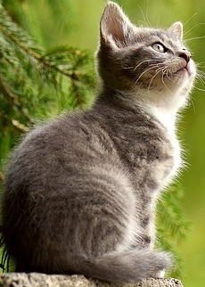
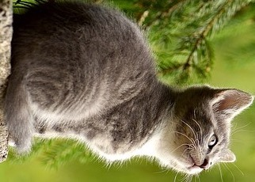
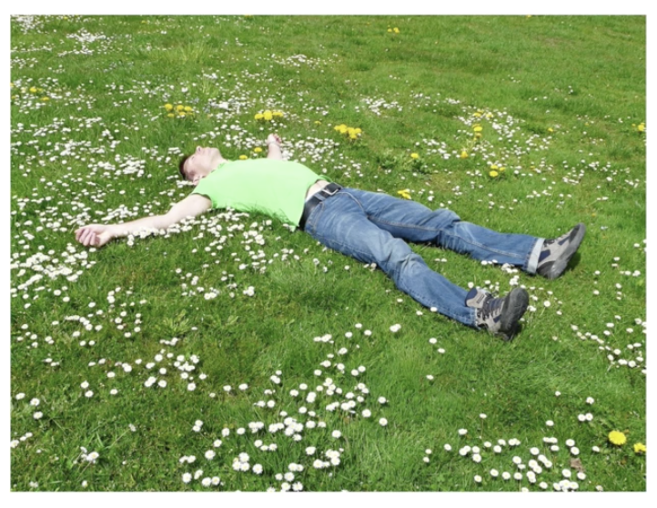
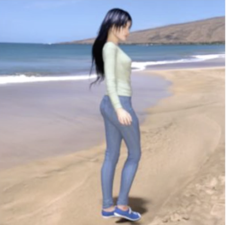
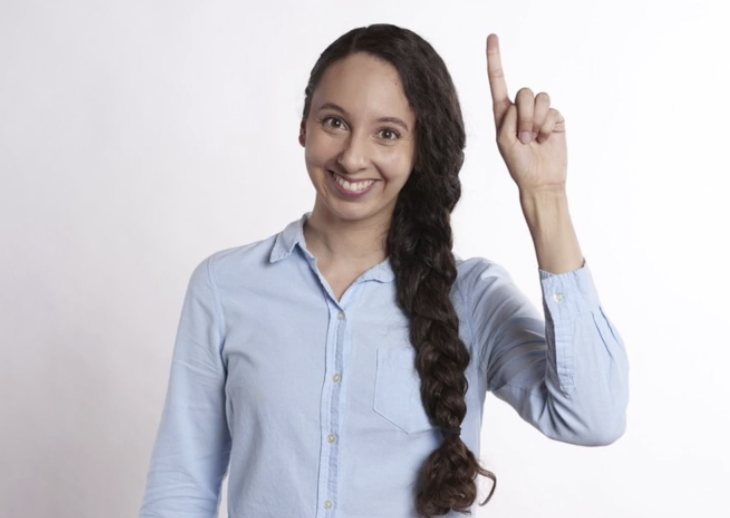
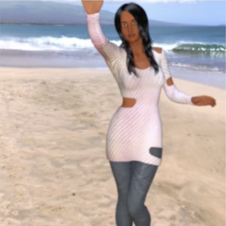
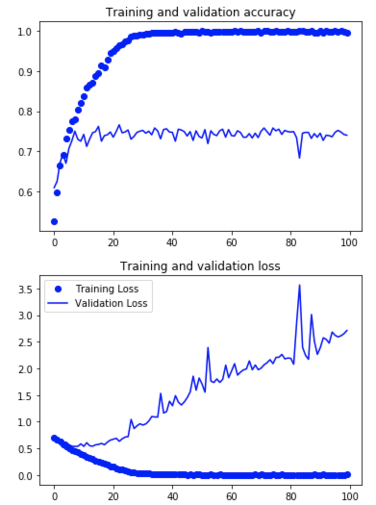

# Augmentation: A technique to avoid overfitting

## 2.2.1 Image augmentation is tool to avoid overfitting

**Image augmentation** and **data augmentation** is one of the most widely used tools in deep learning to 
- increase your dataset size (useful when you have limited data) and 
- make your neural networks perform better (avoid overfitting). 

``` 
So for example, if we have a cat and our cats in our training dataset are always upright and their ears are like this, we may not spot发现 a cat that's lying down. 
```

But with **augmentation**, being able to **rotate** the image, or being able to **skew** the image, or maybe some other **transforms** would be able to effectively generate that data to train off.

|Original|Augmentation|New images|Better performance|
|-|-|-|-|
|| (crap)--> ||Better performance|
||(rotate)-->|||
||

**Issue**:
- Don't do image augmentation on drive directly, which will overwrite the data.
- It's trick to do it since it can brow up memories easily. 

**Sol**:
- Tensorflow will handle this using Image generator and Image data generator (e.g. [ImageDataGenerator](https://keras.io/preprocessing/image/)).
- Augmentation takes place in memory **as** images are being loaded into the neural network for training (**amends your images on-the-fly**). Then stream them into the training set to the neural network we are learning on. All happens in memory.


## 2.2.2 Introducing augmentation

**Reason** of overfitting: 
- limited images.

## 2.2.3 ImageDataGenerator() class

```python
train_datagen = ImageDataGenerator(
    rescale = 1./255 # re-scale on the fly
    rotation_range = 40, # Rotation range is a range from 0-180 degrees with which to randomly rotate images. 
    width_shift_range = 0.2,# Shifting, moves the image around inside its frame.
    height_shift_range = 0.2,
    shear_range = 0.2, # shear the image by random amounts up to the specified portion (up to 20% in this case)
    zoom_range = 0.2, # zoom in a random amount(percent) up to 20% of the size of the image
    horizontal_flip = True,
    fill_mode = 'nearest') # fills in any pixels that might have been lost by the operations. I'm just going to stick with nearest here, which uses neighbors of that pixel to try and keep uniformity. 
```

- **shift**:
  
  Shifting, moves the image around inside its frame. Many pictures have the subject centered. So if we train based on those kind of images, we might over-fit for that scenario. These parameters specify, as a proportion of the image size, how much we should randomly move the subject around. So in this case, we might offset it by 20% vertically or horizontally. 

- **shear**:

|Can't recognize|What we have|Shear that person by skewing歪斜 along the x-axis we'll end up in a similiar pose|
|-|-|-|
||||
||

- **zoom**:
  
|Can't recognize|What we have|Zoom in that training image|
|-|-|-|
||||
||

- **horizontal flip**:
  
|Can't recognize|What we have|If the image were flipped horizontally, then it becomes more structurally similar to the image in test data and we might not over-fit to right arm raisers.|
|-|-|-|
||||
||

## 2.2.4 Without Augmentation V.S. With Augmentation

Cats-vs-Dogs without Augmentation: [official code](./myExercise/Cats_v_Dogs_Augmentation.ipynb), [official link](https://colab.research.google.com/github/lmoroney/dlaicourse/blob/master/Course%202%20-%20Part%204%20-%20Lesson%202%20-%20Notebook%20(Cats%20v%20Dogs%20Augmentation).ipynb#scrollTo=gGxCD4mGHHjG)

[My code]()

We have 4 convolutional layers with 32, 64, 128 and 128 convolutions respectively. 2000 images for training and 100 images for testing. We ran 100 epoches。

In terms of code, the only difference is:

- **Without Augmentation** (Left image below):

```python
# All images will be rescaled by 1./255
train_datagen = ImageDataGenerator(rescale=1./255)
```

- **With Augmentation** (Right image below):

```python
# This code has changed. Now instead of the ImageGenerator just rescaling
# the image, we also rotate and do other operations
# Updated to do image augmentation
train_datagen = ImageDataGenerator(
      rescale=1./255,
      rotation_range=40,
      width_shift_range=0.2,
      height_shift_range=0.2,
      shear_range=0.2,
      zoom_range=0.2,
      horizontal_flip=True,
      fill_mode='nearest')
```




**Left**: We can see from this figure that the **training** reach close to a 100 percent accuracy in a little over 20 epochs. Meanwhile, the **validation** topped out at around **70** percent, and that's **overfitting** clearly been demonstrated. In other words, the neural network was terrific极好的 at finding a correlation between the images and labels of cats versus dogs for the 2,000 images that it was trained on, but once it tried to predict the images that it previously hadn't seen, it was about 70 percent accurate.


## 2.2.5 Tri it yourself: Horse-or-Human-WithAugmentation

[official code](./myExercise/Horse_or_Human_WithAugmentation.ipynb),
[official link](https://colab.research.google.com/github/lmoroney/dlaicourse/blob/master/Course%202%20-%20Part%204%20-%20Lesson%204%20-%20Notebook.ipynb)

[My code]()