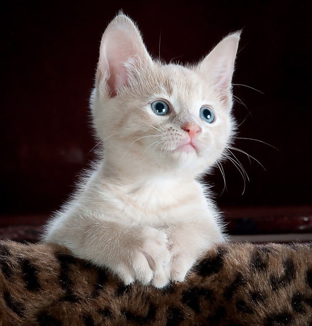

# Larger Dataset cats & dogs

## 2.1.1 ConvNet model

[Cats and Dogs Dataset](https://www.kaggle.com/c/dogs-vs-cats)

Data not clean:
- Data is messy, sometimes you find surprising things like pictures of people holding cats or multiple cats or surprising things in data.
- some files that are zero length and they could be corrupt as a results.
  


[Notebook](./myExercise/Course_2_Part_4_Lesson_2_Notebook.ipynb) will do:
- Explore the Example Data of Cats and Dogs (only 2000 of 25000 images)
- Build and Train a Neural Network to recognize the difference between the two
- Evaluate the Training and Validation accuracy

**Normalization**:

Preprocess our images by normalizing the pixel values to be in the [0, 1] range (originally all values are in the [0, 255] range).
```python
# All images will be rescaled by 1./255.
train_datagen = ImageDataGenerator( rescale = 1.0/255. )
test_datagen  = ImageDataGenerator( rescale = 1.0/255. )
```

**flow_from_directory()**:

Images come in all shapes and sizes. Before training a Neural network with them you'll need to **tweak** the images. Need them to be in a **uniform** size.

This ImageDataGenerator class allows you to instantiate generators of augmented image batches (and their labels) via .flow(data, labels) or .**flow_from_directory**(directory). 
Our generators will **yield** batches of 20 images of size 150x150 and their labels (binary).

```python
train_generator = train_datagen.flow_from_directory(train_dir,
                                                    batch_size=20,
                                                    class_mode='binary',
                                                    target_size=(150, 150))  
```

**Model**:

```python
model = tf.keras.models.Sequential([
    # Note the input shape is the desired size of the image 150x150 with 3 bytes color
    tf.keras.layers.Conv2D(16, (3,3), activation='relu', input_shape=(150, 150, 3)),
    tf.keras.layers.MaxPooling2D(2,2),
    tf.keras.layers.Conv2D(32, (3,3), activation='relu'),
    tf.keras.layers.MaxPooling2D(2,2), 
    tf.keras.layers.Conv2D(64, (3,3), activation='relu'), 
    tf.keras.layers.MaxPooling2D(2,2),
    # Flatten the results to feed into a DNN
    tf.keras.layers.Flatten(), 
    # 512 neuron hidden layer
    tf.keras.layers.Dense(512, activation='relu'), 
    # Only 1 output neuron. It will contain a value from 0-1 where 0 for 1 class ('cats') and 1 for the other ('dogs')
    tf.keras.layers.Dense(1, activation='sigmoid')  
])
```

**Optimizer**:

NOTE: In this case, using the **RMSprop** optimization algorithm is **preferable** to stochastic gradient descent (**SGD**), **because RMSprop automates learning-rate tuning for us**. (Other optimizers, such as Adam and Adagrad, also automatically adapt the learning rate during training, and would work equally well here.)

**Training**:

```python
history = model.fit_generator(train_generator,
                              validation_data=validation_generator,
                              steps_per_epoch=100,
                              epochs=15,
                              validation_steps=50,
                              verbose=2)
```


## 2.1.2 Code
[Official code](https://colab.research.google.com/github/lmoroney/dlaicourse/blob/master/Course%202%20-%20Part%202%20-%20Lesson%202%20-%20Notebook.ipynb)

[My code](./myExercise/Course_2_Part_4_Lesson_2_Notebook.ipynb)


## 2.1.3 Fixing through cropping

In some cases it didn’t classify one cat correctly. Here is one solution to this.

Calssified as cat.
Calssified as dog.
Calssified as cat.


In the case of the cat my model thought was a dog. We'll see that just by **cropping** I was able to get it to change its classification. There must have been something in the uncropped image that matched features with a dog.

## 2.1.4 Validation not improve after 2 epochs

```python
history = model.fit_generator()
```
So we now have a **history** object that we can query for data. Call its history property passing at ACC which gets me the model accuracy. 


When I run it and plot the training and validation accuracy, we can see that my training went towards one while my validation leveled out into 0.7 to 0.75 range. That shows that my model isn't bad, but I **didn't** really **earn anything after just 2 epochs.** It fits the training data very well with the validation data needed work. These results are borne out in the loss where we can see that after two epochs, my training loss went down nicely, but my validation loss climbed. So as it is, my model is about 75 percent accurate-ish after two epochs, and I don't really need to train any further. Remember also that we just used a subset of the full data. Using the entire dataset would likely yield better results.

------

## 2.1.5 Exercise 5

Use the full Cats v Dogs dataset of 25k images. Note again that when loading the images, you might get warnings about EXIF data being missing or corrupt. Don't worry about this -- it is missing data in the images, but it's not visual data that will impact the training.

[Official code](./myExercise/Exercise_5_Answer.ipynb)

[My code](./myExercise/Exercise_5_Question.ipynb)