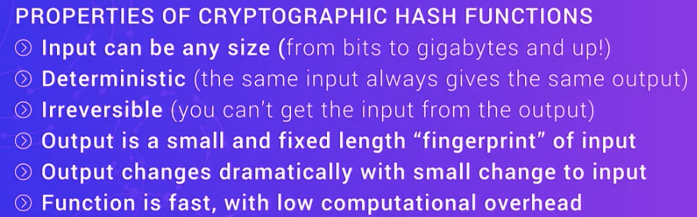
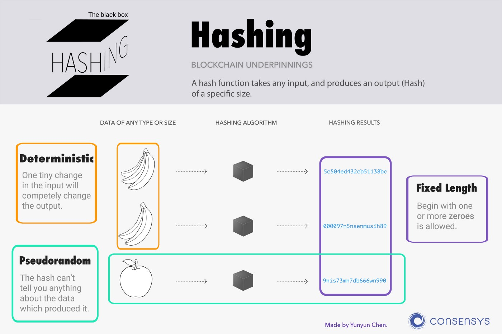
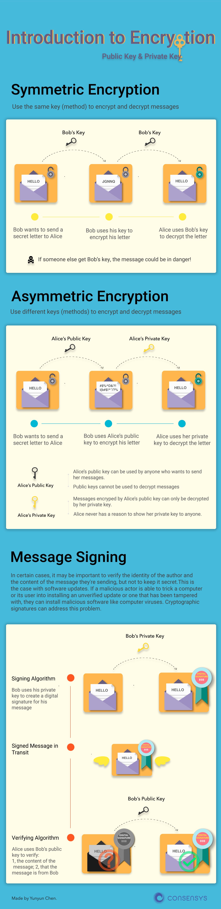
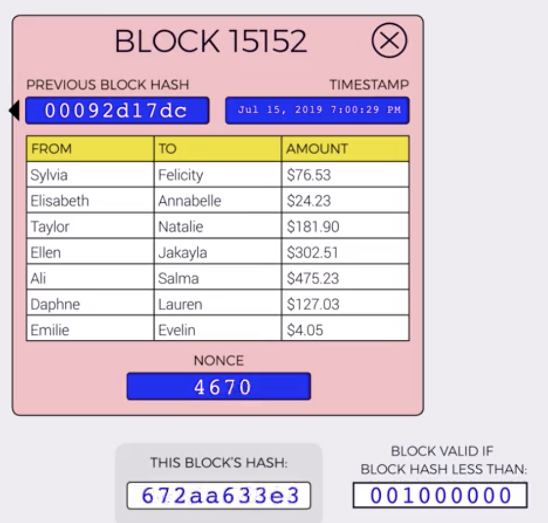

# Module 2 the technical side

In this module we will cover the following topics: 
- Cryptography, 
- Hash Functions, 
- Public Key Cryptography and Signing, 
- Blocks and Blockchain, 
- the Chain, Nodes and Network. 

The reading materials will help you to expand your knowledge of the materials presented in this module. 

Learning Objectives

- Discuss how public key cryptography works
- Describe some features of a block
- Compare server-based and peer-to-peer networks
- Explain what a hash function does.
- Define what a digital signature is.
- Recall how blocks form a secure chain.

# Lesson 1: Public Key Cryptography

postcard -> encrypted mail

- public key A - lock - ciphertext
- private key A - unlock 
- a mathematical one-way process, where, once a message is encoded with someone's public key, the only way to read it is with that person's private key.  It's all but impossible to decrypt or hack the message without it. 

# Lesson 2: Cryptographic Hash Functions

Hash
- any input - fixed length output hash code/ digest, output are hexadecimal numbers
- Determinism: same input always yeild same output
- irreversible

some cryptographic hash fucntions
- SHA-128: Standard Hash Algorithm, output length is 128 bits
- SHA-256: more bits more security because less possible collisoin
- SHA-512  

# Lesson 3: Public Key Cryptography & Signing

Digital Signing
- reverse of public key cryptography
  - encrypt data with you private key 
  - decrypt with your matching public key
  - everyone on the public network could read your message 
    - why?
    - proof it cames from you: digital signing
    - The big advantage of using hashes here is that you don't have to encrypt the entirety of what you're signing. You could sign multiple gigabytes of data with just a few hundred bytes. On a blockchain, signing is used in a similar way to verify transaction origination and ownership. 
- Digital signing is used to verify that you and only you initiated a transaction.

# Lesson 4: Anatomy of a Block

Block
-  The primary purpose of a block is to record transactions.
-  Bitcoin blocks generally contain around 1500-2000 transactions.
-  Block size are generally limited to prevent network congestion.
-  Bitcoin blocks are limited to 1MB in size.

Every block has 
- a unique number, also called its height. Since the blockchain is linear, these numbers again or heights increment. There can be only one block at a given height. - Blocks also contain a timestamp, 
- a strange number called a nonce, 
- some other information not listed here and 
- critically a hash of the previous block in the chain, 

Validity
-  the vast majority of blocks are invalid
-  Block validity is sth defined by a blockchain protocol.  Since most blocks are invalid, you can think of the valid blocks as special.

Bitcon Miner
-  finding a valid block is the hard work that those miners are doing when they mine
-  Blockchains have what's called a difficulty, which is essentially an arbitrary setting, managed by their protocol, that determines how hard it is to create blocks. 
-  The work required to create a valid block is where all the value comes from. Miners are rewarded financially for finding a block. This is the work in "Proof of Work".

PoW
- what proof-of-work means? 
  - By finding a block that is valid, you have proven that work has been done
  - For blockchains like Bitcoin and Ethereum, the difficulty level can change in order to ensure that blocks are created at regular intervals. 
- How work?
  - A block is only defined as valid 
    - if the hash value of the entire block, the hash value being a number, is below another threshold number. 
    - The way you determine if this block is valid, is you simply ask **is this block's hash below the difficulty threshold**?
    - That threshold being set by the difficulty. 
    - Smaller threshold, harder.
  - what data can you change in your block? It contains important transaction data that you can't alter. 
    - This is where the **nonce** comes in. 
    - The nonce is there just so that miners have a piece of data that they can essentially play with. They can change it **randomly** to change the block's output hash until they luck out and happened to find one that is below the required difficulty threshold. 
    - Once they have found a nonce that results in their block's hash being below the difficulty threshold, the block is finally considered valid and it can be broadcast to the network with that miner taking a reward for their effort. 
    - This process is **purely** based on **chance**.
    - (Currently on the Bitcoin blockchain, miners have to find hashes starting with 19 zeroes. That's about as hard as rolling 36-sided dice and getting all sixes. So, finding a block is really hard and a big deal. It's so difficult that with a top of the line mining computer of today running 24/7, you could expect to mine a valid block about once every 40 years. )

 - **Change** old data? 
   - if you try to change any of the data in a block once you've mined it and found a working nonce, you render your block invalid once again, and have to start all over finding a new nonce that goes with the new data. This is why blocks are so hard to alter after they've been mined. 

Checking validity
- Easy
- Other nodes just hash it if it's lower than the diffculty threshold then accept it

# Lesson 5: The Chain of Blocks

real immutability comes in
- all the previous hashes are baked into all future block hashes.
- blocks are linked all the way back to the very first genesis block and are verified by hashes
- All the blocks are connected through the interrelationships of all their hashes. 
- If anything is changed anywhere in the chain, there's a ripple effect invalidating all the blocks that come afterwards.
-  That robustness is the power of the distributed blockchain, and why it's thought of as being incorruptible.

# Lesson 6: Nodes and Networks

Drawbacks of server-based structured
- the bandwidth demands on that server are very high since all traffic goes to and from it.
- there is a single point of failure. If the server crashes or gets hacked,, the system will cease to function and there's certainly a concentration of power here.

Peer-to-peer model
- peers all connect to one another and are all equal.
- pros
  -  information can flow freely between nodes optimizing the use of available bandwidth.
  -  systems are also resilient to failures in individual peers and more resilient to network attacks. 

different kinds of nodes
- Full nodes 
  - store the entire blockchain and verify everything, every single transaction. 
- light nodes 
  - store just a portion of the blockchain. 
- Miners 
  - are separate from nodes. 
  - They don't store the blockchain, they are network participants who create blocks and send them to nodes who verify and include them or reject them. 