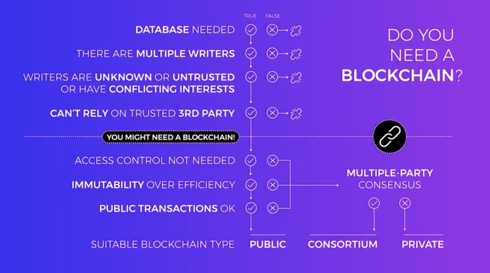

# Module 3 Blockchain In Use

Welcome to the Blockchain in Use module. In this module we will cover the following topics: 
- Introduction, 
- Trust Framework and Consensus Mechanisms, 
- Public, Consortium, Private Blockchains, Blockchain Interoperability, 
- When to Use a Blockchain (Limitations and Misconceptions), 
- Implications of Blockchain on Traditional Business.
 
 
Learning Objectives
- Determine what problems can be solved by using the blockchain solution.
- Explain the difference between public, private, and consortium blockchains.
- State what a consensus mechanism does.
- Describe how different blockchains can work together.
- Discuss how blockchains could affect businesses.

# Lesson 1: Consensus Mechanisms and Trust Frameworks

purpose of a consensus mechanism
- to allow a group of separate nodes to distribute the right to update the system according to a specific set of rules amongst a set of participants and in a secure way.

consensus machanism
- proof of work
- proof of stake
- leased proof of stake
- delegated proof of stake
- proof of importance
  

proof of work 
- think of it as rewarding a minor for their **share** of the computational power on the network. 
  - If you own say 10% of the computational power on the network because of the random nature of hashing, you can expect 10% of the mining rewards to go to you.

drawbacks
- use huge amount of energy
- transaction rates and volumes will be lower
- transaction fees can be high because of the energy used
- transaction fees grow as the network grows

proof of stake
- replace PoW in Ethereum
- Blocks are not mined, they're forged
- forgers are rewarded for the proportion of stake they have, not proportion of computing power
  - instead of rewarding minors for the proportion of computing power they have, it rewards participants called forgers based on the proportion of the currency they own. 
  - roughly speaking if you owned 10% of all the cryptocurrency, you could expect to forge 10% of the blocks on the network and hence take 10% of all the fees. 
- Create a block
  - When creating a block, a forger stakes their currency in escrow. If the block turns out to include a fraudulent transaction, they lose that stake. 
  - forgers risk their stake. If they include a bad transaction, they lose it. This is strong incentive to stay honest.

Benefits of PoS, PoS VS PoW
- Drive transaction costs way down. Transaction fees down.
  - You wouldn't be paying for all the electricity going into mining. You instead pay what is effectively an interest rate on the loan of a given stake.
- Electricity use down.
- Better efficiency.
  - Because doesn't reply on mining
- Speed much faster.
- Also a protection against attacks.
  - Because anyone attacking the network would also have to hold a great deal of capital in the network, which would make such an attack self-defeating. 

One problem of PoW
- Individuals with small balances will likely never get the opportunity to create a block.
- Least proof of stake addresses this by allowing small balance holders to stake a node. 

Least proof of stake
- Allows individuals to stake nodes withe their balance, giving them a share of profits from forging
- The node gains access to all the funds staked to it for the purposes of determining its odds of forging a block. But control of the funds remains entirely in the hands of the staking individual, that individual then takes a proportionate share of the fees generated if their least node forge is a block.

Delegated Proof of Stake
- The number of tokens you own gives you the same number of "votes" to nominate a Witness.
- Witness verify and process transactions
- Top witness get paid the most
- Delegates are also a part of the system. They are the trusted parties who manage the network but don't take part in the transaction processing.

Proof of importance
- Similar,  those with a greater share of currency have a greater probability to forge blocks
- Like proof of stake but with additional variables other than your coin balance
- any variable than contributeds to system health can be used
  - For example, you might want to reward nodes with more recent transaction activity, or disincentivize currency hoarding 货币囤积 by giving smaller rewards to holders with a great deal of currency. 

# Lesson 2: Public, Private & Consortium Blockchains

Three Types of blockchains
- Public blockchains
  - Completely open to the public
- Consortium / shared permissioned
  - Restricted to few possibly competing entities
- Private / Permissioned 
  - Restricted to completely trusted entities
  - Consortium and private are both a type of permissioned blockchain; though a consortium is shared and a private is not.
 
Public blockchains
- Bitcoin
- Ethereum
- Everyone can join

Consortiem
- Only certian members are allowed to join; permission is required
- These are called "shared permissioned" because several entities share access to the blockchain. Considered "low trust".
  - Organizations have some trust in each other but not complete trust. 
- Power isn't centralized with any one compnay but the public can't see the transactions.

Private
- "High trust" environment. Really not much more than a database.
- This is much more like a centralized system but provides a high degree of auditability since transactions are viewable but only to those with access. 
  - (Dayuan doesn't agree with this. Like hyperledge fabric, transactions can be done in any nodes which has access. This is not centralized. )

Performance of consortium and private blockchain
- often much better than public
  - because don't rely on PoW to establish consensus
  - the environment is more trusted 

Blockchain interoperability
- blockchains that can interact with another
  - e.g., an application on the Ethereum blockchain that works with Bitcoins and does so transparently for a user.
- BTC-Relay
  - SPV Simplified Payment Verification
  - The purpose of BTC-Relay is to take information from the Bitcoin blockchain, and use it in smart contracts on the Ethereum blockchain. 
- Interledger protocol
  - Ripple is a company and a cryptocurrency that facilitates bank to bank transfers between different countries. 
  - They've done a demo of this across seven different blockchains. 
- Polkadot
- Cosmos
  - side chains
- Enterprise Ethereum Alliance
  - one of their goals is to work with various industries and working groups to develop interoperability standards
- Blockchain Interoperability Alliance
  - a group of several companies and taking their specific approach

# Lesson 3: When to Use a Blockchain

-  kinds of business problems that are best solved with blockchain.

## Decision tree 
- that includes the kinds of questions you should ask when trying to determine whether you should be using a blockchain at all.
  - you're an executive and you're trying to determine if a blockchain is the right solution for a project that you have. 
  

1. Databse needed?
   - The first question to ask about your project is, do you need a database? 
     - If you don't need a database at all, you don't need a blockchain.
   - BitTorrent, peer-to-peer sharing file system, no need database
2. Share write access?
   - The role of blockchain is to spread the authority to write amongst a group without any one group controlling access. 
     - If you don't need to share this access with multiple people or groups, you don't need a blockchain.
   - For example you want to collect traffic information and sell it you don't need blockchain (no need multiple groups to write into database)
3. Are any of the parties unknown or untrusted? Or if they're trusted, is it possible for them to have conflicting interests?
   - On the Bitcoin blockchain, people have conflicting interests because they stand to gain from an invalid transaction that works in their favor. 因为他们可以从对他们有利的无效交易中获利。
   - if you know and trust all the parties and you know that everyone's interests are unified, then you don't need a blockchain. 
   - For example, suppose three water companies want to maintain a shared database of pollution levels across various sources. They all trust each other and all their interests are unified, they probably don't need a blockchain.
4. Can rely on a trusted 3rd party?
   - But if all parties aren't known or trusted, or they are but have potentially conflicting interests, consider if you could rely on a third party to control the database, or audit it. If that's possible, you don't need a blockchain. 
   - For example, three competing furniture resellers agree to a shared database of suppliers. However, they are all able to trust a third party to manage the database. This third party is an intermediary but they all trust it, so they don't need a blockchain. 

 But if you can't trust an intermediary, after all of that, you're finally ready to start talking blockchains. 

To recap, we have a business problem or project that needs a **database**, requires **shared** **access** amongst parties that may **not be known or trusted** or may have competing interests, and it's not practical or possible for a **third party** to be trusted to manage the database.

5. Access control and multiple-party consensus?
   - Do you want to control access and functionality and will just one party verify information without consensus internally in a high trust environment?
   - If you want to control access and functionality 
     - If only one part, no need consensus: 
       - and will just one party verify information without consensus internally in a high trust environment?
       - If so, a private permission blockchain will work. That's a blockchain operated by you and your organization. This is really just a distributed ledger and it's not very blockchainy. 
     - Else need consensus among multi parties:
       - If you want to control functionality but consensus must be reached by multiple parties, that is other entities will be verifying, writing, and auditing data on the blockchain along with you, 
       - then a shared or consortium, or shared permission blockchain is what you want to use.
       - In this case, a group of possibly competing entities share access and use of a blockchain database.
6. Don't want transactions to be publicly viewable?
   - non-private blockchain: private or consortium
7. Public blockchain: 
   - you don't control functionality, 
   - it immutable
     - the cost is speed and efficiency
   - and all transactions are public
     - Anyone can join it and use it.
   - Use existing public blockchain
     - it's ready-made. 
       - if you wanted to build an app that needs a blockchain, public blockchains are waiting for you.
       
   - Use your own public blockchain
     - You could also create your own public blockchain to fulfill a specific need
     - But being public, you're dealing with unknown and untrusted entities writing to the block chain, so great care must be taken to ensure a robust set of consensus mechanisms are in place to keep the blockchain secure
   
## Supplemental Reading: When to Use a Blockchain

While there is a lot of excitement surrounding blockchain, it's important to stay realistic about the technology's potential. After understanding the requirement, it is important to consider if blockchain is really needed to solve this problem.

[This article lists the factors that need to be considered before arriving at the decision to use a blockchain.](3.2Avoiding%20the%20pointless%20blockchain%20project%20%7C%20MultiChain.pdf) or [pdf](3.2multichain.com-Avoiding%20the%20pointless%20blockchain%20project.pdf)  
 
   

# Lesson 4: Implications of Blockchain on Business

Centralized databases
- to store and process vast amounts of data
- power organizational functions such as finance, human resources, marketing, sales, operations, and more
- problems
  - be prone to attacks from external and internal actors, as they have a single point of failure that even the best cybersecurity fails to protect
  - hacks of Yahoo, Equifax, and Target

Decentralized databases
- problems
  - siloed, 
  - inefficient, and 
  - inconsistent, 
  - making it difficult to share accurate data internally, and externally, 
  - slowing down transaction times, and 
  - failing to provide a single verifiable source of truth on data for multiple parties to agree on

Blockchain
- data can be stored and automatically replicated and shared across a network of databases
  - This network is transparent and verifiable, allowing anyone that is signed into it to see a single source of truth on current and historical data. 
  - It also improves the efficiency, accuracy, and speed of transactions, minimizing disputes, and the need for intermediaries.
  - the distributed architecture of the blockchain is more resilient, reducing the ability for hacks to happen as there is no single point of failure. 
- Use cases
  - supply chain
    - Provenance of assets become a verifiable, traceable, and auditable, creating transparency throughout the lifecycle of a supply chain.
  - medical industry 
    - The medical industry personal ownership of medical records that can be used universally at the person's discretion. 
  - music industry
    - Music ownership and distribution, where creators are not exploited by intermediaries, and receive direct compensation for their work
  - Internet of Things
    - blockchain is used as a means to connect and audit IoT machine to machine transactions

Questions need to be considered before using blockchain
- Are there multiple parties, or entities that need to interact with one another? 
- Do certain parts of the business rely on central agents that are acting as intermediaries? 
- Is there absence of trust, and a transaction, or business process? 
- Are there assets that need provenance in tracking? 
- Finally, what part of the business can be automated, and put into a smart contract? 

Example - payments in the financial service industry
- from the moment that it's swiped, to when the transaction is finally settled, there are multiple intermediaries, and steps that drive high transaction costs, and inefficiencies and processing it. This is why it can take up to three or more days from a transaction to go from pending to finalized. 
- By implementing blockchain technology as payment rails, a financial services business can dramatically speed up transaction times as it removes many intermediaries. It can drive down the costs of transactions, and there are reduced operational costs and risks.

every industry
- businesses will gain many benefits by implementing blockchain technology:
  - improved record keeping of data on disconnected systems, 
  - personal ownership of data and digital assets, 
  - easy access to shared or historical data, 
  - real-time auditing of activities on a system, 
  - trusted attestations on unknown parties to create assurance, 
  - automation of a paper-based multi-step proces
  - s, ability to remove intermediaries from a business process, 
  - tokenize assets that can be traded on public or permissioned chains 
  - integrations with other emerging technologies such as artificial intelligence, and the Internet of Things.
