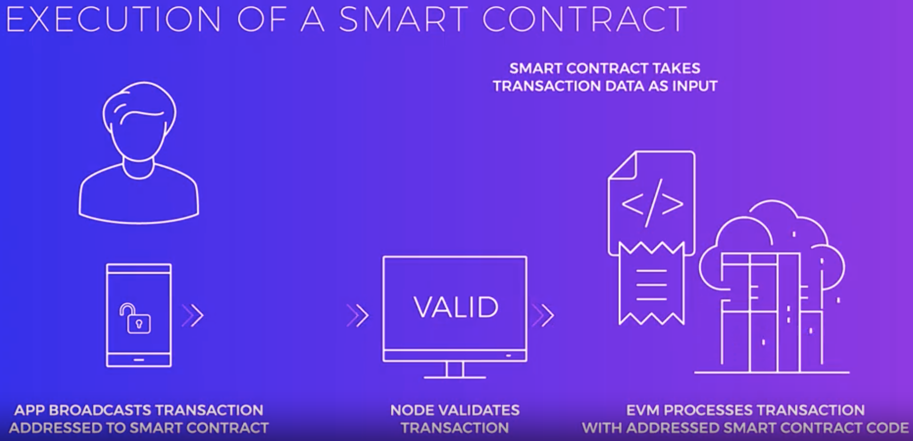
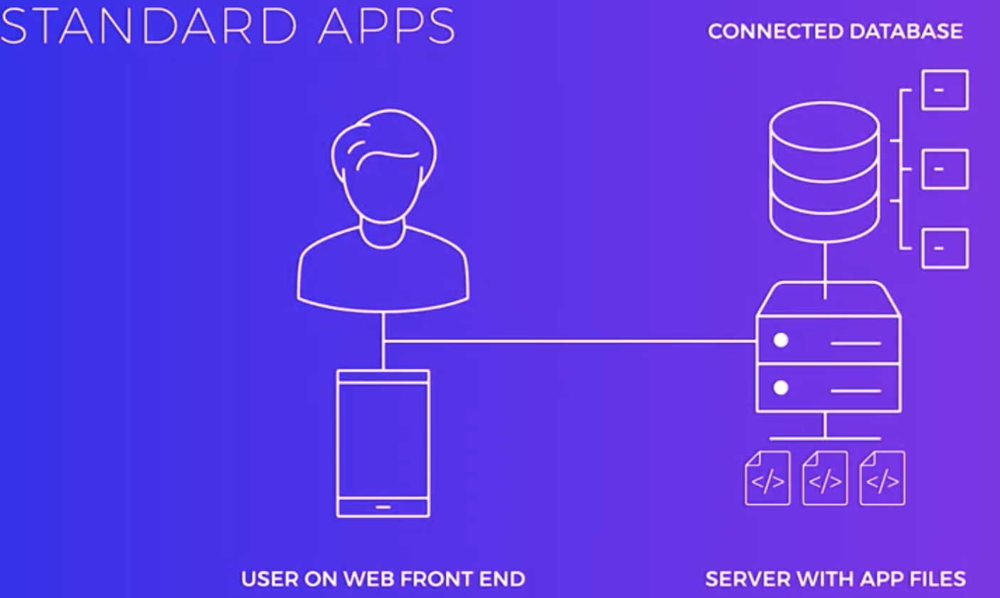
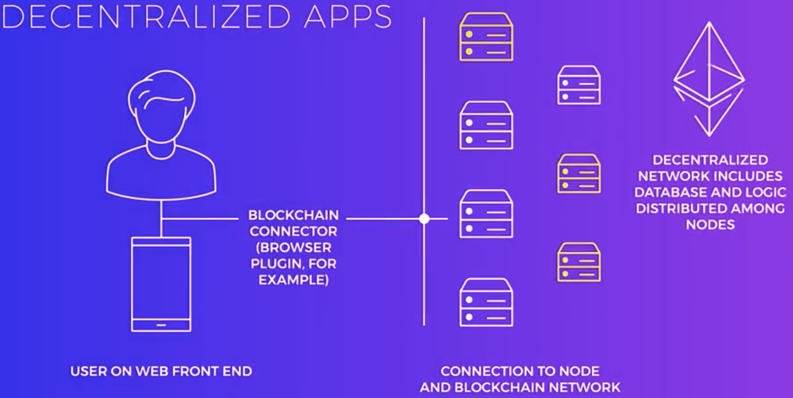
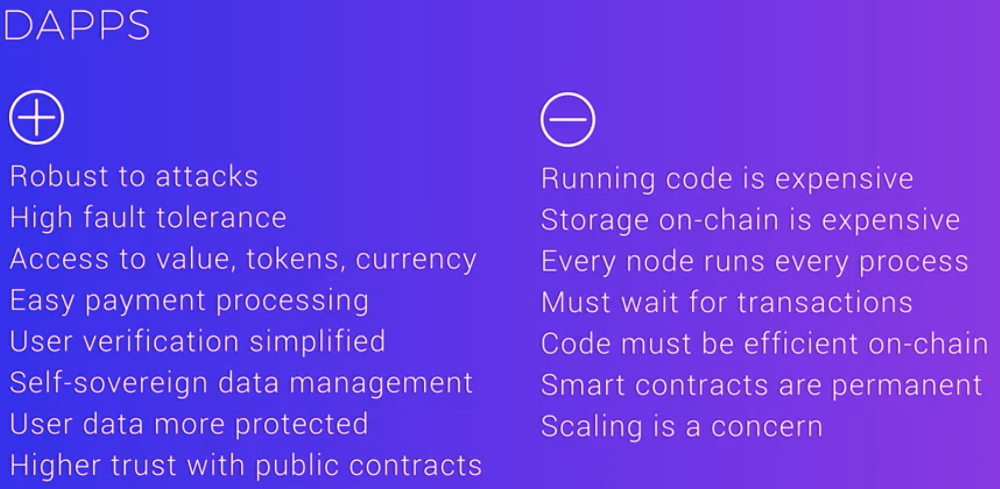

# Module 4 Further Topics

In this module we will cover the following topics: 
- Introduction, 
- Bitcoin and Ethereum, 
- Ethereum, Smart Contracts, 
- Cryptocurrency Tokens, 
- Wallets and the Marketplaces, and 
- Implications on Traditional Businesses. 
  
The reading materials will help you to expand your knowledge of the materials presented in this module. 

Learning Objectives
- Describe how a cryptocurrency wallet is used
- State the differences between cryptocurrencies, coins, and tokens
- Indicate what a dApp is and what makes it different.
- Explain what a smart contract is.
- Describe blockchain platforms and extensions.

# Lesson 1: Cryptocurrency Tokens
First bitcoin
- mined in 2009
  
What is the value?
- Agreement
  - the value of a currency comes from a collective agreement about its worth
  
Decentralized cryptocurrencies 
-   were born when technology enabled electronic currency to have the same properties as physical currency. 
-   Mining difficulity: scaricity 稀缺性
-   Consensus: reliability
-   Digital Signing: Tradeability

Currency, coin, token
- Currency
  - sth exchangable that holds value intrinsically
  - Not all blockchains have an associated currency
  - Bitcoin and Ether are the intrinsic tokens for the two blockchains
  - these kinds of intrinsic tokens as coins
- Intrinsic token
  - vallue is intrinsic
- Extrinsic token
  - has value through reference
- A coin is a unit of cryptocurrency associated with a given blockchain network. 
- A token is usually more like a share in a company, it's tradable, sellable, you own it, 
  - but it can also be seen as a proof of an ownership stake in something and that thing is what has value. 
  - So, the value of the token is extrinsic to it and that is in contrast to the value intrinsic to a coin. 
  - On a blockchain tokens are covered in the same way as coins, but it's an important distinction to make

Example
- on the Ethereum blockchain, you might buy tokens with your Ether, but you wouldn't buy Ether with your tokens, you would sell your tokens for Ether. 
- Tokens can be created arbitrarily on the Ethereum network. If you have a project, you could invent a token and sell it to fund raise. 
- The concept of electronic money isn't entirely new, air miles, and reward points are a fully electronic currency,
- Difference:
  - air miles needs a huge system to support the whole process, to support millions of user
  - With a supporting blockchain like Ethereum, all this is just there. If you knew what you were doing, you could create your own token in just hours, with the entire block chain back-end giving you or anyone everything you need for your token to be ownable, buyable, transferable, and secure, that ability is unprecedented. 
- ICO vs IPO
  - both are ways to raise money by offering shares of ownerships
  - initial coin offering
    - you buy tokens which could represent ownership of just about anything
  - initial public offering
    - You buy stocks which represents a share in a compnay

# Lesson 2: Wallets, Exchanges & Transactions

Wallet
- they are key chains
- each of those keys is a private key which shows you are the owner of the coins associated with the matching public addresses
- with the private key, you can control any coins assigned to the public addresses because the private key is the only way the system knows you own the public key
- keep you private key secure. A paper is good enough. 

Address
- the address is derived from the public key
- so you canhave  diff addresses own by one private key 
- the block only record transactions from one address to another address with credits/debits amount 
- public key/derived public address
  - is the address people assign coins to
  - is a way to confirm the identity of the private key holder through cryptographic signing

Where are coins stored?
- They are not. Coins aren't transferred. Ownership of coins is transferred.
- Backward search only goes so far as to confirm enough tokens are owned.

Exchanges
- buy and sell currency

Transactions
- when you broadcast a transaction
  - all unprocessed transactions are in "mempool"
  - miners draw from it, verify those transactions are valid, confirm you have enough Bitcoin to do the transaction, decrypt your signed transaction to ensure the private key owner (you) is the one initiated it, then create blocks

# Lesson 3: Bitcoin and Ethereum

Bitcoin VS Ethereum
- Bitcoin
  - A peer to peer eletronic cash system
  - Envisioned as a way  for anyone to possess and transfer currency to anyone else without any authority or third party
- Ethereum
  - a nextt generation blockchain envisioned as a world computer that can perform distributed computation in addition to having a currency
  - a peer to peer database and dsitrbuted virtual computer 

State
- the state comprises all the variables in the  system at a givne time as agreed upon by all the nodes through consensus
- transactions can be thought of  as moving the system from one state to another
- The state in Ethereum changes as the result of transactions and the operation of a very special feature of Ethereum, the Ethereum Virtual Machine. 
- EVM
  - the most noteworthy features of Ethereum when it was created
  - it was Turing complete, 
    - which means it's complex enough that it can theoretically do anything any other computer can do. 
      - All of the code that it runs can be stored as a part of the blockchain. 
      - You can program fairly sophisticated apps whose core logic runs on the blockchain.

Ethereum's challenges around scaling
- a fairy  low transaction volume currently 
  - 15 tps
    - the entire system can currently only process about 15 transactions per second.
  - The entire network has to run every computation on every computer, which means that the whole system can really only work as fast as the slowest computers on it.

Ethereum community's 3 approaches to deal with scaling issues
- Adoption of proof of stakes
- Implementation of state channels
- Use of sharding 

PoS
- PoS is a much more efficient way to achieve consensus compared to proof of work
  - The transition to proof-of-stake from proof-of-work will reduce a lot of the computational burden on the network. 
  - Rather than mining blocks by finding a valid low hash value, the network would forge blocks by distributing the permission to create them by the proportion of currency staked by a node rather than the amount of computational power it might have.
- The adoption of proof of stake will make the network more efficient and increase transaction throughput 

State channels
- are a way  to group trasanctions together off-chain and add them all together, reducing the number of separate individual transaction required
  - cluster transactions in one place off chain
  - then open the channel
  - move them on chain as a group 
  - induce the number of transactions the network has to process independently
    - instead provide them in bulk 
- the use of state channels will also make the network more efficient and increase transaction throughput 

Sharding
- is a way of splitting a blockchain into smaller networks (smaller parts, shards), that process transactions and state independently， while maintaining coherence  across the overall network 
  - work independently for collation校对 later
- sharding promises greate potential improvement to network scalablity by reducing the load on individual nodes

Shasper
- the community is looking at addressing scaling with a new initiative called shasper 
  - a new initiative that will address scaling concerns with a combination of proof-of-stake and sharding.

## Bitcoin vs Ethereum
- The core difference between Bitcoin and Ethereum lies in the virtual machine
  -  Within the virtual machine of Ethereum, we can actually program applications. -- solidity,  which is a derivative of JavaScript
  -  DApp

# Lesson 4: Smart Contracts & The EVM

smart contract 
- a small piece of logic or code that can interact with a block chain.
- small contract logic is publicly viewable
- it's fully transparent, trustless, and secure and immutable 
- drawback
  - You have to be very certain that your smart contract doesn't have any mistakes in it. 
- In bitcoin
  - bitcoin script, which is not turing complete
- In Ethereum
  - Solidity, which is Turing complete
    - Turing complete just means it has all that it needs to fully function as a computer or information processor.
- EVM
  - The EVM is what processes the code and smart contracts but processing isn't free. -- Gas -- Ether
  - smart contracts is the code and the EVM is the computer that runs the code.

A simple smart contract example
- you and your friend own an apartment
  - your tenant sends the payment to a smart contract which determiistically splits it between you and your friend
- smart contract makes this deterministic, no rely on any party
  - no third party or human will determine the split. It's openly viewable and immutable.

Gas
- EVM is the engine of Ethereum, gas is the gas
- Gas serves 3 purposes
  - it incentives nodes to process contracts
  - it makes spams and other abuses expensive
  - it helps prevent bad code or infite loops from clogging up the network 

# Lesson 5: Decentralized Apps

Decentralized apps or Dapps, 
- DApp: Complex smart contracts working together to offer full application functionality
- are the next logical step after smart contracts. 
- Where a smart contract is a small piece of logic that is stored and executed by the machines on a blockchain, 
- Dapps refer to higher level applications, built using those smart contracts to provide their functionality. 
  - Dapps like other applications, are a combination of a variety of technologies. 

Web application VS DApp
- 
- 

Pros and Cons
- 

# Lesson 6: Blockchain Platforms & Extensions

