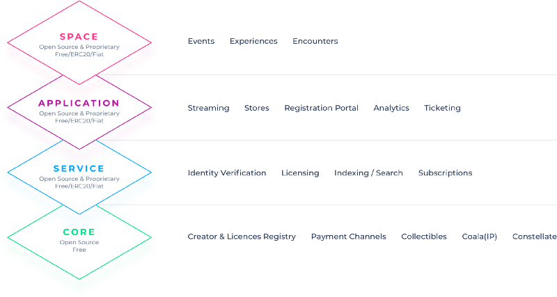

# Module 5 use cases (Ethereum)

In this module we will review the following use cases: 
- Self-Sovereign Identity and Reputation, 
- Ownership and Governance, 
- Supply Chain and Asset Tracking, and 
- Royalties in the Music Industry.

Learning Objectives
- Analyze implications of Blockchain technology into various businesses
- Demonstrate how the decentralized technology can change your business.

# Use Case 1: Uport: Self-sovereign Identity and Reputation

An id which can be used across multiple places/websites. Like a driver license can be used in multipe places.

- What is the business case, area, or topic that this use case applies to?

  - Digital Identity

-  What problem are they trying to solve? 

   - uPort aims to return ownership of digital identity to the individual. Currently, a digital identity is established when a nation-state, company, or other organization is able to say and prove that an individual exists. There are not broadly legitimate ways for an individual to create a digital identity for themselves without engaging with these intermediaries. The result is that digital identity is fragmented across multiple systems controlled by nation-states, companies, and other organizations.

- What is the value created by solving this problem?

  - An identity is central to almost every transaction that occurs in the physical world and the digital world. In the digital world, most identities are siloed and controlled by centralized entities - like your email, your banking information, and your healthcare account. By creating a digital identity that is centered around the user of that identity, the user has ultimate control over their identity and is the final arbiter of who can access and use their data or personal information. The value created is for the individual - the individual has control of their identity and the data associated with that identity.

- Do they need a database?

  - Yes. uPort needs a database because they are creating and storing identities

- Does it require shared write access?

  - Yes, anyone should be able to use uPort in order to create an identity.

- Are any of the parties unknown or untrusted? Or if they’re trusted is it possible for them to have conflicting interest?

  - Anyone should be able to participate in the system, and it should not be possible to prevent anyone from creating an identity. Therefore, all parties can be assumed to be unknown.

- How will a blockchain be applied to this use case? 

  - A blockchain is required to create an identifier (an Ethereum address) and a public-private key pair for signing transactions. The registry of identities on Ethereum allows for information about an identity - whether that be a degree earned or a permission granted to that identity - to be sent to and held by the holder of that identity. This information about an identity is referred to as a claim or attestation, and allows for the holder of the identity to accrue and use information associated with their identity.

- Which component pieces will be utilized? 

  - Public key cryptography allows for users of uPort to sign attestations. So a hospital could registry an identity with uPort, and then send attestations to patients who share their uPort identity with the hospital. Signing a message with the information about what happened during a hospital visit would be an example of how a component piece of the blockchain is used.

- Will the blockchain used be public, private, or consortium and why?

  - uPort is built on top of the public Ethereum blockchain. The public chain is used so that any identity can be verified, as that information is available to all participants in the blockchain. 

- Is a token used (to digitize an asset, store value, or to provide access to the blockchain, for example)? Why is it needed and how will it be used? If a token is not utilized, why is ETH or another native token able to be used?

  - No token is used other than ETH. ETH is used to pay for any transactions occurring on the public blockchain. As uPort supports off-chain transactions, like attesting to a claim, ETH does not have to be used every time an attestation is issued.

- Are there overlay networks that will need to be utilized in order to make this use case operate? If so, what are they? If not, why does the existing infrastructure work?

  - A user’s public key is stored on IPFS, which allows for others to verify any attestation that the user has made about herself or to other users.

- Are there other factors to consider in this use case?

  - Private keys are currently kept on the mobile device on which the uPort identity is created. Therefore, uPort developed a data recovery and backup option utilizing a seed phrase. When an individual sets up their uPort, they write down the seed phrase - which is a series of words. If the user were to lose their mobile device, they could download the uPort app onto a new device, and use the seed phrase during setup to recovery the identity they previously created. This is very important, as establishing a digital identity on a device means that consideration must be given to how to recover information associated with that identity if the device were to be lost or stolen.

# Use Case 2: Meridio/Pangea: Ownership and Governance

Meridio/Pangea: Ownership and Governance

Allow a person to buy only partial of a real estate, like 2% of a 2b2b apartment.

- What is the business case, area, or topic that this use case applies to? 

  - Real Estate 

 

- What problem are they trying to solve?  

  - Purchasing real estate is expensive, and it is difficult for an individual to be able to get the financing to afford to purchase a property. When purchasing real estate, brokers and insurance providers are intermediaries that purchasers have to deal with, and these intermediaries also charge fees. Finally, once purchased, all the wealth that went into the property purchased is tied up in that property. While an owner can rent out the property, a renter does not have a way to get equity in that property. Meridio is trying to make real estate more accessible by solving these problems. 

 

- What is the value created by solving this problem? 

  - Meridio converts individual properties into digital shares on the blockchain, seamlessly connecting diverse investors and asset owners to invest and trade. It creates divisible real estate with equity and ownership for all.  

 

    Real estate investors get lower investment minimums, as there are no large capital requirements with digital shares. Direct, peer-to-peer transactions with owners reduces transaction costs imposed by intermediaries. Investors are able to reallocate their fractional ownership of property the way you would stocks or bonds. 

 

    Property owners are able to unlock additional capital by having access to a diverse pool of investors and industry partners. They also can reduce transaction costs as the transaction processing is streamlined through automated payments, reporting and capital calls. Finally, they have access to analyze asset specific data from time trading activity and asset valuation occuring on the blockchain. 

 

    By taking traditional assets like real estate, tokenizing them, and storing ownership data on the Ethereum blockchain, Meridio hopes to make real estate more accessible and liquid for the average person. 

 

 

- Do they need a database? 

  - Yes. A database is needed to store ownership data on the assets that are tokenized on this platform. 

  

- Does it require shared write access? 

  - Yes, as investors and owners buy and sell assets, they both need to be able to record their transactions. 

 

- Are any of the parties unknown or untrusted? Or if they’re trusted is it possible for them to have conflicting interest? 

  - The platform aims to bring together owners and investors that have not interacted before. Therefore, it is safe to assume that using a blockchain can create transparency where relationships between the parties has not previously existed. 

 

- How will a blockchain be applied to this use case? Which component pieces will be utilized?  

  - Meridio seeks to address the industry challenges of liquidity, transparency, and inclusion by creating fractional ownership in real estate assets using a token. This is done by converting the shares representing common equity into transferrable and traceable shares on the blockchain.  

    
 

  - So what are the benefits of putting property on the blockchain? Here are a few: 

  - The property owner can get instant liquidity while benefiting in the long term upside of partial asset ownership because: 

    - He/she understands the nature of the asset class and wants to reallocate their portfolio.
    - He/she wants to attract new capital to fund upgrades or renovations.

  - Align incentives with stakeholders to drive overall asset value by: 

    - Distributing shares to mall-goers to incentivize shareholders to shop at your mall and increase foot traffic.
    - Paying property managers in shares to enhance performance metrics.

  - Increase residential occupancy and encourage better participation by: 

    - Provide concessions in the form of shares to office space renters to create a collaborative working environment.
    - Selling shares to renters so they have clear incentive to rent in your building and maintain upkeep of the property.
    - Provide real estate brokers shares for incentive-based compensation, encouraging long term participation.
 

  -  Meridio leverages smart contracts on the Ethereum blockchain to support the investing and trading of real estate assets.  

 

        For homeowners and property managers, Meridio will allow them to list their properties on the platform and crowdfund ownership either partially or in whole using tokens. For investors, Meridio will reduce the overhead in investing in property and enable ample liquidity for users to enter and exit the market as they please. 

 

        
 

 

 

- Will the blockchain used be public, private, or consortium and why? 

  - Meridio uses the public Ethereum blockchain. This allows transactions to be transparent to all users. However, no sensitive information is kept on-chain. That means any identifiable details about the participants or the properties is not kept on the blockchain, only the Ethereum addresses of the transactors. 

 

- Is a token used (to digitize an asset, store value, or to provide access to the blockchain, for example)? Why is it needed and how will it be used? If a token is not utilized, why is ETH or another native token able to be used? 

  - Yes, a token is used to digitize the asset of a property. It is needed because it allows for the assignment of fractional ownership in a property, while simultaneously being easy to trade and sell on the platform. 

 

# Use Case 3: Viant: Supply Chain and Asset Tracking

Viant: Supply Chain and Asset Tracking

- What is the business case, area, or topic that this use case applies to?

  - Business process modeling, asset tracking, and supply chain building

- What problem are they trying to solve? 

    - Viant solves the problem of transparency in asset tracking and supply chains. This has been a struggle for many businesses and organizations, whether they are tracking vaccines from distribution to use or tracking oil and gas samples through the extraction, analysis, and decision making process. In order to know where an asset comes from, the idea of provenance is key. Provenance is a record of ownership that shows the history of the asset. Provenance shows its creation or starting point, and then every step along the supply chain it is a part of. By creating a digital, immutable provenance of an asset, the asset can be clearly traced and gives transparency to anyone who wants to track it. This transparency allows for compliance with protocol, whether agreed upon by participants in the supply chain or with regulations from governments. 

- What is the value created by solving this problem?

  - Viant allows businesses to increase transparency by recording the provenance of an asset on their blockchain platform. Tracking in this way allows for participants in the supply chain to have confidence that at each step along the way in the supply chain, the agreed upon actions are occuring. For example, for doctors, this might mean knowing exactly when a vaccine was produced, and how it got from a production facility to their hospital. 

    Asset tracking in this way also makes regulatory compliance easier for industries where it is necessary to prove the provenance of an asset. If a fish is claimed to be fresh caught off the coast of Fiji, and a regulator wanted to confirm this, Viant allows for the tracking of the fish from catch to market, recording the data about where the fish was caught and how it moved to market.

    Finally, creating this transparency in the supply chain allows for participants to begin to identify inefficiencies in the supply chain. If an asset is continually going through an unnecessary step in the process, it will be recorded, so the business or group of participants can take action to improve the supply chain.

- Do they need a database?

  - Yes. Information about each asset being tracked needs to be recorded.

- Does it require shared write access?

  - Yes. At each step in a supply chain, the individual interacting with the asset needs to be able to write data about that asset to the blockchain. Therefore, it becomes important that there is shared write access to the individuals who are participating in the supply chain.

- Are any of the parties unknown or untrusted? Or if they’re trusted is it possible for them to have conflicting interest?

  - In order to ensure that asset tracking is done properly, there has to be an assumption that the lack of trust of the other parties, even if they are trusted. The only way to maintain transparency that is inscrutable, especially for regulators, is to create a chain of provenance that can be easily followed and is immutable. Therefore, an assumption of the parties involves having a lack of trust or having conflicting interest is necessary to create the conditions for transparency that would hold up to both internal and regulatory scrutiny.

- How will a blockchain be applied to this use case? Which component pieces will be utilized? 

  - Viant creates a tamper-proof asset tracking system built on top of the Ethereum blockchain. The Viant user interface allows an analyst to model a business process or supply chain, and then create Smart contracts that contain those details of the business process. The smart contracts are used to write data on the movement of assets from various users and steps along the supply chain to the Ethereum blockchain. Therefore, the movement of assets is able to be transparently tracked. 

- Will the blockchain used be public, private, or consortium and why?

  - For Viant, all three types of blockchain can be used. A private or permissioned blockchain might be requested by a company that wants to keep their supply chain information private to the participants in the supply chain, and therefore, will not put their data on the Ethereum public blockchain. For certain actors, a consortium blockchain will make sense, as multiple actors will want to collaborate together in the supply chain. Finally, certain organizations might want to make a supply chain process completely public, and are able to do so on the public Ethereum blockchain.

- Are there overlay networks that will need to be utilized in order to make this use case operate? If so, what are they? If not, why does the existing infrastructure work?

  - Yes, IPFS is used as decentralized storage for the attributes of the assets. For example, details on a type of beverage being shipped. That way less information has to be written to the blockchain, but can be recalled to give information about a tracked asset.

- Are there other factors to consider in this use case?

  - Viant allows the definition of roles, users, and permissions, to give access to certain parts of Viant to the users. For example, not everyone participating needs access to model the supply chain. They may just need permission to accept or reject an asset. For example, an inspector ensuring the asset meets a certain quality control standard in the asset tracking process. The smart builder allows for the assignment of roles and create specific users that are tied to those roles. Then, permissions of what those users can do can be created. So many individuals or groups participating in the system may just need permissions to access the tracker, since they are playing a role in tracking an asset through the process.

# Use Case 4: Ujo: Royalties in the Music Industry

Ujo: Royalties in the Music Industry

- What is the business case, area, or topic that this use case applies to? 

  - The Music Industry 

 

- What problem are they trying to solve?  

  - Roughly forty-percent of our music consumption is streamed from platforms like Spotify or Soundcloud. However, aside from artists on the “Top 40” playlists and those that are well-established in fame, smaller artists struggle to receive substantial compensation from these streaming services. Ujo seeks to solve the problem of unfair artist compensation by ensuring the artists are compensated fairly and transparently for their work. 

 

- What is the value created by solving this problem? 

  - The vision at Ujo is to empower music through a transparent and open ecosystem and the mission is to build resilient, sustainable and accessible infrastructure for artists, supporters, and developers. Through building towards the creation of a fair, efficient, and decentralized music ecosystem, Ujo hopes to enable opportunity and creativity to flourish. No matter how an artist’s music will be used, they should control the rate at which they are paid. Artists will see greater value received directly from the fans of their music, instead of passing through intermediaries like record labels.

- Do they need a database? 

  - Yes, there is a need for a database to record information about artists on the platform, as well as to record licensing rights, and record payment transactions. 

 

- Does it require shared write access? 

  - Yes, all artists need to be able to register identities on this platform in order to receive payments sent to their Ethereum addresses. Fans also need to be able to interact with the system in order to send payments to listen to songs, and purchase collectibles that are created by the artists. 

 

- Are any of the parties unknown or untrusted? Or if they’re trusted is it possible for them to have conflicting interest? 

  - In order for artists and fans to interact directly without having to go through an intermediary like the record industry, the participants have to be able to interact without directly knowing each other. 

 

- How will a blockchain be applied to this use case? Which component pieces will be utilized?  

  - The Ujo platform uses blockchain technology to create a transparent and decentralized database of rights and rights owners, automating royalty payments using smart contracts and cryptocurrency. For example, the blockchain is used to store the Ethereum address of artists, store information on licensing rights, and execute smart contracts that provide payments. These include a series of smart-contracts that include the following core functions: the Artist Registry, Licensing Handlers, Oracle for ETH to USD conversion, and Non-Fungible (NFT) Collectible Tokens. 

 

    There are four layers to the Ujo platform, which can be seen below:

    

 

- Will the blockchain used be public, private, or consortium and why? 

  - Ujo is built on the public Ethereum blockchain . This gives the ability for any artist or fan the ability to participate in the system. It provides transparency into the transactions that are taking place on the Ujo platform. 

 

 

- Is a token used (to digitize an asset, store value, or to provide access to the blockchain, for example)? Why is it needed and how will it be used? If a token is not utilized, why is ETH or another native token able to be used? 

  - ETH is used for payment on the Ujo platform. In addition to ETH, Ujo uses a non-fungible token (a collectable token) they have defined as a Badge (specifically, the Badge contracts contain an implementation of the ERC-721 spec along with a type of Non-Fungible Token (NFT)). Badges are received for various actions users of the platform participate in including, but not limited to proof-of-purchases for music acquired through the platform. Other types of badges issued also include a variety of patronage tokens. Ujo first realized the potential of cryptocollectibles and experimented with the concept in early July of 2017 with the release of the RAC album Ego in a custom Ujo store (which was written about in a post taglined: An Experiment in Tokenizing Social Capital). This was before massively popular dApps such as CryptoKitties, and CryptoPunks popularized the idea and garnered the widespread attention of the web3 community. 

 

- Are there overlay networks that will need to be utilized in order to make this use case operate? If so, what are they? If not, why does the existing infrastructure work? 

  - In tandem with the development of a protocol for metadata and IP, we also realized the need for simplicity for developers to interact with decentralized storage systems in a modular way. This sparked the idea for a library that would serve as a middleware to make uploading to networks such as IPFS and Swarm as simple as importing a library and instantiating a service object with the capabilities to put and get files and data to the desired backend by calling the associated methods for doing so. This library called Constellate abstracts most of the complexity of dealing with each network directly. 

 

- Are there other factors to consider in this use case? 

  - In addition to the smart-contract components of the Core layer, Ujo has also done considerable amount of work contributing and building complementary tools they hope will benefit the greater decentralized ecosystem. One of these is COALA IP, which stands for The Coalition Of Automated Legal Applications — Intellectual Property Group (COALA IP). Members of the Ujo team joined the working group that formed when the need for a protocol for referencing licenses on the blockchain was realized. As stated on the COALA IP site: “COALA IP’s goal is to establish open, free, and easy-to-use ways to record attribution information and other metadata about works, assign or license rights, mediate disputes, and authenticate claims by others.” The initial implementation of the spec was built by BigchainDB. Following their lead and in close collaboration with their team, Ujo built the JavaScript implementation of of the protocol last year. The need for a metadata standard that fits the requirements of decentralized licensing is not specific to only Ujo, and there has been a lot of continued interest in this project so Ujo plans to continue iterating on this project in collaboration with the community.

    Read more about the specifics of the Ujo use case and their road map at The Ujo Platform: A Decentralized Music Ecosystem
 
# Example Blockchain use case

 
Here are some examples to help you understand what your assignment should look like.

- Example 1 Summary: 

    uPort is self-sovereign identity solution that allows a user to create a digital identity, while simultaneously protecting their personally identifiable information. The public Ethereum blockchain is utilized in order to run a smart contract. The smart contract is used to create an identity on the Ethereum network. The smart contract acts as a unique identifier that is tied to cryptographic keys. These keys can be used for authentication, to sign documents, claims, or blockchain transactions. The only data visible on the blockchain are abstract identifiers and the public keys, so no personal data is publicly available. All claims data is held by the user and are not displayed on the blockchain. A wallet to store the claims will exist in the form of the uPort mobile application, giving the user control over these off-chain claims.

    This example is a **good** illustration of explaining why the blockchain must be used, and how a smart contract is the key component that allows for this example to work. Notice how the learner has explained the use case in the summary, and has explained the problem that this solves. They also explain what data is not stored on the blockchain.

    Now let's look at an example where blockchain does not fully apply to the use case:

- Example 2 Summary:

    In order to decentralize the control around student records, we propose recording all student data on the public Ethereum blockchain. All student assignments and tests will be encoded in a smart contract. When those assignments and tests are completed, a transaction will be immutably recorded on the blockchain. Students will be issued a token called Education Coin. Students can look up their grades publicly on the blockchain and use Education Coin to share their grades with any entity or individual, such as a university. Students will be able to tokenize their grades.

    This example demonstrates the **common error** of attempting to use a blockchain to serve as a database. Notice how the learner has attempted to put all of the data on the blockchain, as opposed to appending the minimum amount of information to the blockchain, and using an overlay network, like IPFS, to store the data. Additionally, they introduce a token that does not make sense in the context of their idea. In fact, two tokens are actually introduced in this example, but the example lacks an explanation of their purpose and functions.

    This error can be avoided by distinguishing data that needs to be on a blockchain from data that can be moved to an overlay network. They also need to carefully consider the purpose of a token and if a token scheme is even necessary.