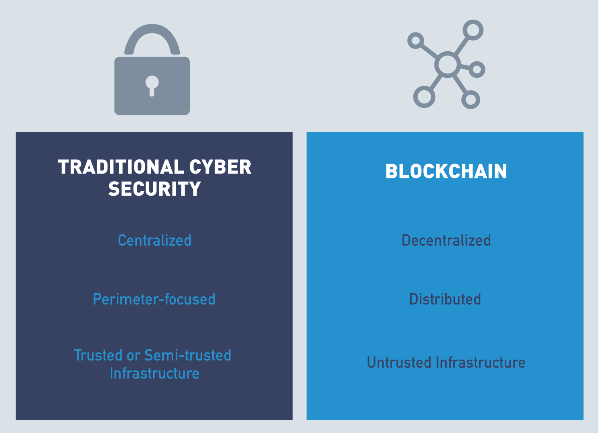
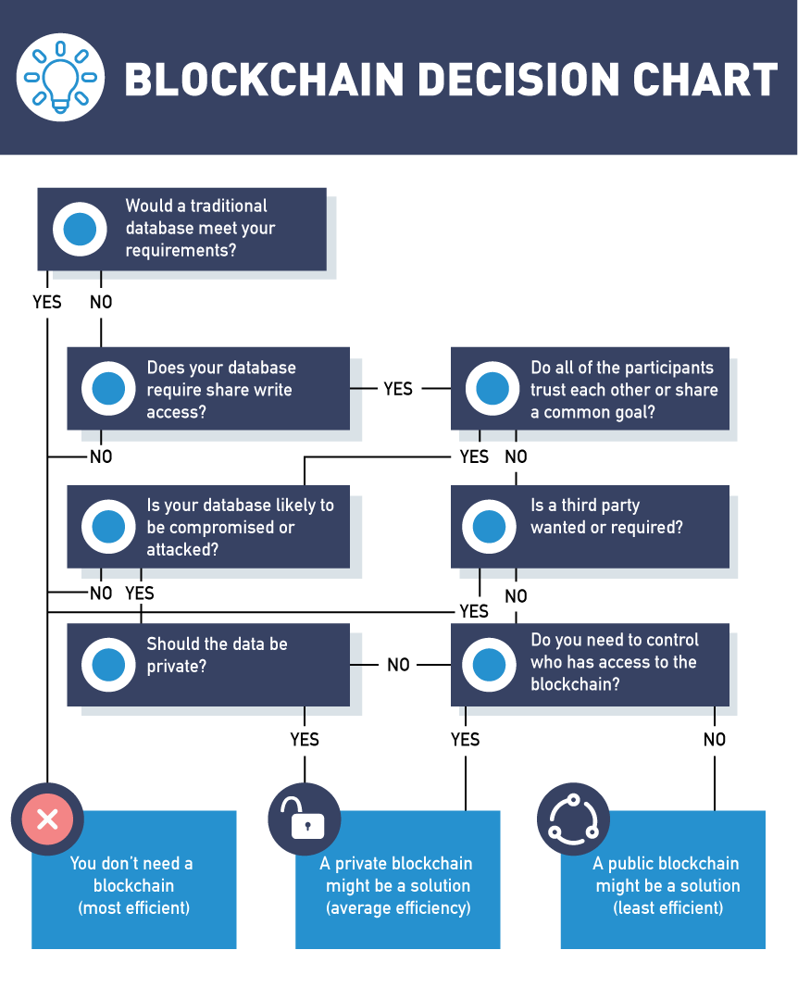
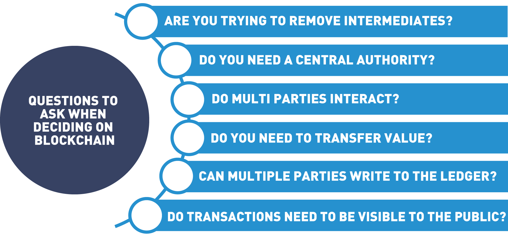
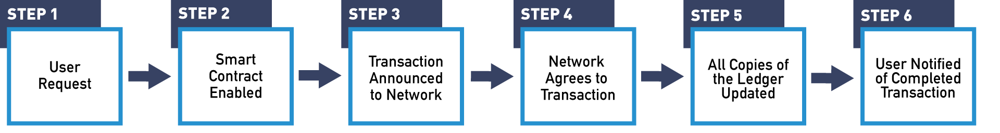
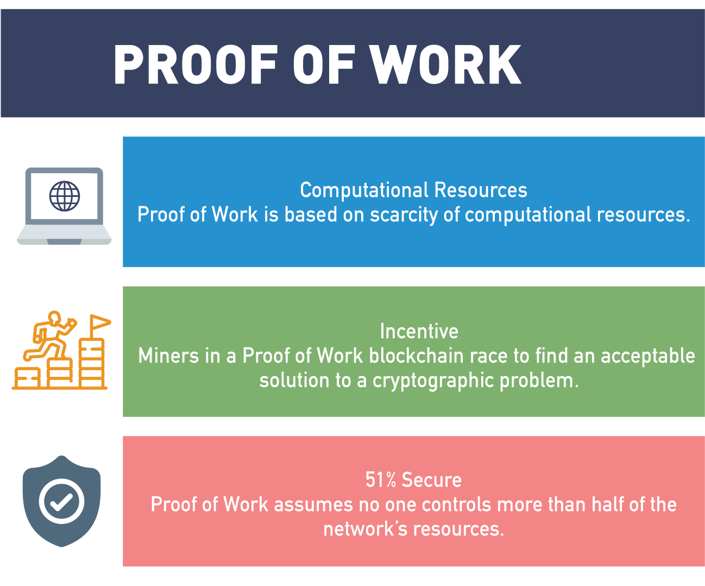
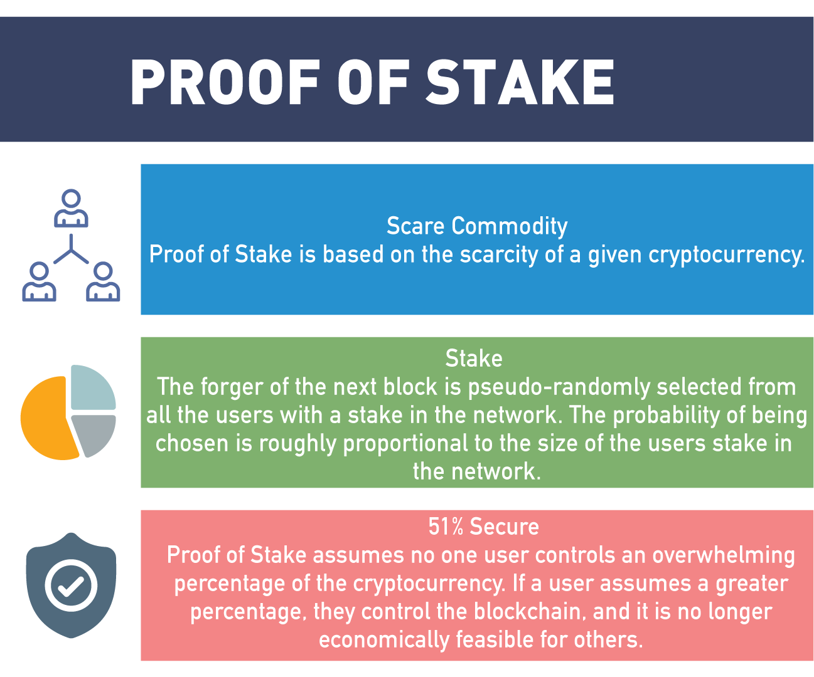
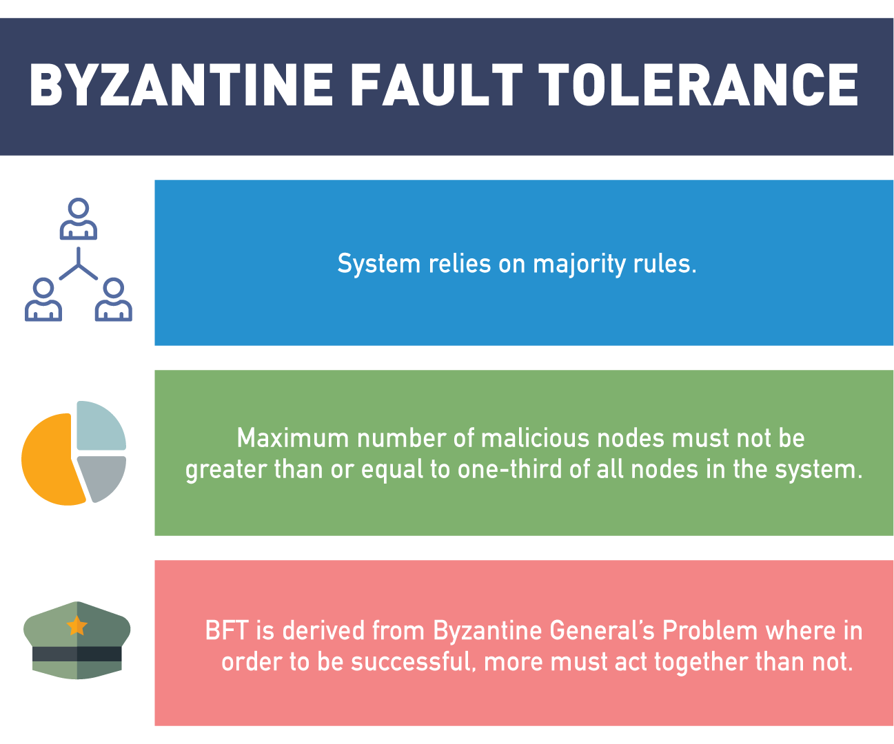

# Chapter 3. Blockchain Functions

- [Chapter 3. Blockchain Functions](#chapter-3-blockchain-functions)
- [A. Introduction](#a-introduction)
  - [1. Chapter Overview](#1-chapter-overview)
  - [2. Learning Objectives](#2-learning-objectives)
- [B. Smart Contracts](#b-smart-contracts)
  - [3. Video: What Are Smart Contracts?](#3-video-what-are-smart-contracts)
  - [4. Smart Contracts Recap](#4-smart-contracts-recap)
  - [5. What Do Smart Contracts Provide?](#5-what-do-smart-contracts-provide)
  - [6. Video: Campaign Finance](#6-video-campaign-finance)
- [C. Blockchain Security](#c-blockchain-security)
  - [7. Blockchain Security vs. Standard Cybersecurity](#7-blockchain-security-vs-standard-cybersecurity)
  - [8. Video: Introduction to Blockchain Security vs. Standard Cybersecurity](#8-video-introduction-to-blockchain-security-vs-standard-cybersecurity)
  - [9. Blockchain Security Environment](#9-blockchain-security-environment)
  - [10. Security Attacks](#10-security-attacks)
  - [10.1. Security Attacks: Denial-of-Service (DoS)](#101-security-attacks-denial-of-service-dos)
  - [10.2. Security Attacks: Endpoint Security](#102-security-attacks-endpoint-security)
  - [10.3. Security Attacks: Code Vulnerabilities](#103-security-attacks-code-vulnerabilities)
  - [10.4. Security Attacks: Intentional Misuse](#104-security-attacks-intentional-misuse)
  - [10.5. Security Attacks: Data Protection](#105-security-attacks-data-protection)
- [D. Public and Permissioned Blockchains](#d-public-and-permissioned-blockchains)
  - [11. Different Types of Blockchains](#11-different-types-of-blockchains)
  - [12. Video: Public (Permissionless) Blockchains](#12-video-public-permissionless-blockchains)
  - [13. Public Blockchain Benefits](#13-public-blockchain-benefits)
  - [14. Video: Private (Permissioned) Blockchains](#14-video-private-permissioned-blockchains)
  - [15. Private Blockchain Benefits](#15-private-blockchain-benefits)
  - [16. Security: Public vs. Private Blockchains](#16-security-public-vs-private-blockchains)
  - [17. Video: Public and Private Comparison](#17-video-public-and-private-comparison)
  - [18. Is Blockchain Right for You?](#18-is-blockchain-right-for-you)
  - [19. Blockchain Decision Chart](#19-blockchain-decision-chart)
  - [20. Questions to Ask When Deciding on Blockchain](#20-questions-to-ask-when-deciding-on-blockchain)
  - [21. Video: Blockchain Is Like Hot Sauce](#21-video-blockchain-is-like-hot-sauce)
- [E. The Blockchain Transaction](#e-the-blockchain-transaction)
  - [22. Video: Blockchain Transaction Flow](#22-video-blockchain-transaction-flow)
  - [23. Blockchain Transactions](#23-blockchain-transactions)
- [F. Consensus](#f-consensus)
  - [24. Consensus in Blockchain](#24-consensus-in-blockchain)
  - [25. Video: Consensus](#25-video-consensus)
  - [26. Introduction to Consensus in the Blockchain](#26-introduction-to-consensus-in-the-blockchain)
  - [27. Consensus Mechanisms](#27-consensus-mechanisms)
  - [28. Proof of Work](#28-proof-of-work)
  - [29. Proof of Stake](#29-proof-of-stake)
  - [30. Fault Tolerance in the Blockchain](#30-fault-tolerance-in-the-blockchain)
  - [31. Video: Fault Tolerance](#31-video-fault-tolerance)
- [G. Knowledge Check](#g-knowledge-check)
- [H. Summary](#h-summary)

# A. Introduction

## 1. Chapter Overview

In this chapter, we will examine some blockchain functions. 
1. Smart Contract
   
   First, we will discuss smart contracts, how blockchains have the ability to store and run computer code (applications) that can execute the terms of an agreement. These digital promises stored and executed on the blockchains remove intermediaries and ambiguity thereby reducing conflict.

2. How secure information

    We will discuss how blockchains secure their information and how these techniques differ from traditional database security. 
    
3. Public, private and hybrid models   

    Next, we will discuss different types of blockchains (public, private and hybrid models) and design considerations that need to be made before blockchains can be developed. We will examine the steps in a basic blockchain transaction from start to finish.

4. Consensus
   
    Finally, we will discuss blockchain consensus models and why they are the backbone to the blockchain operations. We will compare Proof of Stake and Proof of Work models and be able to discuss the differences and environmental considerations. Also, we will discuss private blockchain structures and how permissioning mechanisms are the basis for their ConsenSys models.

## 2. Learning Objectives

By the end of this chapter, you should be able to:

- Explain what smart contracts are and how they work.
- Discuss the benefits of using smart contracts.
- Compare blockchain security vs. standard security.
- Indicate the differences between private and public blockchains.
- Understand when to use a public vs. a private blockchain.
- Analyze the flow of a transaction in blockchain.
- Discuss consensus mechanism used in blockchain.
- Explore different methods of achieving consensus (Proof of Work, Proof of Stake, etc.).

# B. Smart Contracts

## 3. Video: What Are Smart Contracts?

3 types transactions
-  When we make a transaction on the blockchain, understand that there are only three types of transactions we can make.
-  type 1: 2 or more parties, record announcement of monetary value
-  type 2: 2 or more parties, record announcement
-  type 3: record announcement
-  type 1: 2 or more parties, record announcement of monetary value
   -  two or more parties coming together and using the blockchain to record an announcement of the exchange of monetary value.
      -  to record the fact that I paid you three Bitcoin for your used car or I paid you twelve blockchain for your vacation home.
      -  This is the model that many of us start off with in blockchain and again, it's the one that's most familiar and gets talked about the most right now.
- type 2: 2 or more parties, record announcement
  - take away the idea of a monetary transaction or exchange,
  - then we're left with two or more parties using blockchain to record an important announcement.
  - we see many valid use cases around this.
    - Doctor and patient
      - I go to the doctor for my annual physical.
      - My doctor checks me out and he says: "Hey Kris, I want to put you on a new prescription for XYZ". 
      - Well, maybe we're keeping our medical information on the blockchain, and so my doctor and I both agree that's a pretty good thing to add to my medical record.
      - In this case, we still need two or more parties, because it's very important that I, as a patient, don't have the ability to go and update my own medical record without a licensed medical professional involved.
      - And it's also equally important that my doctor is not able to update my medical record without my consent or permission.
      - And so, that's two or more parties coming together, recording an important announcement or important data point, but nowhere in that example has money or anything of monetary value exchanged hands.
- type 3: record announcement
  - Now, if we peel away the very last layer, you can take away this idea of having to have two or more parties. And what we're left with is just a single party announcing an important or significant event.
  - this is the simplest type of blockchain transaction, and also the most powerful.
    - a single organization or single entity making the announcement of something they did, and this is really the heart of blockchain.
    - supply chain
      - a grower announce they've planted a crop.
      - an organic pesticide company come and treat that organic produce.

Smart contract
- smart contracts are just computer code. They're codified logic that we can use to respond to any kind of event that gets captured on the blockchain.
- Smart contracts don't have to be legally binding and they don't have to involve multiple parties.
- think it as a class
- think of a smart contract as a set of rules that get executed every time a certain type of event happens.
- think it as workflow or business process automation 

Smarrt contract - blockchain powerful
- smart contract is where the real power of blockchain comes in 
  - not only do we have a permanent, unchangeable record of all the different events that have occurred,
  - we can also write non-subjective computer code, that defines exactly how that process is going to be managed and what steps are going to be taken when that event occurs.
  - This allows us to ensure process consistency.
    - It allows us to ensure that processes that are normally fulfilled by intermediaries or middlemen can now be satisfied on their own without the need for human intervention.
  - And this leads to much more efficient organizations in way of organizing human effort.

## 4. Smart Contracts Recap

- They are computer programs that execute an action based on terms and conditions.
- Can also be known as chain code.
- Smart contracts have terms recorded in a computer language instead of legal language. Smart contracts are not necessarily legally binding and do not need multiple participants.
- Each step of a smart contract can only be implemented after the execution of the immediate former step.
- Smart contracts are written in Solidity, a programming language designed for developing smart contracts that run on the Ethereum Virtual Machine.
- The smart contracts act as a foundation to build decentralized applications (DApps).
- Once executed, the information in the smart contract is stored on a blockchain which cannot be altered.

## 5. What Do Smart Contracts Provide?

- Accuracy
  - Replacing human intermediaries with executable code ensures the process will always be performed the same.
- Cost savings
  - Replacing intermediaries often provides significant cost reduction.
- Efficiency
  - Removing process intermediaries often results in significant process efficiency gains.
- Backup
  - A blockchain and smart contract deployed to it can provide a permanent record, allowing for auditing, insight, and traceability, even if the creator is no longer in business.
- Autonomy
  - Smart contracts can be developed by anyone, no need for intermediaries such as lawyers, brokers, or auditors.

## 6. Video: Campaign Finance

campaign finance and campaign donations.
- a voter put $1000 donation to smart contract
- receiver get $250
- after  get elected,  gett $250
- after fullfill 3 campaign trail promises., get $250
- after fullfill 80% or more of my campaign promises during my first four-year term in office, get $250 for reelection

# C. Blockchain Security

## 7. Blockchain Security vs. Standard Cybersecurity

Blockchain is commonly called the future of computing. It takes a very different approach to data storage and processing and requires a very different perspective for security.

In this section, we will discuss some of the ways that security differs in traditional and blockchain environments.

## 8. Video: Introduction to Blockchain Security vs. Standard Cybersecurity

- traditional cybersecurity:
  - perimeter-focused 
    - we put trusted data and assets behind a strict perimeter.
    - anybody we let inside that perimeter is trusted to see that data and access those resources, either partially or fully
  - code in conventional applicattions and conventional technology
    - code from us  or third party organizations
    - rely on due diligence
  - hardware
    - run  on trusted hardware we own or third party  we trust
- blockchain
  - no perimeter
    - security has to come from somewhere else. BC has no perimeter
    - securitty of BC comes from the incredible amount of  repetition
      - attack is practically impossible
  - code in BC
    - our smart contract or other's smart  contract
    - spend more time and energy making  sure the code is safe and secure
  - hardware  
    - run on untrusted resources
      - we must ensure that all the trust in a blockchain solution comes from the protocol and the code layer itself

## 9. Blockchain Security Environment

One of the primary differences between cybersecurity in a traditional computing environment and on the blockchain is the environment itself and what it is and isn't designed to do.

- Standard Cyber Security

  - The traditional computing environment is a company network fully or, at least mostly, under the control of the company's computer security staff.
  - While many organizations are making the shift to cloud-based environments, they still have a high degree of control over the security and configuration of their rented systems.
  - Traditional networks are highly centralized, and the focus of cybersecurity on these systems is primarily perimeter-focused. All systems and authorized users on the network are trusted or semi-trusted, so the focus is on preventing attackers from entering from outside the network.

- Blockchain Cyber Security

  - Blockchains are designed to be decentralized, distributed systems running on untrusted hardware.
  - While security in traditional environments is designed to provide security by putting all data in one place and building walls around it, security in blockchain is based on ensuring that data is protected from modification by copying data to as many locations as possible to make modification of all copies infeasible.
  - Traditional infrastructure focuses on confidentiality and integrity, while blockchain is designed to provide integrity and availability.

## 10. Security Attacks

the same attack is possible against both paradigms, but the details of how to implement it vary.

## 10.1. Security Attacks: Denial-of-Service (DoS)

A denial-of-service (DoS) attack is when an attacker makes it impossible for a system to serve its users as designed. This can be accomplished by exploiting a flaw in the system, but, more commonly, is accomplished by performing legitimate actions at a rate higher than the target can handle. To be effective, denial-of-service attacks typically focus on a system’s weakest link or bottleneck.

- In traditional environments, denial-of-service attacks target a company's web server to prevent customers from accessing the company's services. This can be accomplished by making more connection requests than the server is capable of supporting.
- In blockchain, a denial-of-service attack involves submitting more transactions to the blockchain than it can handle. Since many blockchains have fixed-size blocks created at a fixed rate and are stored in a distributed fashion, they have a maximum capacity that a determined attacker can exceed, rendering the blockchain unusable.

## 10.2. Security Attacks: Endpoint Security

Traditional infrastructure and blockchain environments also differ with regard to endpoint security. Endpoint security originated to ensure multi-layer prevention against malware, fraud, cyber threats, and attempts to extract private information.

- In traditional cyber, endpoints are under the control of the enterprise and have some level of heterogeneity. Heterogeneity can be dangerous because an attacker has more options for finding a vulnerability to exploit.
- In blockchain, endpoints are the nodes and may be completely homogeneous. While homogeneity means that a flaw in one system is a flaw in all of the systems, blockchains built in trust and data privacy feature guard against such attacks.

## 10.3. Security Attacks: Code Vulnerabilities

Computer applications are dependent on reliable code. Another way that traditional and blockchain cybersecurity differ is in the level of trust in the code used in a company's applications.

- In traditional cyber, the company writes most of the code, and vulnerabilities can arise only from code that the company controls.
- In blockchain, anyone can write a smart contract, and a flaw in the smart contract or the underlying platform code can have wide-reaching consequences. But since smart contracts can be vetted and reused, such inconsistency can be edited from the code. We will discuss an example of a vulnerability in a platform's code in a later section covering the Ethereum network.

## 10.4. Security Attacks: Intentional Misuse

Both traditional and blockchain environments are vulnerable to attacks based on intentional misuse of the system.

- In traditional cyber, insider attacks or intentional misuse of the system by clients are possible. In fact, a denial-of-service attack is a specific type of intentional misuse.
- Blockchain systems are set up to incentivize network participants, miners or nodes, to do something that is in their best interest. A weakness is, if more than half of the network's processing power is controlled by a single group, the network is controlled by that group.

## 10.5. Security Attacks: Data Protection

Finally, traditional infrastructure and blockchain differ in their goals regarding data protection.

- In traditional cyber, data is siloed, and access is strictly controlled by the owners, placing responsibility for confidentiality, integrity, and availability in their hands.
- In blockchain, data is distributed, and the blockchain is relied upon to provide integrity and availability.

# D. Public and Permissioned Blockchains

## 11. Different Types of Blockchains

- Public Blockchains
  - A public blockchain is open to anyone to join. Public blockchains are decentralized where no one has control over the network. These immutable and censorship resistant networks are ideal for participants who don't trust each other, but still interact in a network and take part in consensus. Bitcoin and Ethereum are examples of public, permissionless blockchains.
- Permissionless Blockchains
  - Public blockchains are permissionless. Anyone effectively can join the blockchain network. No one is prohibited from joining.
- Private Blockchains
  - Private blockchains define a user's rights on the network prior to admittance. Restrictions are placed on activities such as who can write to the ledger and what transaction they can participate in. Hyperledger and Corda blockchains are examples of private permissioned blockchains.
- Permissioned Blockchains
  - In a permissioned blockchain, participation is permissioned by an organization or a consortium of organizations. This empowered entity defines who can participate in certain transactions and consensus on the network.

## 12. Video: Public (Permissionless) Blockchains

- public vs private
  - talk about who  can write data onto BC
- open vs closed
  - who can read the data

- public  BC
  - most people mean  public open BC
    - Bitcoin, Ethereum, Litecoin
- private BC
  - most people mean private closed BC
  - we want to control who can  read and write
    - 1st step is identity
  
- permissionless BC
  - strive to increase and protect the user's anonymity, by design
  - no way  to identify individuals, so  no permissions or access rules
    - （Ethereum they can but they don't provide built-in tools that  a permission blockchain platform will）

## 13. Public Blockchain Benefits

The benefits of public blockchain are:

- Ledger is distributed
  - The database is not centralized like in a client-server approach, and all nodes in the blockchain participate in the transaction validation.
- Immutable
  - When something is written to the blockchain, it cannot be changed.
- Open Consensus Model
  - No restriction placed on who can operate a node in the network.
- Open read and write
  - Anyone can participate by submitting transactions to the blockchain, such as Ethereum or Bitcoin; transactions can be viewed on the blockchain explorer.
- Low barrier to entry
  - Transactions on a public network can be accomplished with an Internet connection and a cell phone.
- Secure due to mining (51% rule)
  - With Bitcoin, obtaining a majority of network power could potentially enable massive double spending, and the ability to prevent transaction confirmations, among other potentially nefarious acts. This has never been accomplished as the computing power needed to stage such an attack would be too costly.

## 14. Video: Private (Permissioned) Blockchains

- 1st step is identity
  - the idea behind the private blockchain all begins with understanding who a user is, because once we understand who a user is
  - tend to come with identity management tools or a modular architecture, where you can plug in your own identity management solution.
    - This can be anything from an Active Directory deployment to an OAuth solution using Google, Facebook, LinkedIn, etc.
- This also changes the incentive for good behavior a little bit in a public blockchain

## 15. Private Blockchain Benefits

- Ledger is distributed/immutable
  - The database is not centralized like in a client-server approach, and all nodes in the blockchain participate in the transaction validation. When something is written to the blockchain, it cannot be changed.
- Compliance support
  - As an enterprise, you likely would have compliance requirements to adhere to, and having control of your infrastructure would enable this requirement more seamlessly.
- Faster transactions
  - When you distribute the nodes locally, but also have much less nodes to participate in the ledger, the performance is faster.
- Consensus more efficient/more options
  - More options for consensus models. Enterprise or private blockchains have less nodes and usually have a different consensus algorithm, such as BFT vs. POW, which we will discuss in a later section.
- Better scalability
  - Being able to add nodes and services on demand can provide a great advantage to the enterprise.
- Enterprise permissioned
  - The enterprise controls the resources and access to the blockchain, hence private and/or permissioned.

## 16. Security: Public vs. Private Blockchains

["The Difference Between Public and Private Blockchain" article by Praveen Jayachandran;](16%20ibm.com-The%20difference%20between%20public%20and%20private%20blockchain.pdf) [or this file](16%20The%20difference%20between%20public%20and%20private%20blockchain%20IBM%20Supply%20Chain%20and%20Blockchain%20Blog.pdf)

similarities:

- Both are decentralized peer-to-peer networks, each maintaining a shared append-only ledger of digitally-signed transactions.
- Both maintain transaction replicas in-sync through a protocol referred to as consensus.
- Both provide certain guarantees on the immutability of the ledger.

[Public, Private, Permissioned Blockchains Compared](16.2%20-%20investopedia.com-Public%20Private%20Permissioned%20Blockchains%20Compared.pdf); [or this file](16.2%20-%20Public,%20Private,%20Permissioned%20Blockchains%20Compared.pdf)

difference:
- the main difference between a public and private blockchain is related to who is allowed to participate in the network, execute the consensus protocol, and maintain the shared ledger:

  - A public blockchain network is completely open and anyone can join and participate in the network.
  - A private blockchain network requires an invitation, and must be validated by either the network starter or by a set of rules. Private blockchains are usually set up as permissioned networks, placing restrictions on who is allowed to participate in the network, and only in certain transactions.

## 17. Video: Public and Private Comparison

public blockchains tend to
- b2c

private blockchain 
- supply chain 
- value chain relationships 
- creating any kind of shared infrastructure between enterprises 

competing  
- they're really not  
- many real-world use cases use components of both 

## 18. Is Blockchain Right for You?

Consider the following aspects before deciding if blockchain is for you:

- Blockchain decisions
  - When it comes to decision making around which blockchain model to use, it's important to determine which platform and structure is right for your business.
- Intermediaries
  - Blockchain implementations can eliminate middlemen from work processes.
- Central authority
  - Some organizations rely on one person having control, with blockchain decentralized work flows without a single point of failure are emerging.
- Multi-party interaction
  - Blockchain provides a trust layer that opens up new opportunities for participation.
- Visibility
  - Blockchain transparency reduces dispute over what is in the ledger since agreement occurs before transactions are committed and everyone can have access to the ledger.
- Write access
  - Public permissionless blockchains do not prohibit who can add blocks to the chain, where private permissioned can restrict access.
- Value transfer
  - Blockchains can differ in the ways participants transfer value.

## 19. Blockchain Decision Chart

## 20. Questions to Ask When Deciding on Blockchain

## 21. Video: Blockchain Is Like Hot Sauce

# E. The Blockchain Transaction

## 22. Video: Blockchain Transaction Flow

## 23. Blockchain Transactions

Although blockchains can differ in form and function, all follow a basic transaction flow.

- Step 1: Operation Initiated

  - Let's follow the step with a basic Bitcoin transaction. If Alicia wants to send Billy some bitcoin, she would go to a Bitcoin wallet application either on her phone or computer where she has some Bitcoin stored. Wallet applications are usually free downloads that create a digital wallet to purchase and/or store your cryptocurrency.

  - It is worth mentioning here that cryptocurrencies are a function of a particular blockchain, the Bitcoin blockchain only transacts bitcoin and the Ethereum blockchain can only exchange Ether. To initiate the transaction, Alicia would make a request of the system to send Bitcoin to Billy’s wallet by specifying the amount and Billy’s Bitcoin address.

- Step 2: Smart Contract Triggered

  - When Alicia sends her transaction to the network, it triggers a smart contract that checks with the nodes on the network to make sure Alicia has the currency to spend, and that she hasn't already spent it. Once checked, the transaction is added to a proposed block.

- Step 3: Operators Spread Transaction

  - Proposed block is communicated to the network through the peer-to-peer protocols.

- Step 4: Consensus

  - In order for the Bitcoin network to validate a block, nodes or miners must validate the correctness of a block by completing a math problem first. The node that completes the Proof of Work equation first is rewarded with some newly minted Bitcoin. Once a solution for the equation is reached, the other nodes can easily check its accuracy, thereby accepting the new block onto the blockchain.

- Step 5: Spread The New Block

  - This block is spread throughout the network through the same peer-to-peer communications we used for the transaction. When block operators receive a copy of the new block, they add it to their copy of the distributed ledger. This guarantees that all members of the peer network agree on the current state of the blockchain’s distributed ledger.

- Step 6: Transaction Completed

  - The user’s wallet monitors for the creation of new blocks that include transactions associated with the user. When a block containing the completed code from the user’s operation is received, an event is created to notify the user that the operation is complete. When the block containing Alicia’s Bitcoin transfer to Billy is added to the blockchain, an alert will be sent to the affected wallets that the transaction was accepted and completed.

# F. Consensus

## 24. Consensus in Blockchain

Consensus in blockchain is moving away from a centralized system where one entity keeps track of the ledger towards a decentralized system where trust does not rest with one entity but all entities and what they decide together. The blockchain is a distributed and decentralized system, which means that it needs to have a way of tracking the official current state of the system. Since the blockchain can include financial transactions and business agreements, it is important that all parties involved are in sync regarding the terms of the agreement.

In this section, we will discuss the details of how a blockchain network comes to agreement on the contents of the blockchain.

## 25. Video: Consensus

Blockchain is inherently a very inefficient system. All nodoes keep a copy. But this is what we need for the consensus.

Methods for consensus:
- Proof of Work
  - Widely used
    - in Bitcoin, every major public and most private blockchain
  - Limitation
    - how big and how fast it can scale
    - currently 15-20 transactions worldwide per second
      - Visa: 70000 transactions per second
- Other solution
  - Tangle, use a blockless solution
  - Proof of Stake
  - Delegated Proof of Stake
  - Proof of Activity
  - Proof of Elapsed Time
  - Practical Byzantine Fault Tolerance 
  - Raft, Kafka (Both are Crash Fault Tolerant (CFT) consensus algorithms) 

## 26. Introduction to Consensus in the Blockchain

## 27. Consensus Mechanisms

In order to ensure no one spent the same Bitcoin twice, Satoshi Nakamoto created the consensus algorithm called Proof of Work for the Bitcoin network. Since then, several other consensus algorithms have been invented to fit different use cases. These include Proof of Stake, Delegated Proof of Stake, Practical Byzantine Fault Tolerance, and Proof of Elapsed Time. The most commonly used consensus algorithms are Proof of Work and Proof of Stake.

## 28. Proof of Work

Proof of Work exploits the scarcity of computational resources by choosing a problem that can only be solved by guessing. T
- "In Proof of Work, users in the blockchain network who want to create the next block (and win the associated reward) are called miners. To win the right to mine a block, miners race to find an acceptable solution to a “hard” cryptographic problem. (...), “hard” mathematical problems can only be solved by random guessing. When a miner finds an acceptable solution, they create a block and broadcast it to the network, finalizing that block.

- Proof of Work exploits the scarcity of computational resources by choosing a problem that can only be solved by guessing. There is no limit on the number of guesses that a miner can make at once. Proof of Work, therefore, incentivizes miners to run as many mining machines as possible to maximize the probability that they are the first to find a solution to the problem. Since mining computers take money to purchase and money to run, the amount of control that a user can exert over the blockchain is limited by the amount of money they have available to invest in mining equipment".
- Also the process of mining requires computing power that runs on electricity. Some argue the Bitcoin network is not sustainable because of its increasing need for electricity. The argument against this assumes Bitcoin miners are out to make a profit and by using renewable energy sources to power the mining operations they will be more profitable. As a result of seeking out carbon-friendly energy sources, mining companies will bring new renewable energy solutions to the power grids.

Security  and 51%
- The security of the Proof of Work consensus is based on the assumption that no one controls more than half of the computational resources of a blockchain’s mining network. If one entity controls 51% of the mining effort, they control consensus. To take control would require a huge investment in equipment and energy, more than would be gained by defrauding the system.

## 29. Proof of Stake

Block forger is selected randomly while the probability  is based on  the stakes they  own
- "Users in a Proof of Stake blockchain can "stake" or promise not to use the tokens they own. This gives them the opportunity to be selected as the next user to create or "forge" a new block and earn the reward. A block forger is pseudo-randomly selected from all of the users who have staked some of their assets, and the selection process is biased based on the size of the stake.

- For example, imagine that a wheel is divided into sections where the size of a section is proportional to the size of a user’s stake. The next block creator would be chosen by spinning the wheel and seeing whose section comes out on top. In Proof of Stake, each user has a copy of the wheel and they are all synchronized so that each person can independently determine the selection and get the same result. This is why Proof of Stake uses a pseudo-random instead of a random selection process".
- In Proof of Stake, an attacker needs to control enough of the staked currency to guarantee they will be selected to create every block. Since cryptocurrency is a limited asset, buying up enough of it to do this is expensive, making attacks on Proof of Stake systems economically infeasible.

## 30. Fault Tolerance in the Blockchain

In blockchain, it is essential all participants agree to the state of the ledger. Shared decentralized ledgers arrive at network agreement or the state of the ledger by consensus algorithms. But what happens if all participants in the network don’t agree? Let's discuss the concept of Fault tolerance and why it is an important blockchain concept.

- "Blockchain is a distributed, decentralized system that maintains a shared state. While consensus algorithms are designed to make it possible for the network to agree on the state, there is the possibility that agreement does not occur. Fault tolerance is an important aspect of blockchain technology".

## 31. Video: Fault Tolerance

# G. Knowledge Check

# H. Summary