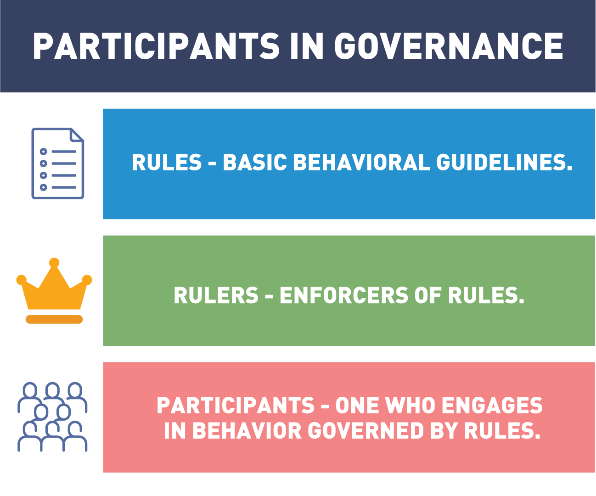
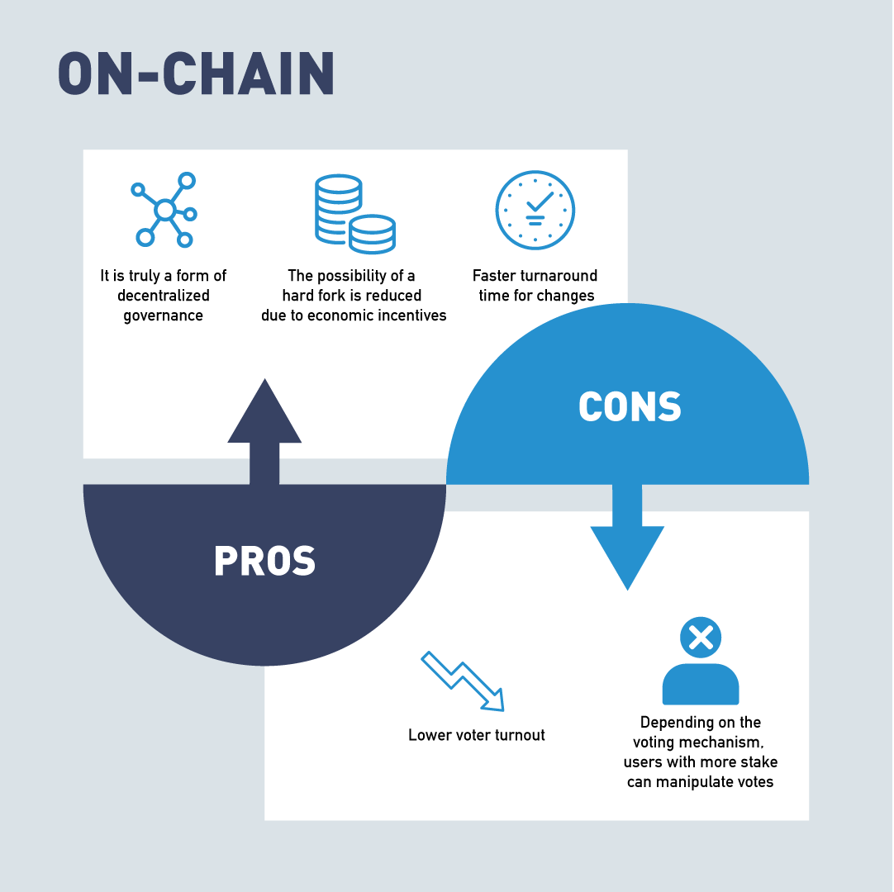
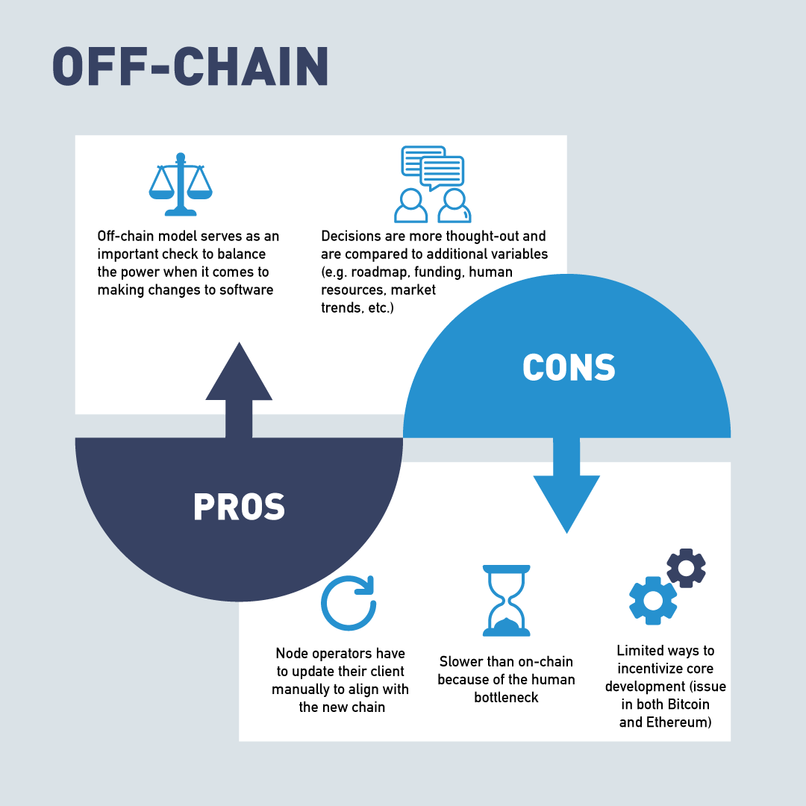
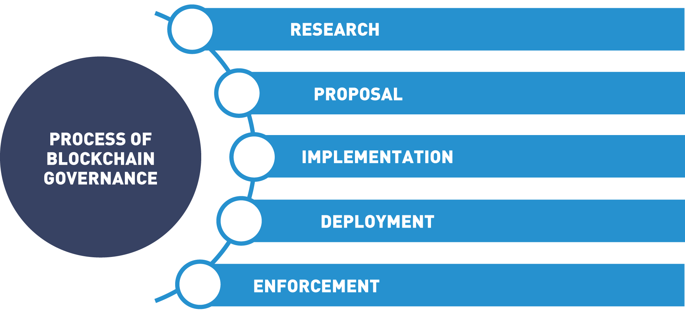

# Chapter 4. Blockchains and Governance

- [Chapter 4. Blockchains and Governance](#chapter-4-blockchains-and-governance)
- [A. Introduction](#a-introduction)
  - [1. Chapter Overview](#1-chapter-overview)
  - [2. Learning Objectives](#2-learning-objectives)
- [B. Open Source Code](#b-open-source-code)
- [C. Governance](#c-governance)
  - [3. Introduction to Governance](#3-introduction-to-governance)
  - [4. Video: Governance Explained](#4-video-governance-explained)
  - [5. Governance Models](#5-governance-models)
  - [6. How Does Blockchain Fit Into Governance?](#6-how-does-blockchain-fit-into-governance)
  - [7. On-Chain vs. Off-Chain Governance](#7-on-chain-vs-off-chain-governance)
  - [8. What Is Blockchain Governance?](#8-what-is-blockchain-governance)
  - [9. Blockchain Governance Strategies](#9-blockchain-governance-strategies)
  - [10. Consortium Governance](#10-consortium-governance)
  - [11. Who Really Governs the Blockchain?](#11-who-really-governs-the-blockchain)
  - [12. Bitcoin Network and Governance](#12-bitcoin-network-and-governance)
  - [13. Bitcoin Improvement Protocols (BIP)](#13-bitcoin-improvement-protocols-bip)
  - [14. Governance in Ethereum](#14-governance-in-ethereum)
  - [15. Ethereum Improvement Proposals EIP’s](#15-ethereum-improvement-proposals-eips)
  - [16. DAO Hard Fork on Ethereum](#16-dao-hard-fork-on-ethereum)
  - [17. Governance in Hyperledger Frameworks](#17-governance-in-hyperledger-frameworks)
  - [18. Governance in Corda](#18-governance-in-corda)
  - [19. Working Groups and Special Interest Groups](#19-working-groups-and-special-interest-groups)
  - [20. Video: Governance With Autonomy - Driverless Cars](#20-video-governance-with-autonomy---driverless-cars)
  - [21. Decentralized Autonomous Organization (DAO)](#21-decentralized-autonomous-organization-dao)
  - [22. Video: Decentralized Autonomous Organization (DAO)](#22-video-decentralized-autonomous-organization-dao)
  - [23. Governance for Enterprise](#23-governance-for-enterprise)
- [D. Identity and Anonymity on Blockchain](#d-identity-and-anonymity-on-blockchain)
- [E. Knowledge Check](#e-knowledge-check)
- [F. Summary](#f-summary)

# A. Introduction

## 1. Chapter Overview
In this section, we will cover blockchain governance. We will start by discussing the cooperative way blockchain companies share the computer code for this technology. We will also explore how this open source environment is fostering new innovations. And then we will examine who really is in charge of blockchains and how the network effect determines the direction a blockchain will take.

Next, we will take a look at how these trustless systems with open interactions are more secure than past systems. Finally, we will dive into the idea of collaboration among parties who don't trust each other and how blockchain technology is changing how the global community can interact. This new form of world wide collaboration can be the key to solving the world's toughest problems.

## 2. Learning Objectives

By the end of this chapter, you should be able to:

- Discuss open source communities and blockchain source code.
- Discuss the different types of governance models and what types of governance are used in public and private blockchains.
- Analyze governance types in a blockchain and determine which are used for the more popular blockchains.
- Analyze examples of Decentralized Autonomous Organizations (DAOs).
- Summarize the advantages and disadvantages of a consortium blockchain.

# B. Open Source Code

# C. Governance

## 3. Introduction to Governance

## 4. Video: Governance Explained

## 5. Governance Models
- Representative democracy
- Direct democracy

## 6. How Does Blockchain Fit Into Governance?

Each and every blockchain ecosystem that has or is being created will need some kind of governance mechanism in place. As discussed in the “[Bitcoin and Blockchain Governance: What It Is and Why It Matters](6.bitcoinmarketjournal.com-Bitcoin%20and%20Blockchain%20Governance%20What%20It%20Is%20and%20Why%20It%20Matters.pdf)” article by Evan Karnoupakis, traditional systems and laws are made and then enforced. When participants (miners, developers, and users) in the network are interacting, ideally they are acting in a way that’s best for the overall group. Being able to build a governance structure in a decentralized (sometimes anonymous, as well) world has proven to be extremely difficult, but this is a problem that many DLT companies are in the midst of solving.

Most governance structures in the blockchain ecosystem are looking to achieve similar goals, such as:

- Protocol changes and technical upgrades.
- Critical bug and vulnerability fixes.
- Using pooled funds for research and development.

## 7. On-Chain vs. Off-Chain Governance

These goals can be achieved through many different methods of governance. When designing a blockchain, choices between on-chain and off-chain governance must be balanced.

-  on chain

In the on-chain governance, rules for instituting changes are encoded into the blockchain protocol. This means that any decision being made is automatically being translated into code (e.g. decisions concerning block size). Developers propose changes through code updates and each node votes on whether to accept or reject the proposed change.

- off chain

On the other hand, as discussed in the Medium article "Revisiting the On-chain Governance vs. Off-chain Governance Discussion",

"Off-chain governance can be seen as decision-making that first takes place on a social level and is later actively encoded into the protocol by the developers. For instance, Bitcoin developers share their improvement proposals (BIPs) through a mailing list, whereas Ethereum collects improvement protocols (EIPs) on GitHub.

Fred Ehrsam (Coinbase co-founder) argues that the Bitcoin governance system resembles the checks and balances system of the US government. Just like the Senate, developers submit a pull request to the community, the miners take the role of the judiciary who decides whether or not proposals are adopted in practice. Lastly, the users are just like citizens in a nation or state and can revolt and switch protocols or sell their tokens".

## 8. What Is Blockchain Governance?

Strategies must include **incentives** so the members want to be good actors in the system. The **efforts of the group** must be coordinated to be productive. Both of these elements are necessary in blockchain governance models.

## 9. Blockchain Governance Strategies

Several different blockchain governance strategies have been proposed and implemented for different blockchains. Let's review some blockchain governance strategies sorted from the fewest to the most members directly involved in the decision

- "Benevolent dictator for life
  - The original creator or lead developer of a cryptocurrency has the final say on all decisions. The simplest governance strategy is nicknamed benevolent dictator for life. In this strategy, the creator of the blockchain is the final authority on all decisions regarding the blockchain (...).
- Core development team
  - A team of the most active developers decides what functionality should or shouldn’t be included. The next step up places control of the blockchain roadmap in the hands of a core development team. This is a strategy commonly used in open source programming projects, where users are able to offer or request features, but developers have the final say on what is or is not included in the official release.
- Open governance
  - The team making governance decisions for the blockchain is chosen by the users of the blockchain. Some blockchains use the open governance method of handling governance of the blockchain. In this system, the team that makes the final technical decisions for a system is selected by the system’s users.
- On-chain governance
  - The rules for how the blockchain operates are stored on-chain in smart contracts with built-in capability and procedures for modifications. A blockchain-specific governance strategy is on-chain governance. In this form of blockchain governance, the rules describing how the blockchain should operate are stored on the blockchain itself. These regulations typically are implemented as smart contracts on the blockchain with built-in methods for users to modify the rules based upon their needs and the needs of the blockchain".
  
## 10. Consortium Governance

Due to blockchains built in trust and collaboration mechanisms, new pathways are opening up for enterprises to work together. A new form of collaboration fostered by blockchain is consortiums. Consortium, as defined by Webster's dictionary, is

"an agreement, combination, or group (as of companies) formed to undertake an enterprise beyond the resources of any one member".

Most enterprise blockchain solutions will be implemented by a "consortium" of enterprises, building one or more applications on top of a "blockchain platform". These consortiums are already forming in many industries to deal with the particular problems of those industries. Alliances in Trade Finance, Carbon Emissions Accounting, Social Impact and Healthcare have working blockchain consortiums solutions.

## 11. Who Really Governs the Blockchain?

Blockchain governance comes down to the users. For a blockchain community to thrive it needs a robust community. Changes to the operation of the blockchain must be accepted by the majority of its users or they will create a new blockchain that does. The process by which changes are made follow these five steps discussed by Pierre Rochard in his article "[Bitcoin Governance](https://nakamotoinstitute.org/mempool/bitcoin-governance/) or [pdf](11.nakamotoinstitute.org-Bitcoin%20Governance.pdf)":

The changes to a blockchain starts with research. Before the problem or situation can be addressed it must be understood. A proposal consists of a problem definition and a proposed solution. Implementation requires a little bit more work as the nodes and user must agree to the change or it can not be enforced.

As explained in the "Blockchain Governance In A Nutshell" article by Demiro Massessi:

"Major changes to a blockchain require a hard fork. A hard fork is a change to the blockchain protocol that makes it incompatible with old clients.

For a hard fork to be successful, users need to agree to follow it. Users can refuse to follow a hard fork, creating a divergent blockchain. The DAO Hard Fork on Ethereum created Ethereum Classic.

Despite the official story of who governs the blockchain, in the end, the users are the ones who really make the final decisions of what will or will not be included in the blockchain. With the huge number of potential options, users can abandon a blockchain that makes changes that they disagree with.

Any major change to a blockchain requires a "hard fork". All this means is that the blockchain protocol has changes that are not backward compatible, so blockchain clients that do not make the switch will not be able to operate on the main blockchain. A soft fork is a change that invalidates previous valid blocks by accepting new blocks, soft forks are backwards compatible. For a hard fork to be successful, users of the blockchain need to make the decision to update their software protocols to incorporate the new changes.

If not all users decide to make the switch after a hard fork, a divergent blockchain can be created. Since the blockchain is a distributed network, the decision to implement a hard fork doesn’t cause the old version of the blockchain to become non-functional. Users who choose not to follow the fork can decide to maintain the old blockchain, fragmenting the blockchain network".

## 12. Bitcoin Network and Governance

As we mentioned in previous sections, Bitcoin uses a Proof of Work model to encourage miners to add blocks to the network. This governs the operations of the blockchain. But what happens when changes need to be made? How do they get implemented? **The Bitcoin community consists of three main players: developers, miners, and users.** None of these participants have the ability to make emergency decisions when unexpected situations occur. Bitcoin uses an off-chain governance model where decisions are balanced by the developers, miners and users. In blockchain, developers must write the code to change the blockchain. Without the consent of the miners and users, the developers have no way of enforcing the change. Miners and users must choose to adopt the new software changes.

## 13. Bitcoin Improvement Protocols (BIP)

When a change to the Bitcoin protocol is needed, developers will share the proposed change with other protocol developers. This improvement sharing could be in the form of an email to the bitcoin-dev mailing list, a formal white paper, and/or a Bitcoin Improvement Proposal (BIP). Code is written and tested that will enact the change. If developers in the community approve the proposals and resulting code, the proposal is put to a vote on chain and the miners decide if the proposal is implemented. This occurs through a hard or soft fork.

This system is not without faults, as can be seen with the SegWit improvement protocol which alters block size. The vision surrounding blockchains deals with decentralization. By implementing the SegWit changes, a change in how the Bitcoin blockchain protocol operates, a central authority was responsible for enacting the change. To many in the community this decision went against the fundamental tenets of blockchains decentralized philosophy.

As a result, the Bitcoin community was torn and the Bitcoin Network **split** into two different chains ****Bitcoin (BTC)** and Bitcoin Classic (BCH)**. The Bitcoin Foundation is set up to educate and promote the Bitcoin Blockchain.

## 14. Governance in Ethereum

Vitalik Buterin first described the concept of Ethereum through a [Whitepaper](https://ethereum.org/en/whitepaper/) (or [pdf1](14.Ethereum%20Whitepaper%20|%20ethereum.org.pdf) [pdf2](14.ethereum.org-Ethereum%20Whitepaper.pdf)) introduced at the Bitcoin Convention in Miami 2014. It was based on the code for Bitcoin, but included a logic engine that could execute smart contracts. By connecting computers using the Ethereum blockchain, computing power is aggregated creating the Ethereum Virtual Machine. Ethereum is not only a functioning blockchain with smart contract capabilities, but a platform for new blockchains to be built upon. The EVM computing does not come free, a GAS price is charged for the GAS needed to perform the transaction’s computations. This GAS fee can change dramatically depending on network conditions as the current price of Ether is part of the calculation.

## 15. Ethereum Improvement Proposals EIP’s

Like Bitcoin, Ethereum's three main players (**developer, miners and users**) must update code to improve on functionality. [Ethereum Improvement Proposals (EIPs)](https://ethereum.org/en/eips/) are standards specifying potential new features or processes for Ethereum. EIPs contain technical specifications for the proposed changes and act as the “source of truth” for the community. A note worth EIP was the code for issuing a token. The [Ethereum Request for Comment, ERC-20](https://ethereum.org/en/developers/docs/standards/tokens/erc-20/) introduced the standards for issuing utility tokens on blockchain based on Ethereum protocols. The **[Beacon Chain](https://ethereum.org/en/upgrades/beacon-chain/)** introduced the Proof of Stake consensus model and the concept of sharding. Sharding is the concept of running parallel side chains to alleviate congestion of the network. The [Berlin Hard Fork](https://www.coindesk.com/tech/2021/04/15/berlin-hard-fork-is-now-live-on-ethereum/) and the [London Fork](https://eips.ethereum.org/EIPS/eip-1559) are improvements to stabilize fees paid to the miners so these fees do not fluctuate with the price of Ether.

Ultimately, Ethereum uses the **benevolent dictator for life** mode of blockchain governance. While user input and input from the development team is welcome for Ethereum, Vitalik Buterin is the final authority on decisions regarding the Ethereum roadmap.

## 16. DAO Hard Fork on Ethereum

One famous example of this type of fragmentation is the DAO hack on the Ethereum network. The DAO was an Ethereum smart contract that completed a record-breaking crowdfunding campaign on the Ethereum network, with all of this value stored within the DAO smart contract. A **flaw** in the smart contract’s code allowed an **attacker** to create another version of the smart contract under their control and siphon off a portion of the DAO contract’s funds, worth roughly **72 million dollars** at the time. After much debate, the Ethereum network decided to implement a hard fork that allowed investors of the DAO to reclaim their stolen Ether.

This was a very contentious decision, because the historical ledger in the blockchain is supposed to be immutable and all transactions are final. Smart contracts are supposed to be their own final authority, so any action that could be performed with a smart contract, including exploiting a programming flaw to drain value from it, is considered fair game. The Ethereum network’s decision to reverse the DAO hack went against the principles of blockchain’s immutability and the supposed self-regulation of smart contracts.

Some of the Ethereum network refused to follow the DAO hard fork, resulting in a divergent blockchain where the DAO hack was successful. This created the **Ethereum Classic** cryptocurrency, which shares the same history as Ethereum up to the DAO hack, but is completely independent after that point.

## 17. Governance in Hyperledger Frameworks

[Hyperledger](https://www.hyperledger.org) was introduced as an open source blockchain project sanctioned by the Linux Foundation. Spearheaded by Brian Behlendorf, its mission is to provide the community with the tools and education to foster distributed ledger technology on an enterprise level. Hyperledger frameworks use an **Open Governance** model to make technical decisions regarding the Hyperledger environment. The Hyperledger [Technical Steering Committee (TSC)](https://www.hyperledger.org/about/leadership) is the final authority for technical decisions in Hyperledger. Each year, the Hyperledger Technical Steering Committee is selected from the Hyperledger environment’s active contributors and maintainers. Contributors and maintainers can submit themselves as potential candidates for the fifteen slots, and the slots are filled based on voting by the same group of contributors and maintainers. This model is designed to allow those with an active role in the Hyperledger development community to have a say in how that community is governed.

## 18. Governance in Corda

[Corda](https://www.corda.net) is an open source blockchain project designed for business. Developed by R3, an enterprise blockchain software firm, in collaboration with over 200 technology and industry partners. The Corda platform was launched in September of 2017. Corda also uses an **Open Governance** model to make technical decisions regarding the future of the blockchain. The Corda Network Governing Body is selected to represent the interests of all users in the Corda network.

## 19. Working Groups and Special Interest Groups

[Enterprise Ethereum Alliance Working Groups](https://entethalliance.org/participate/working_groups/)

[Interest Groups (IGs)](https://entethalliance.org/participate/interest_groups/)

[Hyperledger Wiki](https://wiki.hyperledger.org)

[Government Blockchain Association (GBA)](https://gbaglobal.org)

## 20. Video: Governance With Autonomy - Driverless Cars

The passenger is running late and therefore decides to take advantage of the option to pay an extra fee for an expedited route.
Conceivable solutions to provide this options could include designating a lane on the highway for users paying the premium or sending micropayments to other vehicles in exchange for adjusting their travels to create a clear path for the expedited vehicle.

## 21. Decentralized Autonomous Organization (DAO)

An organization whose operating rules are encoded into a computer program controlled by its members. It is composed of a complex stack of smart contracts that form a decentralized application (Dapp).

In simple terms, a DAO is an organization that runs on a stack of computer programs (called smart contracts in the blockchain world) that are all interconnected to maintain a set of pre-programmed rules that have been previously voted upon by a community. When thinking about regular corporations stripped all the way down to their bare bones, they are basically different groups following rules, responsibilities, and duties given from those sitting at the top of the organization. The bigger they are, the more complex these pieces become. At the moment, a DAO's goal is to automate this complex system piece by piece.

Within each DAO, there is a kind of pooling process for humans to contribute new rules into the system. These rules are then presented to the community and voted upon, based on the DAOs previously created rules. These new rule commitments will need majority agreement (may be different for each DAO) from the community to make this rule real. If this new computer-coded rule is accepted by the community, then it will be placed into the stack of other computer coded rules to improve the overall autonomous organization.

## 22. Video: Decentralized Autonomous Organization (DAO)

in 2008, the world's first fully automated trading system, **Betterment**, went live.
Just six short years later, more than 75% of shares traded on US exchanges were made by fully automated systems.

## 23. Governance for Enterprise

Governance becomes much easier when it’s in a controlled environment, with each member agreeing upon set rules prior to jumping in with everyone else. Governance structures vary by industry and profit vs. non-profit, so there will be no set governance model everyone uses, but there are two we’ve come across in the blockchain space:

- One is including the formation of smaller subgroups to work on specific issues.
- The second is providing several levels of potential engagement, ranging from participation in monthly calls to active technology development.

The point we would like to get across here is that a consortium governance model is currently more efficient than most decentralized blockchains.

# D. Identity and Anonymity on Blockchain

# E. Knowledge Check

# F. Summary