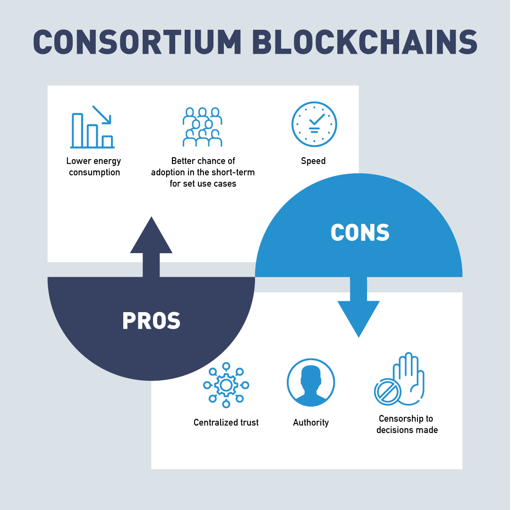

# Chapter 4. Blockchains and Governance

- [Chapter 4. Blockchains and Governance](#chapter-4-blockchains-and-governance)
- [A. Introduction](#a-introduction)
  - [1. Chapter Overview](#1-chapter-overview)
  - [2. Learning Objectives](#2-learning-objectives)
- [B. Open Source Code](#b-open-source-code)
- [C. Governance](#c-governance)
  - [3. Introduction to Governance](#3-introduction-to-governance)
  - [4. Video: Governance Explained](#4-video-governance-explained)
  - [5. Governance Models](#5-governance-models)
  - [6. How Does Blockchain Fit Into Governance?](#6-how-does-blockchain-fit-into-governance)
  - [7. On-Chain vs. Off-Chain Governance](#7-on-chain-vs-off-chain-governance)
  - [8. What Is Blockchain Governance?](#8-what-is-blockchain-governance)
  - [9. Blockchain Governance Strategies](#9-blockchain-governance-strategies)
  - [10. Consortium Governance](#10-consortium-governance)
  - [11. Who Really Governs the Blockchain?](#11-who-really-governs-the-blockchain)
  - [12. Bitcoin Network and Governance](#12-bitcoin-network-and-governance)
  - [13. Bitcoin Improvement Protocols (BIP)](#13-bitcoin-improvement-protocols-bip)
  - [14. Governance in Ethereum](#14-governance-in-ethereum)
  - [15. Ethereum Improvement Proposals EIP’s](#15-ethereum-improvement-proposals-eips)
  - [16. DAO Hard Fork on Ethereum](#16-dao-hard-fork-on-ethereum)
  - [17. Governance in Hyperledger Frameworks](#17-governance-in-hyperledger-frameworks)
  - [18. Governance in Corda](#18-governance-in-corda)
  - [19. Working Groups and Special Interest Groups](#19-working-groups-and-special-interest-groups)
  - [20. Video: Governance With Autonomy - Driverless Cars](#20-video-governance-with-autonomy---driverless-cars)
  - [21. Decentralized Autonomous Organization (DAO)](#21-decentralized-autonomous-organization-dao)
  - [22. Video: Decentralized Autonomous Organization (DAO)](#22-video-decentralized-autonomous-organization-dao)
  - [23. Governance for Enterprise](#23-governance-for-enterprise)
  - [24. Governance for Enterprise: Consortiums](#24-governance-for-enterprise-consortiums)
  - [25. Consortiums: Pros and Cons](#25-consortiums-pros-and-cons)
- [D. Identity and Anonymity on Blockchain](#d-identity-and-anonymity-on-blockchain)
  - [26. Video: Identity on the Blockchain](#26-video-identity-on-the-blockchain)
  - [27. Identity](#27-identity)
  - [28. Video: Anonymity in the Blockchain](#28-video-anonymity-in-the-blockchain)
  - [29. Advanced Blockchain Anonymity Techniques](#29-advanced-blockchain-anonymity-techniques)
  - [30. Specific Anonymity Implementations](#30-specific-anonymity-implementations)
  - [31. Trust in Blockchains](#31-trust-in-blockchains)
  - [32. Establishing Trust in Blockchains](#32-establishing-trust-in-blockchains)
  - [33. What Do Blockchains Really Do?](#33-what-do-blockchains-really-do)
- [E. Knowledge Check](#e-knowledge-check)
- [F. Summary](#f-summary)

# A. Introduction

## 1. Chapter Overview
In this section, we will cover blockchain governance. We will start by discussing the cooperative way blockchain companies share the computer code for this technology. We will also explore how this open source environment is fostering new innovations. And then we will examine who really is in charge of blockchains and how the network effect determines the direction a blockchain will take.

Next, we will take a look at how these trustless systems with open interactions are more secure than past systems. Finally, we will dive into the idea of collaboration among parties who don't trust each other and how blockchain technology is changing how the global community can interact. This new form of world wide collaboration can be the key to solving the world's toughest problems.

## 2. Learning Objectives

By the end of this chapter, you should be able to:

- Discuss open source communities and blockchain source code.
- Discuss the different types of governance models and what types of governance are used in public and private blockchains.
- Analyze governance types in a blockchain and determine which are used for the more popular blockchains.
- Analyze examples of Decentralized Autonomous Organizations (DAOs).
- Summarize the advantages and disadvantages of a consortium blockchain.

# B. Open Source Code

# C. Governance

## 3. Introduction to Governance

## 4. Video: Governance Explained

## 5. Governance Models
- Representative democracy
- Direct democracy

## 6. How Does Blockchain Fit Into Governance?

Each and every blockchain ecosystem that has or is being created will need some kind of governance mechanism in place. As discussed in the “[Bitcoin and Blockchain Governance: What It Is and Why It Matters](6.bitcoinmarketjournal.com-Bitcoin%20and%20Blockchain%20Governance%20What%20It%20Is%20and%20Why%20It%20Matters.pdf)” article by Evan Karnoupakis, traditional systems and laws are made and then enforced. When participants (miners, developers, and users) in the network are interacting, ideally they are acting in a way that’s best for the overall group. Being able to build a governance structure in a decentralized (sometimes anonymous, as well) world has proven to be extremely difficult, but this is a problem that many DLT companies are in the midst of solving.

Most governance structures in the blockchain ecosystem are looking to achieve similar goals, such as:

- Protocol changes and technical upgrades.
- Critical bug and vulnerability fixes.
- Using pooled funds for research and development.

## 7. On-Chain vs. Off-Chain Governance

These goals can be achieved through many different methods of governance. When designing a blockchain, choices between on-chain and off-chain governance must be balanced.

-  on chain

In the on-chain governance, rules for instituting changes are encoded into the blockchain protocol. This means that any decision being made is automatically being translated into code (e.g. decisions concerning block size). Developers propose changes through code updates and each node votes on whether to accept or reject the proposed change.

- off chain

On the other hand, as discussed in the Medium article "Revisiting the On-chain Governance vs. Off-chain Governance Discussion",

"Off-chain governance can be seen as decision-making that first takes place on a social level and is later actively encoded into the protocol by the developers. For instance, Bitcoin developers share their improvement proposals (BIPs) through a mailing list, whereas Ethereum collects improvement protocols (EIPs) on GitHub.

Fred Ehrsam (Coinbase co-founder) argues that the Bitcoin governance system resembles the checks and balances system of the US government. Just like the Senate, developers submit a pull request to the community, the miners take the role of the judiciary who decides whether or not proposals are adopted in practice. Lastly, the users are just like citizens in a nation or state and can revolt and switch protocols or sell their tokens".

## 8. What Is Blockchain Governance?

Strategies must include **incentives** so the members want to be good actors in the system. The **efforts of the group** must be coordinated to be productive. Both of these elements are necessary in blockchain governance models.

## 9. Blockchain Governance Strategies

Several different blockchain governance strategies have been proposed and implemented for different blockchains. Let's review some blockchain governance strategies sorted from the fewest to the most members directly involved in the decision

- "Benevolent dictator for life
  - The original creator or lead developer of a cryptocurrency has the final say on all decisions. The simplest governance strategy is nicknamed benevolent dictator for life. In this strategy, the creator of the blockchain is the final authority on all decisions regarding the blockchain (...).
- Core development team
  - A team of the most active developers decides what functionality should or shouldn’t be included. The next step up places control of the blockchain roadmap in the hands of a core development team. This is a strategy commonly used in open source programming projects, where users are able to offer or request features, but developers have the final say on what is or is not included in the official release.
- Open governance
  - The team making governance decisions for the blockchain is chosen by the users of the blockchain. Some blockchains use the open governance method of handling governance of the blockchain. In this system, the team that makes the final technical decisions for a system is selected by the system’s users.
- On-chain governance
  - The rules for how the blockchain operates are stored on-chain in smart contracts with built-in capability and procedures for modifications. A blockchain-specific governance strategy is on-chain governance. In this form of blockchain governance, the rules describing how the blockchain should operate are stored on the blockchain itself. These regulations typically are implemented as smart contracts on the blockchain with built-in methods for users to modify the rules based upon their needs and the needs of the blockchain".
  
## 10. Consortium Governance

Due to blockchains built in trust and collaboration mechanisms, new pathways are opening up for enterprises to work together. A new form of collaboration fostered by blockchain is consortiums. Consortium, as defined by Webster's dictionary, is

"an agreement, combination, or group (as of companies) formed to undertake an enterprise beyond the resources of any one member".

Most enterprise blockchain solutions will be implemented by a "consortium" of enterprises, building one or more applications on top of a "blockchain platform". These consortiums are already forming in many industries to deal with the particular problems of those industries. Alliances in Trade Finance, Carbon Emissions Accounting, Social Impact and Healthcare have working blockchain consortiums solutions.

## 11. Who Really Governs the Blockchain?

Blockchain governance comes down to the users. For a blockchain community to thrive it needs a robust community. Changes to the operation of the blockchain must be accepted by the majority of its users or they will create a new blockchain that does. The process by which changes are made follow these five steps discussed by Pierre Rochard in his article "[Bitcoin Governance](https://nakamotoinstitute.org/mempool/bitcoin-governance/) or [pdf](11.nakamotoinstitute.org-Bitcoin%20Governance.pdf)":

The changes to a blockchain starts with research. Before the problem or situation can be addressed it must be understood. A proposal consists of a problem definition and a proposed solution. Implementation requires a little bit more work as the nodes and user must agree to the change or it can not be enforced.

As explained in the "Blockchain Governance In A Nutshell" article by Demiro Massessi:

"Major changes to a blockchain require a hard fork. A hard fork is a change to the blockchain protocol that makes it incompatible with old clients.

For a hard fork to be successful, users need to agree to follow it. Users can refuse to follow a hard fork, creating a divergent blockchain. The DAO Hard Fork on Ethereum created Ethereum Classic.

Despite the official story of who governs the blockchain, in the end, the users are the ones who really make the final decisions of what will or will not be included in the blockchain. With the huge number of potential options, users can abandon a blockchain that makes changes that they disagree with.

Any major change to a blockchain requires a "hard fork". All this means is that the blockchain protocol has changes that are not backward compatible, so blockchain clients that do not make the switch will not be able to operate on the main blockchain. A soft fork is a change that invalidates previous valid blocks by accepting new blocks, soft forks are backwards compatible. For a hard fork to be successful, users of the blockchain need to make the decision to update their software protocols to incorporate the new changes.

If not all users decide to make the switch after a hard fork, a divergent blockchain can be created. Since the blockchain is a distributed network, the decision to implement a hard fork doesn’t cause the old version of the blockchain to become non-functional. Users who choose not to follow the fork can decide to maintain the old blockchain, fragmenting the blockchain network".

## 12. Bitcoin Network and Governance

As we mentioned in previous sections, Bitcoin uses a Proof of Work model to encourage miners to add blocks to the network. This governs the operations of the blockchain. But what happens when changes need to be made? How do they get implemented? **The Bitcoin community consists of three main players: developers, miners, and users.** None of these participants have the ability to make emergency decisions when unexpected situations occur. Bitcoin uses an off-chain governance model where decisions are balanced by the developers, miners and users. In blockchain, developers must write the code to change the blockchain. Without the consent of the miners and users, the developers have no way of enforcing the change. Miners and users must choose to adopt the new software changes.

## 13. Bitcoin Improvement Protocols (BIP)

When a change to the Bitcoin protocol is needed, developers will share the proposed change with other protocol developers. This improvement sharing could be in the form of an email to the bitcoin-dev mailing list, a formal white paper, and/or a Bitcoin Improvement Proposal (BIP). Code is written and tested that will enact the change. If developers in the community approve the proposals and resulting code, the proposal is put to a vote on chain and the miners decide if the proposal is implemented. This occurs through a hard or soft fork.

This system is not without faults, as can be seen with the SegWit improvement protocol which alters block size. The vision surrounding blockchains deals with decentralization. By implementing the SegWit changes, a change in how the Bitcoin blockchain protocol operates, a central authority was responsible for enacting the change. To many in the community this decision went against the fundamental tenets of blockchains decentralized philosophy.

As a result, the Bitcoin community was torn and the Bitcoin Network **split** into two different chains ****Bitcoin (BTC)** and Bitcoin Classic (BCH)**. The Bitcoin Foundation is set up to educate and promote the Bitcoin Blockchain.

## 14. Governance in Ethereum

Vitalik Buterin first described the concept of Ethereum through a [Whitepaper](https://ethereum.org/en/whitepaper/) (or [pdf1](14.Ethereum%20Whitepaper%20|%20ethereum.org.pdf) [pdf2](14.ethereum.org-Ethereum%20Whitepaper.pdf)) introduced at the Bitcoin Convention in Miami 2014. It was based on the code for Bitcoin, but included a logic engine that could execute smart contracts. By connecting computers using the Ethereum blockchain, computing power is aggregated creating the Ethereum Virtual Machine. Ethereum is not only a functioning blockchain with smart contract capabilities, but a platform for new blockchains to be built upon. The EVM computing does not come free, a GAS price is charged for the GAS needed to perform the transaction’s computations. This GAS fee can change dramatically depending on network conditions as the current price of Ether is part of the calculation.

## 15. Ethereum Improvement Proposals EIP’s

Like Bitcoin, Ethereum's three main players (**developer, miners and users**) must update code to improve on functionality. [Ethereum Improvement Proposals (EIPs)](https://ethereum.org/en/eips/) are standards specifying potential new features or processes for Ethereum. EIPs contain technical specifications for the proposed changes and act as the “source of truth” for the community. A note worth EIP was the code for issuing a token. The [Ethereum Request for Comment, ERC-20](https://ethereum.org/en/developers/docs/standards/tokens/erc-20/) introduced the standards for issuing utility tokens on blockchain based on Ethereum protocols. The **[Beacon Chain](https://ethereum.org/en/upgrades/beacon-chain/)** introduced the Proof of Stake consensus model and the concept of sharding. Sharding is the concept of running parallel side chains to alleviate congestion of the network. The [Berlin Hard Fork](https://www.coindesk.com/tech/2021/04/15/berlin-hard-fork-is-now-live-on-ethereum/) and the [London Fork](https://eips.ethereum.org/EIPS/eip-1559) are improvements to stabilize fees paid to the miners so these fees do not fluctuate with the price of Ether.

Ultimately, Ethereum uses the **benevolent dictator for life** mode of blockchain governance. While user input and input from the development team is welcome for Ethereum, Vitalik Buterin is the final authority on decisions regarding the Ethereum roadmap.

## 16. DAO Hard Fork on Ethereum

One famous example of this type of fragmentation is the DAO hack on the Ethereum network. The DAO was an Ethereum smart contract that completed a record-breaking crowdfunding campaign on the Ethereum network, with all of this value stored within the DAO smart contract. A **flaw** in the smart contract’s code allowed an **attacker** to create another version of the smart contract under their control and siphon off a portion of the DAO contract’s funds, worth roughly **72 million dollars** at the time. After much debate, the Ethereum network decided to implement a hard fork that allowed investors of the DAO to reclaim their stolen Ether.

This was a very contentious decision, because the historical ledger in the blockchain is supposed to be immutable and all transactions are final. Smart contracts are supposed to be their own final authority, so any action that could be performed with a smart contract, including exploiting a programming flaw to drain value from it, is considered fair game. The Ethereum network’s decision to reverse the DAO hack went against the principles of blockchain’s immutability and the supposed self-regulation of smart contracts.

Some of the Ethereum network refused to follow the DAO hard fork, resulting in a divergent blockchain where the DAO hack was successful. This created the **Ethereum Classic** cryptocurrency, which shares the same history as Ethereum up to the DAO hack, but is completely independent after that point.

## 17. Governance in Hyperledger Frameworks

[Hyperledger](https://www.hyperledger.org) was introduced as an open source blockchain project sanctioned by the Linux Foundation. Spearheaded by Brian Behlendorf, its mission is to provide the community with the tools and education to foster distributed ledger technology on an enterprise level. Hyperledger frameworks use an **Open Governance** model to make technical decisions regarding the Hyperledger environment. The Hyperledger [Technical Steering Committee (TSC)](https://www.hyperledger.org/about/leadership) is the final authority for technical decisions in Hyperledger. Each year, the Hyperledger Technical Steering Committee is selected from the Hyperledger environment’s active contributors and maintainers. Contributors and maintainers can submit themselves as potential candidates for the fifteen slots, and the slots are filled based on voting by the same group of contributors and maintainers. This model is designed to allow those with an active role in the Hyperledger development community to have a say in how that community is governed.

## 18. Governance in Corda

[Corda](https://www.corda.net) is an open source blockchain project designed for business. Developed by R3, an enterprise blockchain software firm, in collaboration with over 200 technology and industry partners. The Corda platform was launched in September of 2017. Corda also uses an **Open Governance** model to make technical decisions regarding the future of the blockchain. The Corda Network Governing Body is selected to represent the interests of all users in the Corda network.

## 19. Working Groups and Special Interest Groups

[Enterprise Ethereum Alliance Working Groups](https://entethalliance.org/participate/working_groups/)

[Interest Groups (IGs)](https://entethalliance.org/participate/interest_groups/)

[Hyperledger Wiki](https://wiki.hyperledger.org)

[Government Blockchain Association (GBA)](https://gbaglobal.org)

## 20. Video: Governance With Autonomy - Driverless Cars

The passenger is running late and therefore decides to take advantage of the option to pay an extra fee for an expedited route.
Conceivable solutions to provide this options could include designating a lane on the highway for users paying the premium or sending micropayments to other vehicles in exchange for adjusting their travels to create a clear path for the expedited vehicle.

## 21. Decentralized Autonomous Organization (DAO)

An organization whose operating rules are encoded into a computer program controlled by its members. It is composed of a complex stack of smart contracts that form a decentralized application (Dapp).

In simple terms, a DAO is an organization that runs on a stack of computer programs (called smart contracts in the blockchain world) that are all interconnected to maintain a set of pre-programmed rules that have been previously voted upon by a community. When thinking about regular corporations stripped all the way down to their bare bones, they are basically different groups following rules, responsibilities, and duties given from those sitting at the top of the organization. The bigger they are, the more complex these pieces become. At the moment, a DAO's goal is to automate this complex system piece by piece.

Within each DAO, there is a kind of pooling process for humans to contribute new rules into the system. These rules are then presented to the community and voted upon, based on the DAOs previously created rules. These new rule commitments will need majority agreement (may be different for each DAO) from the community to make this rule real. If this new computer-coded rule is accepted by the community, then it will be placed into the stack of other computer coded rules to improve the overall autonomous organization.

## 22. Video: Decentralized Autonomous Organization (DAO)

in 2008, the world's first fully automated trading system, **Betterment**, went live.
Just six short years later, more than 75% of shares traded on US exchanges were made by fully automated systems.

## 23. Governance for Enterprise

Governance becomes much easier when it’s in a controlled environment, with each member agreeing upon set rules prior to jumping in with everyone else. Governance structures vary by industry and profit vs. non-profit, so there will be no set governance model everyone uses, but there are two we’ve come across in the blockchain space:

- One is including the formation of smaller subgroups to work on specific issues.
- The second is providing several levels of potential engagement, ranging from participation in monthly calls to active technology development.

The point we would like to get across here is that a consortium governance model is currently more efficient than most decentralized blockchains.

## 24. Governance for Enterprise: Consortiums

These consortium blockchains have historically taken two approaches:

- Business-focused consortia
  - They aim to build and operate blockchain-based business platforms to solve a specific business problem (e.g. Digital Trade Chain – focused on cross-border payments).
- Technology-focused consortia
  - They seek to develop reusable blockchain platforms based on technical standards (e.g. Hyperledger).

## 25. Consortiums: Pros and Cons

# D. Identity and Anonymity on Blockchain

## 26. Video: Identity on the Blockchain

- Napster
  - founded 1999
  - peer to peer digital audio file distribution
  - Napster had a decentralized network architecture, but they maintained the centralized authority.
    - Therefore, the central authority could be attacked and, by taking out the central authority, could effectively control Napster. This is because Napster relied on that mix of centralized control over a decentralized network.
  - This impacted identity because you need an identity to control.

- Torrents
  - Torrents provide a decentralized network with decentralized authority.
  - to manage identity differently.
  - It's also the reason why torrents are still being used today, in spite of the entertainment industry's best efforts to stop it.
  - Why Torrent is not blockchain?
    - Because there's no guarantee that the nodes would do the right thing.
    - Nobody could guarantee that the nodes would cooperate with each other.
    - No incentive, no punish => no trust on transaction being processed correctly
      - blockchain solves this problem
        - It perfectly incentivized how to create a decentralized self-contained network using crypto economics.
        - This is why all public blockchains can operate without an authority.
        - It is also the reason why cryptocurrency is mandatory for a public blockchain, and not needed for a private blockchain.

- blockchain
  - On the blockchain, identity is important.
    - You have to be able to prove that your assets actually belong to you.
    - Incentives, punishments to id
  - for tracking identity and identity information
    - most use public key cryptography 
      - hard math problem
        - e.g. multiplication and factoring
        - exponents and logarithms 
    - famous public key cryptography algorithms
      - RSA 
  - identity 
    - A user's address on the blockchain it's their public key.
    - This has several useful properties.
    - Users do not need to reveal their identity on the blockchain, but they can positively identify themselves,
  - Ethereum
    - a user's identity is managed using a public key or address
  - Hyperledger (Fabric) and Corda 
    - identity is encoded in x.509 certificates, which include the user's public key.
  - Corda, 
    - specifically, certificates can either be 
      - public, which means that they are published to the blockchain,
      - or confidential, meaning that they are only shared with the parties that the owner performs transactions with.

## 27. Identity

Self-sovereign identity and blockchain solutions introduce identity management in a way that can improve a system considered broken. This topic will be examined in the next chapter. In this section, we will cover identity as seen through transactions and how and if you want your identity tied to a transaction.

## 28. Video: Anonymity in the Blockchain

Privacy and anonymity on the blockchain are a crucial part of its success in some applications.

- relationship between a user's keys and a user's actual identity
  - there is nothing about a public key that ties it to its corresponding private key.
    - no way to know the private key from public key
      - calculation from private key to public key is doable
    - private key cannot be tied with a person's real identity
      - if private key stolen, cannot identify the owner actual identity
- privacy
  - blockchain users have a limited amount of built-in privacy.
  - but
    - users' identity could be learned through sifting through the data stored on the blockchain to obtain the metadata
      - Based on the repeated transactions to places like a coffee shop or a market, someone could get an idea of where an individual lives and their habits.
      - For businesses, repeated transactions may indicate business relationships that may lead to a loss of a competitive advantage if leaked.
      - On basic blockchains, anonymity only goes so far.
- enhancements that increase privacy
  - while still allow transactions to be verified and validated and publicly 
  - some mechanisms
    - zero knowledge proofs ZKP
      - to prove your knowledge of a secret without revealing the secret
        - e.g. a colorblind person and two objects identical except for the color
    - stealth addresses
      - use one-time address (impossible to link a transaction to an account) to perform transactions on the blockchain
    - ring signatures
      - a group sign transactions instead of only one member signing them
      - others can only link a transaction to a group but cannot link to a particular member
      - protocol CoinJoin
        - mix several transactions together, 
          - so that it is diffcult to pair senders with recipients
    - Confidential transactions 
      - take advantage of homomorphic encryption,
        - which makes it possible to perform mathematical operations on encrypted data.
        - 同态加密 2009年9月克雷格·金特里（Craig Gentry）
          - 同态加密是一种加密形式，它允许人们对密文进行特定的代数运算得到仍然是加密的结果，将其解密所得到的结果与对明文进行同样的运算结果一样。换言之，这项技术令人们可以在加密的数据中进行诸如检索、比较等操作，得出正确的结果，而在整个处理过程中无需对数据进行解密。其意义在于，真正从根本上解
  - implemation 
    - Etherrum
      - no enhancement
      - still in the level that no one can tie a public key to a real world identity
      - plan to include  ZKP
    - Hyperledge Fabric
      - provides several options for privacy and anonymity.
        - channel
          - At the lowest levels, users can achieve increased anonymity through channels which can further encrypt the data that's stored on the channel using keys only available to members of the channel.
        - private transactions
          - At the next level, Hyperledger Fabric also allows users to perform private transactions.
            - in a private transaction, data is stored on the cloud, but the hash of the data is stored on the blockchain.
            - This allows users to use the blockchain to ensure data authenticity without storing the actual data publicly on the blockchain.
        - ZKP
          - Finally, Hyperledger supports zero knowledge proof, where a prover can demonstrate possession of some data without revealing the data itself.
    - Corda 
      - allows users to perform transactions either as a party or an anonymous party on their blockchain.
      - An anonymous party has the same level of anonymity protection as a basic blockchain, relying on the fact that public keys cannot be tied directly to real-world identities.
      - A party on the Corda blockchain reveals the real-world identity of the user which intentionally sacrifices anonymity for identity validation.

## 29. Advanced Blockchain Anonymity Techniques

The following are only some of the mechanisms developed and implemented in various blockchains:

- Zero-knowledge proofs
  - Zero-knowledge proofs use cryptographic algorithms to allow a user to prove knowledge of a secret without revealing the secret. A prover proves knowledge of a secret without revealing it. New technology referred to as SNARK (Succinct Non-interactive - ARgument of Knowledge) are fine tuning privacy issues on blockchains.
- Stealth addresses
  - Stealth addresses involve using one-time addresses to perform transactions on a blockchain. A stealth address is just a one-time address that makes it impossible to link a transaction to a known account. This prevents the data mining attacks on privacy that we discussed earlier.
- Ring signatures
  - We mentioned previously that transactions are digitally signed. With ring signatures, all that can be determined from a transaction is that a member of a group signed it, but not the particular member.
- CoinJoin
  - The ability to see who is performing transactions with whom is dangerous to user privacy and anonymity. Protocols like CoinJoin mix several transactions together so that it is difficult to pair senders with recipients.
- Confidential transactions
  - Confidential transactions take advantage of homomorphic encryption, which makes it possible to perform mathematical operations on encrypted data. This means that the data contained in a transaction can be hidden from the public, while still allowing the network to verify that the transaction is valid.

## 30. Specific Anonymity Implementations

- Ethereum
  - Ethereum is working on improving the zero-knowledge proofs, mixing and DAPPS (applications developed to improve anonymity) to strengthen privacy. Also ConsenSys, the Enterprise Solutions builder for Ethereum introduced QUORUM, a fork of the Ethereum blockchain which enables users to benefit from the public Ethereum blockchain while enjoying features from a private network. Developed by JPMorgan, it is a permissioned implementation.
- Hyperledger
  - Channels: Subsections of the blockchain that make transactions visible only to members.
  - Private transactions: Hashes of private data are stored to publicly verify it on the blockchain.
  - Zero-knowledge technology: One can demonstrate knowledge of a secret without revealing the secret itself.
- Hyperledger Besu
  - Besu is an Ethereum client that runs on the Ethereum public network, private networks, and test networks such as Rinkeby, Ropsten, and Görli. Hyperledger Besu includes several consensus algorithms including PoW, PoA, and IBFT, and has comprehensive permissioning schemes designed specifically for uses in a consortium environment.
- Corda
  - Parties on the Corda Network can be represented in one of two ways:
  - Party: A public key and name.
  - Anonymous party: Only a public key.

## 31. Trust in Blockchains

Just as there are benefits with blockchain technology, there are also some challenges. Blockchain is a culmination of technologies that have been blended to provide a trustless platform. Expect some challenges and use case justifications taking the old line of business apps to the blockchain.

Let's recap the features of a blockchain that establishes trust:

- Blockchain technology is about storing some kind of data (which are transactions in regards to the Bitcoin blockchain).
- Blockchain is essentially transferring trust from an intermediary to technology.
- Storing data in the blockchain is through cryptographic functions.
- Private key/public key.
- Collaboration through consensus.

## 32. Establishing Trust in Blockchains

All transaction data on a chained block is assumed to be trustworthy.

The users base this trust on the fact that:

- This data has not been tampered with.
- The blockchain is immutable.

## 33. What Do Blockchains Really Do?

Blockchains minimize the amount of **trust** required from any single actor in the system. **They do this by distributing trust among different actors in the blockchain as defined by the consensus protocols.**

Blockchains have a shared ledger that gives us the absolute truth of the state of the system. **It uses mathematics, economics, and game theory to incentivize all parties in the system to reach a “consensus”** (i.e. coming to an agreement on a single state of the ledger).

- Consensus algorithms
  - The blockchain is based on a consensus algorithm where all nodes agree that the transaction is valid.
- Financial transparency
  - Financial transparency can reduce the need for intermediaries.
- Smart contracts
  - Smart contracts reduce the need for accountants, lawyers, bankers, etc., as computer code can replace some basic functions. Trust shifts to technology.
- Trust in technology
  - Trustless blockchains is a transfer of trust to technology from organizations, governments and corporations.
- Confidential transactions
  - Privacy techniques mask details of transactions while still proving they occurred.
- Decentralized ledger
  - The ledger acts as a trust broker when two parties who don’t trust each other want to interact.
- Transparent code
  - Most blockchains are built on open-source software that is transparent, community-driven code that is open for comment.

# E. Knowledge Check

Blockchain governance models resemble:

x Dictatorship
 
x Sole decision making
 
! Democracy
 
x None of the above

The decision process for a Decentralized Autonomous Organization relies on which of the following?

An elected group
 
A select few
 
Popular vote
 
! Smart contracts

# F. Summary

In this chapter, we discussed:

- Open source communities and blockchain source code.
- Governance models for blockchain and who is really in charge.
- How a blockchain is “trustless”.
- Why a trustless system is more secure than a system that requires trust.
- Why anonymity is required in public blockchains.
- How private/public key cryptography provides anonymity