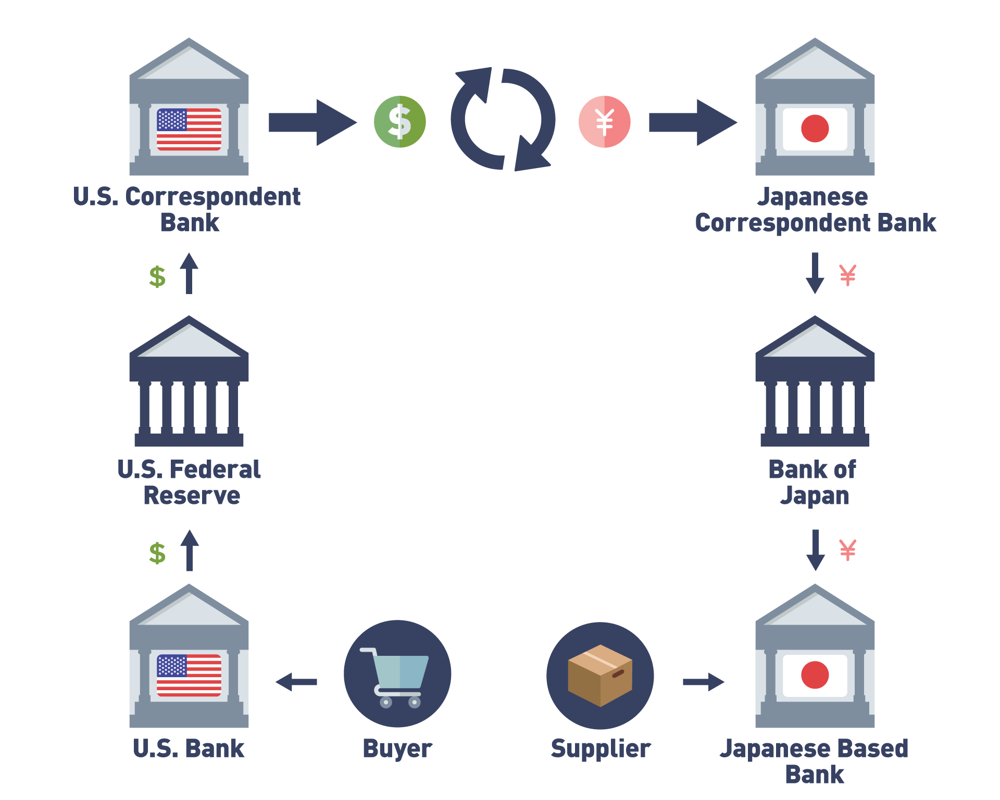
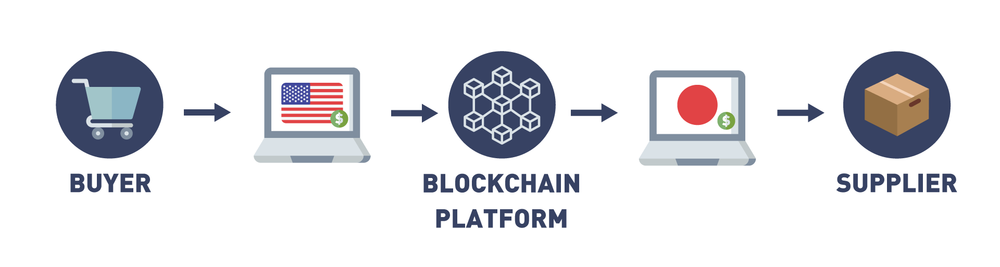
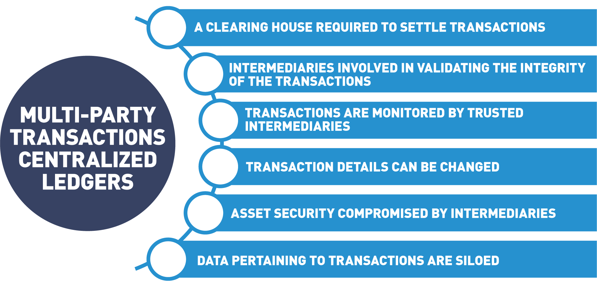
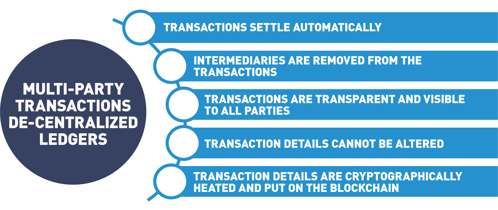
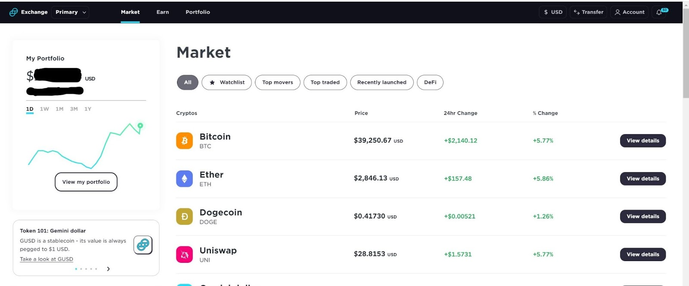
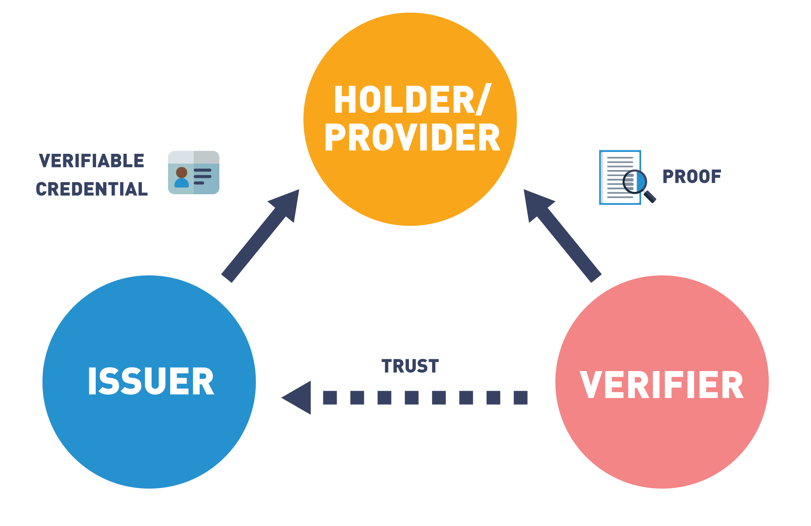
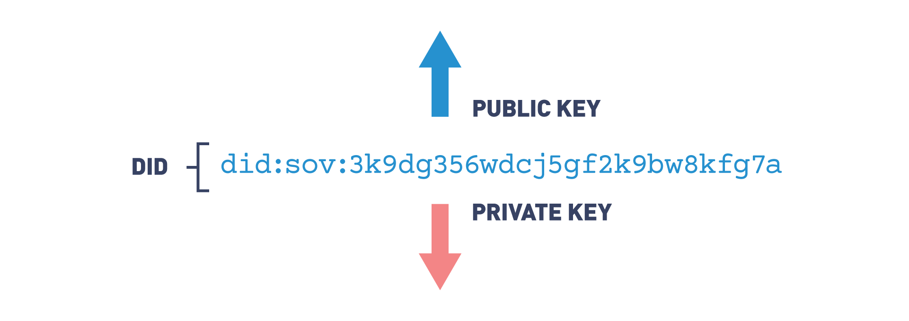
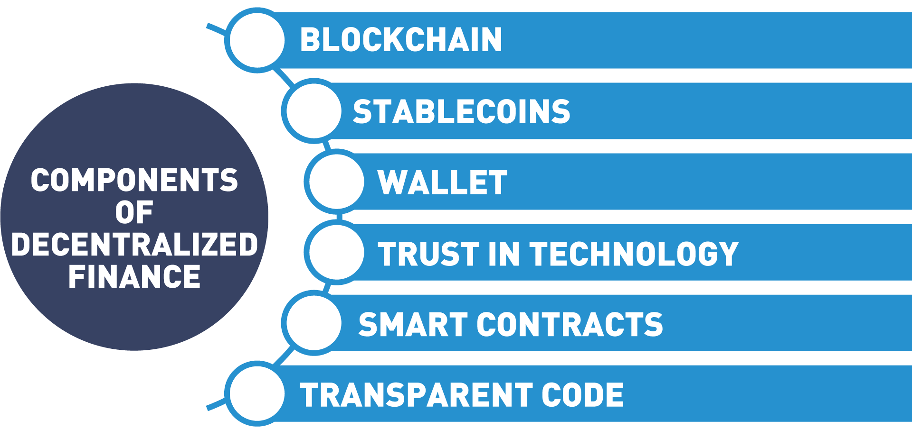
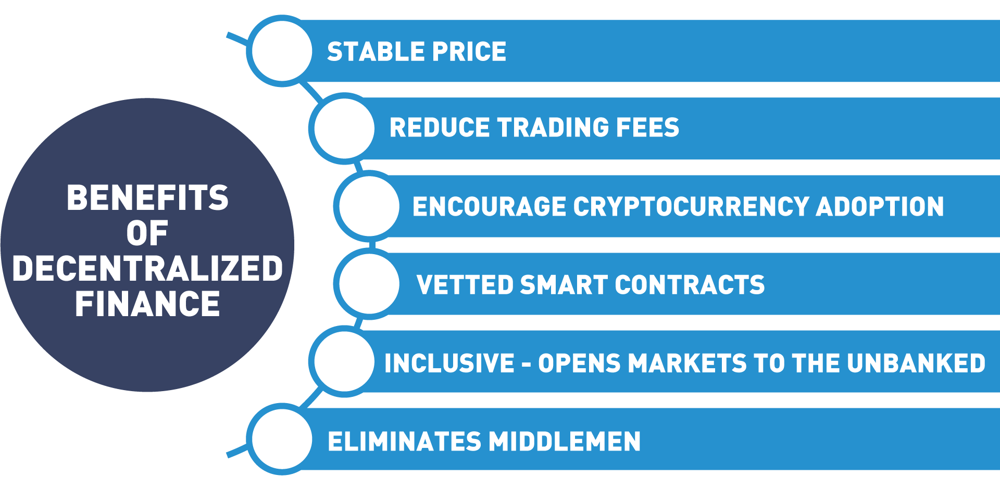

# Chapter 5. Blockchain Problem Solving and Future Trends

- [Chapter 5. Blockchain Problem Solving and Future Trends](#chapter-5-blockchain-problem-solving-and-future-trends)
- [A. Introduction](#a-introduction)
  - [1. Chapter Overview](#1-chapter-overview)
  - [2. Learning Objectives](#2-learning-objectives)
- [B. Problems Blockchain Solves](#b-problems-blockchain-solves)
- [B.1. Immutability](#b1-immutability)
  - [3. Immutability Defined](#3-immutability-defined)
  - [4. Video: Immutability](#4-video-immutability)
  - [5. Traditional Database Immutability Concept](#5-traditional-database-immutability-concept)
  - [6. Blockchain Immutability Concept](#6-blockchain-immutability-concept)
- [B.2. Transparency](#b2-transparency)
  - [7. Transparency Defined](#7-transparency-defined)
- [B.3. Append-Only](#b3-append-only)
  - [8. Traditional CRUD Explanation](#8-traditional-crud-explanation)
  - [9. Blockchain Append-Only](#9-blockchain-append-only)
- [B.4. Autonomy](#b4-autonomy)
  - [10. Autonomy Defined](#10-autonomy-defined)
  - [11. Autonomy: Human Process-Driven Complexity](#11-autonomy-human-process-driven-complexity)
  - [12. Autonomy with Smart Contracts](#12-autonomy-with-smart-contracts)
  - [13. Video: Smart Contracts](#13-video-smart-contracts)
  - [14. Multi-Party Transactions](#14-multi-party-transactions)
  - [15. Blockchain Multi-Party Sync (Removing Middlemen)](#15-blockchain-multi-party-sync-removing-middlemen)
  - [16. Cross Border Payments and Ledgers](#16-cross-border-payments-and-ledgers)
  - [17. Video: Double Spend](#17-video-double-spend)
  - [18. Blockchain Solves The Double Spend Problem](#18-blockchain-solves-the-double-spend-problem)
  - [19. Digital Currency Difficulties](#19-digital-currency-difficulties)
- [C. Digital Currencies](#c-digital-currencies)
  - [20. Digital Currencies Overview](#20-digital-currencies-overview)
  - [21. Cryptocurrency Defined](#21-cryptocurrency-defined)
  - [22. Cryptocurrencies Markets](#22-cryptocurrencies-markets)
- [D. Future Trends](#d-future-trends)
  - [23. Self-Sovereign Identity (SSI)](#23-self-sovereign-identity-ssi)
  - [24. Key Concepts](#24-key-concepts)
  - [25. Decentralized Finance](#25-decentralized-finance)
  - [26. Benefits of Decentralized Finance](#26-benefits-of-decentralized-finance)
  - [27. Central Bank Digital Currencies (CBDC)](#27-central-bank-digital-currencies-cbdc)
  - [28. Types of Central Bank Digital Currencies](#28-types-of-central-bank-digital-currencies)
  - [29. Non-Fungible Tokens (NFTs)](#29-non-fungible-tokens-nfts)
  - [30. Interoperability](#30-interoperability)
- [E. Knowledge Check](#e-knowledge-check)
- [F. Summary](#f-summary)

# A. Introduction

## 1. Chapter Overview

Now that we understand the basics of how blockchain works, Chapter 5 will discuss **the problems blockchain can solve**. We will discuss the concept of immutability and how the append only blockchain brings new trust in shared information. Next, we will take what we learned about smart contracts to see how they are bringing autonomy to systems that previously required human interaction. We will discuss the double-spend issue and how blockchain can solve for it. We will also discuss some popular cryptocurrencies.

Next, we will discuss the **new business trends** blockchain makes possible. First, we will discuss the way we manage our identity and information on the Internet and how decentralized identity solutions rooted on a blockchain are fixing what is broken. Next, we will discuss how blockchain is revolutionizing the financial markets by autonomous market solutions that remove middlemen and open markets up to previously excluded clients. We will also join in the conversation around Central Bank Digital currencies and how enacting blockchain solutions can streamline the government's monetary policies.

Finally, we will discuss the energized world of NFT’s (non-fungible tokens) and how owning unique rights to everything from music, sports collectables and even “captured moments” is turning the collectable world upside down. We end the chapter with a brief discussion on interoperability. In order for this new technology to take hold, blockchains need to be able to communicate and transfer value amongst themselves.

## 2. Learning Objectives

By the end of this chapter, you should be able to:

- Discuss immutability in blockchains.
- Explain what transparency is and review advantages and disadvantages of append-only ledgers.
- Explain how blockchain is looking to be autonomous through smart contracts.
- Discuss how blockchain removes third party intermediaries.
- Discuss how blockchain solves the problem of double spending.
- Distinguish between traditional database vs. blockchain immutability.
- Discuss central bank digital currencies and how they operate.
- Explain identity management on a blockchain.
- Discuss decentralized finance and the implications for the financial industry.
- Examine Central Bank Digital Currencies (CBDC).
- Discuss non-fungible tokens and how they will impact society.
- Examine the importance of interoperability for blockchains.

# B. Problems Blockchain Solves

# B.1. Immutability

## 3. Immutability Defined

Immutability is when something is unable to be changed.

## 4. Video: Immutability

- Immutable
  - As this data is stored in many different locations, changing or removing a copy of the data in one single place, or in a limited number of places poses no threat.
- record who  endorse or agree with

Imagine the new opportunities that arise when organizations can safely and securely share their most critical data with one another,
with the trust that the data they're seeing hasn't been compromised or altered.

## 5. Traditional Database Immutability Concept

- Central can override
  - if there is a central authority, they have all the ability in the world to override that feature.
- Immutability is not new
  - Another point to keep in mind is that immutability has been around for many years, just like the majority of the tech used via blockchain; it is the combination of these that makes it unique.

## 6. Blockchain Immutability Concept

- Review immutable
  - Let's review the aspects of the public blockchain that improve the chances of it being immutable.
- Consensus leads to immutable
  - There are many different variables, but the main one is consensus. In a blockchain, it refers to the logs of transactions which are created by consensus among the chain’s participants. The basic notion is that once a blockchain transaction has received a sufficient level of validation and posted on the chain, it can almost never be replaced, reversed or edited.
- Chance of overriding is 0
  - If all the nodes within the network (Bitcoin specifically) are working to solve a really hard math problem by running many computers simultaneously, the chances of anyone overriding that are slim to zero.

  - But, if someone wanted to undermine the immutability of the Bitcoin blockchain, here’s how they would do it:

    - First, they would install more mining capacity than the rest of the network put together, creating a so-called “51% attack”.
    - Second, instead of openly participating in the mining process, they would mine their own “secret branch", containing whichever transactions they approve and censoring the rest.
    - Finally, when the desired amount of time has passed, they would anonymously broadcast their secret branch to the network.

  - Since the attacker has more mining power than the rest of the network, their branch will contain more Proof of Work than the public one. Every Bitcoin node will therefore switch over since the rules of Bitcoin state that the more difficult branch wins. Any previously confirmed transactions not in the secret branch will be reversed and the Bitcoin they spent could be sent elsewhere. The computing power required to achieve this is enormous and probably only theoretical, but it’s important to consider.

- Example: DAO hack, Ethereum hard fork
  - One other less technical and malicious example would be from the Ethereum hard fork that directly happened after the DAO hack. In this example, the majority of the Ethereum nodes in the network decided to update the software preventing those hackers from withdrawing the cryptocurrency “earned” (stolen). This update could not be enforced, since every Ethereum user controls their own computer. Nonetheless, it was publicly supported by Vitalik Buterin, Ethereum’s founder, as well as many other community leaders. As a result, most users complied, and the blockchain with the new rules kept the name "Ethereum". A minority disagreed with the change and continued the blockchain according to its original rules, earning the title "Ethereum Classic".

# B.2. Transparency

## 7. Transparency Defined

Anything that is see-through, where there is very little fog or obstruction in the way. 

In the context of business/technology, this can be seen as a way of operating that is easy for others to see what actions are being performed.

# B.3. Append-Only

## 8. Traditional CRUD Explanation

- traditional DB
  - client
    - create, read, update, delete
    - In a traditional database, a client can perform four functions on data: create, read, update, delete. 
  - administrator
    - In a traditional database, there is usually an administrator, the authority giver who allows certain known participants in the database to do more than read/create; it allows them to update (change) and/or delete.

  - track  changes
    - Due to the fact that the administrator is controlling who has access and who doesn’t, it’s easier to track these changes and prevent actors from tampering. 
- public blockchain
  - In the public blockchain world, this isn’t necessarily the case.

## 9. Blockchain Append-Only

- full node is its own administrator
  - Within the public blockchain world, every full node on the network is its own administrator, where it can create (e.g. add) and read; this is also known as read/write access (e.g. append-only). These nodes only add more data over time in the form of blocks, but all previous data is permanently stored and cannot be altered.

    - Read: query (e.g. search) and retrieve data from the blockchain.
    - Write: add more data onto the blockchain.

["Blockchains vs. Traditional Databases" ](9.towardsdatascience.com-Blockchains%20versus%20Traditional%20Databases.pdf)

# B.4. Autonomy

## 10. Autonomy Defined

- Autonomy
  - Independence or freedom, the ability to make your own decisions without being controlled by anyone else. 
    - This sense of freedom can be at the macro level of a country or at the micro level of a person.
- matter
  - how much autonomy one truly wants and can handle.

## 11. Autonomy: Human Process-Driven Complexity

- intermediaries - complex
  - solve this complex
    - The blockchain world is looking to solve all of this complexity with autonomy from intermediaries via automated smart contracts. In the traditional world of doing any kind of transaction with another party, there tends to be a lot of administrative paperwork, with third parties intervening every step of the way. Some of this is needed, but most of it becomes wasted time and effort which could be spent elsewhere.
    - Depending on how complex a transaction is between two parties, designated specialists can make the process more efficient. Many players are involved in the process, from contract drafters, signatories, and regulators. If a dispute over the contract occurs, many parties can be involved, including the courts.

    - This complexity can be seen within many areas of life. Take a moment to dissect the backend of certain services or products you use and this concept will become exposed very quickly.

## 12. Autonomy with Smart Contracts

- Smart Contract for Autonomy
  - Autonomy in the blockchain world can be seen from many different angles. We are going to focus solely on smart contracts in this section, due to the amount of autonomy they provide everyone involved. 

  - An example of a smart contract could be,

    - "if this happens before the end of the year, then you pay me, else I pay you".

- smart contact need human/AI/Oracle
  - At the present moment, they can't make decisions without human intervention, or AI, which is a highly debated topic at the moment by many neuroscientists/philosophers. Companies are emerging as reliable Oracles that filter in real world facts to the blockchain. An Oracle is defined as a reliable source of information and blockchain makes that information immutable.

- 3 main attributes that can bring more autonomy to exchanging information between parties
  - Anyone is able to create their own smart contracts without a central authority giving the right to do so
  - These contracts are executed without too much human intervention, and 
  - they’re stored on blockchain technology which provides a sense of permanence. 
  
- smart contract benefits  
  - not only improving our autonomy as individuals or companies, 
  - but shifting wasted resources (middle men/women) toward more impactful work.

## 13. Video: Smart Contracts

- Blockchain 1.0 
  - capturing and recording data, but not acting upon it. 
  - Bitcoin
    - only record
- Blockchain 2.0
  - Ethereum 2015
    - capture data, act upon it as well.
      - implemented by the technology "Smart Contracts"
  - Smart Contract
    - a Smart Contract is some computer code deployed to a blockchain network. 
      - Users can transact with the Smart Contract just as they would another user, except when transacting with a Smart Contract, the rules defined in the code are used to process the transaction. 
    - This advancement now allows blockchain solutions to manage and automate processes, and record their results on a permanent, immutable, secure ledger shared with all relevant parties.

## 14. Multi-Party Transactions

- third party -- most efficient

  - In our current world of transactions, there’s always a third party to assist with connecting the sender and receiver. This has always been the most efficient way to move something from Point A to Point B. 

  - But with a third party making the connection comes the need to trust that they’ll get whatever is being sent in an efficient, economical, and effective way. This trust is open to human and process error. But we’ve discovered through experimentation that certain use cases could be automated via smart contracts.

- cross-border payments
  - One example is cross-border payments. Sending money from one country (border) to another country (different border). The major issue with how this is traditionally done today (e.g. correspondent banking) is that certain transactions end up stopping off at 7–10 different checkpoint banks. This constant stopping is making the money movement more expensive (each bank takes a fee), slower, and less reliable (sometimes it might never make it). This type of transaction is heavily reliant upon third parties to facilitate the movement of information and money.

## 15. Blockchain Multi-Party Sync (Removing Middlemen)

- Blockchain benefits: remove middle men
  - Blockchain technology has been shown to provide many benefits, but one of the most prominent and immediate benefits is removing middlemen (third parties) from a variety of processes. 
- middlemen already removed:
  - There is a long list of examples for middlemen currently being removed, such as:
    - Energy distributors
    - Payment networks (Visa and Mastercard)
    - Content distributors (YouTube, Facebook, Medium, etc.)
    - Central exchanges (NASDAQ, London Stock Exchange, NYSE, etc.)
    - Cloud database providers (AWS, Azure, etc.).
- Blockchain trust
  - How is the blockchain world removing this middleman? The answer is all around trust. Within the public blockchain world, where everyone is theoretically anonymous, there needs to be trust so we’re able to exchange valuable things without the concern of bad actors. Trust is built into the consensus mechanism that we’ve mentioned multiple times throughout this course. This incentivizes all the participants to help secure and validate good actions throughout the network. With that built-in "trustless" trust, we’re able to remove those middlemen that provide no additional value, plus it could potentially increase the efficiency based on which public blockchain is being used.

## 16. Cross Border Payments and Ledgers

- Traditional centralized ledger  -- changable, not safe
  - Traditional centralized ledger systems have weaknesses. Accuracy is dependent on intermediaries who can change details of the centralized ledger. Data derived from the ledger is siloed and misused.
    
- Distributed decentralized ledgers - immutable, secure
  - Distributed decentralized ledgers are not dependent on intermediaries who can manipulate the data. Data is secure and tamper resistant.
    

## 17. Video: Double Spend

Bitcoin was not the first attempt to create a digital currency, but it was the first which
was able to successfully solve a long-standing problem - the "Double Spend" problem.

## 18. Blockchain Solves The Double Spend Problem

Bitcoin was the **first** decentralized protocol to solve this problem and now more protocols are following, such as: 
- Proof of Stake (PoS), 
- Delegated Proof of Stake (DPoS), 
- Directed Acyclic Graphs (DAG) structures, 
- Proof of Authority (PoA), etc.

## 19. Digital Currency Difficulties

- to create digital cash, many failed due to a variety of reasons, such as:
  - adoption
  - security
  - fraud

- digital currency attempts:
  - DigiCash
    - 1983, when David Chaum introduced the idea of digital cash in a research paper 
    - 1992, he founded DigiCash, an electronic cash company, which eventually went bankrupt in 1998 due to adoption (buyout by another financial institution). 
    - Today, David is a leading pioneer of blockchain companies such as Elixxir and Praxxis to provide scalable digital sovereignty.

  - CyberCash in 1994 (failed after the Y2K bug of 2000).
  - E-gold in 1996 (sunk by continuous money laundering, hacking, and extortion).
  - Liberty Reserve in 2006 (shut down in 2013 due to this becoming a great hangout spot for cybercriminals).

# C. Digital Currencies

## 20. Digital Currencies Overview

- Digital currencies
  - Digital currencies are available only in the digital world and not in the physical world. 
- Digital currencies define
  - They can be defined as any currency, money, or money-like asset that is primarily managed, stored or exchanged on computer systems. 
- Examples of digital currencies include 
  - cryptocurrency, 
  - virtual currency and 
  - central bank digital currency.

## 21. Cryptocurrency Defined

According to Investopedia,

"A cryptocurrency, broadly defined, is currency that takes the form of tokens or “coins” and exists on a distributed and decentralized electronic ledger. While a large majority remain completely intangible, some cryptocurrencies have ventured into the physical world by building associations with companies offering traditional payment rails (credit cards and payment processors)".

[10 Important Cryptocurrencies Other Than Bitcoin](21.investopedia.com-10%20Important%20Cryptocurrencies%20Other%20Than%20Bitcoin.pdf)

## 22. Cryptocurrencies Markets 

To break down the crypto markets, let's start with some basic definitions.

- Crypto Wallet

  - A cryptocurrency wallet is an application on your computer or smart phone that connects you to a blockchain where you can trade cryptocurrencies. A Bitcoin wallet allows you to trade Bitcoin, an Ethereum wallet accommodates Ether. You can not send Bitcoin to the Ethereum blockchain, each cryptocurrency must transact on its own blockchain.

- Multi-currency Wallets
  - Some wallets allow you to hold multiple cryptocurrencies in the same application. In these wallets, each cryptocurrency will have its own balance. To initiate a transaction, the application will create a cryptographically secure address (specific for the particular blockchain). This address acts as your account number and lets you send and receive the cryptocurrency.

- Atomic Swaps
  - Additional features in these wallets lets you “swap” one cryptocurrency for another. The application provider acts as the intermediary to secure the transactions from one chain to the other.

- Metamask

  - Metamask is a cryptocurrency wallet used to interact with the Ethereum blockchain and other blockchains issued in accordance with the Ethereum Platform. Tokens issued in accordance with the ERC-20 standard for utility tokens can be stored in a metamask wallet. Metamask not only stores cryptocurrencies but acts as a gateway to blockchain applications. You can access the wallet through a mobile application or a browser extension.

- ConsenSys
  - ConsenSys, spearheaded by Joe Lubin, an early Ethereum programmer, is a software engineering company that helps developers build next-generation networks and enable enterprises to launch more powerful financial infrastructure. Consensys Mesh is a playground for entrepreneurs and programmers to build decentralized platforms and projects, Metamask is just one project to come out of the efforts at Consensys.

- CryptoKittes
  - One example of how the Metamask wallet is used is with the CryptoKittes project. CryptoKitties are one of the first examples of a digital collectible where you own the rights (private keys) to code that represents a unique kitten. A kitten is a set of identifiers built or “bred” by a smart contract to be one of a kind. In order to purchase, view or interact with a digital kitten you must open your Metamask wallet and connect it to the cryptokitties.co website.
  - Kittens purchased on the cryptokitties.co site will be stored in the Metamask wallet associated with your account or can be put up for sale at an NFT marketplace. Any fees or revenue from your kittens will automatically be reflected in your Metamask wallet totals. Cryptokitties are the first example of a non-fungible token which we will cover in the next section.

- Exchanges

  - Cryptocurrency exchanges vary in complexities and user experience.

- Beginners
  - To start off, it is advantageous to deal with a centralized solution to store your cryptocurrency. These larger exchanges act as a bank for your cryptocurrencies. Offering features like loans and staking rewards (rewards for being an active part in a network).They vet the currencies they allow you to trade and store, while controlling the private keys for you, so accessing your currencies is as easy as a username and password. Such examples of these organizations are Coinbase and Gemini. Below you can see a screenshot of the Gemini Custodial Crypto Account Dashboard:
  - 

- Advanced
  - In keeping with the decentralization nature of the cryptocurrency markets, exchanges exist where you are the custodian of your accounts and trading is done from your computer or smartphone. This is where the term Decentralized Finance was born. It gives you the ability to apply smart contracts to govern your trades and access to markets previously only for accredited investors. Such examples of decentralized exchanges are Liquid, SushiSwap and Uniswap. Below is the screenshot of the Liquid Exchange:
  - 
- Hardware Wallets

  - Hardware wallets offer an alternative to storing your cryptocurrency online. These devices plug into a USB port and transfer your private keys (ownership rights to the cryptocurrency) from your “hot wallet” (mobile, computer or web based) to be stored offline. If the device is damaged or lost, so are the cryptocurrencies stored. This is what the ledger wallet looks like:

# D. Future Trends

## 23. Self-Sovereign Identity (SSI)

- Web 1.0 vs 2.0 vs 3.0

    As explained by Drummond Reed,

  - "Web 1.0 used centralized identity; 
  - Web 2.0 graduated to federated identity; now 
  - Web 3.0 is using decentralized digital identity, a model known as "self-sovereign identity" or "SSI" 
    - because now individuals control their own portable digital identity credentials in their own digital wallets—just like we prove our identity with physical credentials from our physical wallets every day. The digital signatures on these credentials use blockchain technology for decentralized public key management. Finally we can have a trust layer for the Internet that doesn't require everyone to rely on centralized authorities".

- SSI
  - The concept of self-sovereign identity (SSI) is based on the idea that the Internet was created without a way to properly deal with identifying participants. 
    - Innovative minds, such as Drummond Reed and Alex Preukscha, have been working on solutions to this problem. 
    - We will start with some key terms taken from the "Self-Sovereign Identity: Decentralized Digital Identity and Verifiable Credentials" book by Reed and Preukscha.

- Internet and Identity
  - Problem 
    - The Internet was designed to identify computers, not users. The result is a tangled web of passwords, and usernames, and siloed data that is bought and sold without our consent. 
  - Blockchain solution
    - With blockchain and cryptographic techniques, solutions are being developed to fix what is broken with identity and the Internet. 
    - W3C
      - The W3C Consortium is an international community where members work together to develop web standards. Led by web inventor and Director Tim Berners-Lee and CEO Jeffrey Jaffe, W3C's mission is to lead the Web to its full potential. W3C is working on standards that can be used to define a new paradigm for the Internet and Identity.

## 24. Key Concepts

- Self-sovereign identity (SSI)

  - SSI is relatively new, having only emerged onto the Internet stage in 2016. At one level, SSI is a set of principles about how identity and personal data control should work across digital networks. At another level, SSI is a set of technologies which build upon core concepts in identity management, distributed computing, blockchain or Distributed Ledger Technology (DLT), and cryptography.

- Verifiable credentials

  - The essence of decentralized identity is transitioning physical identity credentials (birth certificate, driver licenses, passports, college degrees, medical records, etc.) to a digital twin that the individual can possess in a digital wallet.

- Verifier

  - A verifier is the person, organization or computer program granting verification of an assertion. They request proof that a claim or statement about a credential is true.

- Issuers

  - Issuers are the source of credentials—every credential has an issuer. Most issuers are organizations such as government agencies (passports), financial institutions (credit cards), universities (degrees), corporations (employment credentials), NGOs (membership cards), or churches (awards).

- Holders/Provers

  - Providers request verifiable credentials from issuers, hold them in the holder’s digital wallet (below), and present proofs of claims from one or more credentials when requested by verifiers (and approved by the holder). Although we most commonly think of individuals as holders/provers, holders/provers can also be organizations using enterprise wallets, or things in the sense of the Internet of Things (IoT). The trust triangle represents the Trust over IP version of how the new relationship will operate.
  - 

- Decentralized identifiers
  - According to the WC3, [decentralized identifiers (DIDs)](24.DIDComm%20and%20the%20Self-Sovereign%20Internet.pdf) (or [pdf file](24.windley.com-DIDComm%20and%20the%20Self-Sovereign%20Internet.pdf)) are a new type of identifier for verifiable, decentralized digital identity credentials. These new identifiers are designed to enable the controller of a DID to prove control over it and to be implemented independently of any centralized registry, identity provider, or certificate authority. WC3 is working on ways to standardize the format for DIDs.
  - 
  - The DID above is structured to identify what type of credential, the issuer and the cryptographic hash of the credential.

  - The [Sovrin Foundation](https://sovrin.org) and [Everynym](https://www.evernym.com) are leading pioneers in this new emerging sector offering identity solutions in sectors such as Healthcare and Refugee Management.

## 25. Decentralized Finance

- DeFi
  
  According to "[The Complete Beginner's Guide to Decentralized Finance (DeFi)](25.A%20Beginner's%20Guide%20to%20Decentralized%20Finance%20(DeFi)%20%7C%20Binance%20Academy.pdf)" article by Binance Academy, 
    - Decentralized Finance or DeFI refers to a system of financial software that enables financial products to be made available to the public on decentralized blockchains. 
  - New interact
    - As we have learned, the term decentralized and its ramifications will revolutionize how we interact with each other. 
    - These new interactions can have different effects in various sectors. 
    - New interacr in financial
      - In the financial markets, new interactions will dramatically change the current structure by eliminating the need for intermediaries. 
      - Banks, lending institutions, Money Managers, Market Analysts, Hedge Fund Managers, and other positions and functions can now be performed using smart contracts.

  - New platform 
    - With new technology platforms, open source projects are fueled by blockchains, incentive models, stablecoins, smart contracts and self hosted wallets that remove financial middlemen. Users' funds that are pooled together for investment advantages are now managed by a series of smart contracts that execute programmed financial trades instead of a third party.
  - 

## 26. Benefits of Decentralized Finance

Along with the new decentralized financial model come new innovations that have far reaching ramifications. Microloans, smaller loans made from pools of capital, now are available granting access to these financial vehicles to participants previously excluded. For example, in agriculture, farmers are able to secure small loans to help them get crops to market.

Regulating these new financial instruments is proving challenging as government agencies wrestle with controlling currencies that do not recognize borders. And have a steep learning curve. A stable price coupled with the benefits of blockchain, new financial markets are emerging that will change the current financial markets making them more inclusive.

## 27. Central Bank Digital Currencies (CBDC)

- studying how blockchain can improve the way governments handle their central banking systems.

- CBDC
  - Central Bank Digital currencies are a digital form of central bank money that is issued by the central bank as part of its overall monetary policy. 
    - In the Ledger Insights article titled "[IMF Outlines Pros and Cons of Central Bank Digital Currency](27.ledgerinsights.com-IMF%20outlines%20pros%20and%20cons%20of%20Central%20Bank%20Digital%20Currency.pdf)" it is estimated that 80% of central banks are exploring CBDC.

- benefits of Central Bank Digital Currencies include:

  - Transparent monetary policy
    - Due to the distributed ledger technology’s feature of transparency, creating a digital currency will bring clarity to the government's monetary system, where policy can be recorded on the blockchain and remain immutable.
  - Combat money laundering
    - Money laundering is converting illegal funds into legal payments systems. Blockchain can eliminate this practice with a shared ledger that keeps a complete transaction history, making it impossible to erase. Like with all money transfers, certain safeguards are in place to identify wallets or accounts to users. Anti Money Laundering (AML) policies like Know Your Customer (KYC) further ensure citizens are following laws in their countries.
  - Cross-border payments
    - Blockchain technology eliminates middlemen in cross-border payments, reducing transfer fees, and making interactions faster and frictionless while keeping the integrity of the underlying asset.
  - Government efficiency
    - A huge benefit for governments to research CBDC is to overcome existing problems inherent in the existing antiquated systems. By moving to the digital realm, governments can enjoy the cost reductions blockchain offers.
  - Banking the unbanked
    - To be unbanked describes a person who does not have a checking or savings account. Being unbanked puts individuals at an extreme dis-advantage as they do not have access to financial services like loans and usually pay more for check cashing. By creating a digital currency governments can include this market segment, onboarding people with mobile phones.

## 28. Types of Central Bank Digital Currencies

- Wholesale CBDC
  - A wholesale CBCD is a type of currency used by financial institutions to buy and sell financial assets. It would replace real time settlement systems used today.
- Retail CBDC
  - Retail central bank digital currency would be used as a digital twin for fiat currency. Citizens would use it to pay for things, send money and save it.

## 29. Non-Fungible Tokens (NFTs)

- Web 1.0 
  - and how it revolutionized the way exchanged value, looking back it is hard to believe we managed without email. Then came 
- Web 2.0 
  - and our social status and personal information flowed on the net as freely as the air we breathe. 
- Web 3.0 
  - started with blockchain and the transfer of value, the first killer application being Bitcoin.

- What's next?
  - That's where non-fungible tokens come into play and are set to revolutionize art, music, sports and gaming by offering a new kind of digital ownership and the ability to transfer unique value with digital collectables. We first saw a glimpse of this new market with CryptoKitties but let's look deeper into this phenomenon.
- a non-fungible token:

  - "is a unit of data stored on a digital ledger, called blockchain, that certifies a digital asset to be unique and therefore not interchangeable".

- types of non-fungible tokens:

- Digital artwork
  - By guaranteeing uniqueness of a digital item and applying smart contracts to the terms of the sale, artists are now in control of the ownership rights to their work giving control of royalties back to the creator. The New York Times reported art entitled "Everydays – The First 5000 Days", by artist Mike Winkelmann, also known as Beeple, sold for $69.3 million USD in 2021.
- Collectables
  - As we saw with CryptoKitties, non-fungible tokens create unique items. One of the more popular collectables are CryptoPunks, a collection of 10,000 uniquely generated characters each having a unique owner registered on the Ethereum blockchain. A crypto punk, Punk 1651 sold for 78 ETH or $136,850.22 USD.
- Games
  - NFTs can be used to represent assets in computerized games. With the ability to trade assets created in a gaming platform, users and creators of assets in the digital game can trade assets on a third party marketplaces and store them in a wallet where the private keys are controlled by the gamer, taking control away from the game developer.
- Music and film
  - With NFTs, musicians and filmmakers can now tokenize their work where the artist monetizes and profits from their content. When artists release music or film as NFT, they retain control and realize royalties in a more equitable way. Musicians can join in decentralized marketplace such as Mediachain a Ujo to ensure artists are paid fairly, musicians enter into smart contracts that state royalty stipulations without the need of a third party.
- Sports 
  - The sports industry has embraced the idea of NFTs from tokenizing memorable sporting moments to trading card collectables. NBA Top Shots being the leader for creating a marketplace for NBA collectible cards and moments.
- University research 
  - In May 2021, UC Berkeley announced it would auction off NFTs for the patent disclosure for two Nobel Prize-winning inventions dealing with gene editing and Cancer Immunotherapies.

## 30. Interoperability

- Interoperability in blockchains 
  - deals with creating standards so different types of blockchains can communicate with each other.

- Hyperledger Besu
  - If new emerging blockchains can’t communicate with each other, we will have the same issues with siloed data that created frustration with the Internet of Today. As different blockchains take different approaches to interoperability, standards will emerge that will help regulate the industry and help with widespread adoption. Currently Hyperledger and Ethereum are working together on interoperability projects from Hyperledger Besu (to learn more about Hyperledger Besu enroll into Hyperledger Besu Essentials: Creating a Private Blockchain Network (LFS176x)), an open source Ethereum client for enterprise solutions that can be run on the Ethereum public network or on a private permissioned network. Other projects in the Hyperledger labs that deal with interoperability are working on standards that will make it easier for blockchains to talk to each other.

- email interoperability
  - When considering how blockchain interoperability can work, consider email and smartphone. Both of these technologies have the ability to interoperate. Outlook email server can receive email from the Gmail server and Verizon cell phone carriers can transfer and accept calls from T-Mobile. These services would not operate efficiently, if these companies couldn't exchange data. With this in mind, blockchain are developing projects that, like smartphones and emails, will transfer value and information across blockchain seamlessly.

# E. Knowledge Check

# F. Summary

In this chapter, we discussed:

- How some features of blockchain are solving real world problems.
- How immutability is opening up new cooperation models for business.
- How the concept of autonomy will reduce conflict by eliminating human processes.
- New emerging business models as multiparty exchanges, with built in trust, are being developed.
- How the double spend accounting issue is solved with blockchain.
- Future trends in decentralized finance and Central Bank Digital Currencies.
- The importance of interoperability between blockchains.
- Non-fungible tokens (NFTs) and their importance to the blockchain ecosystem.