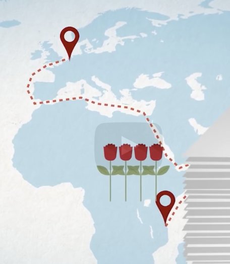
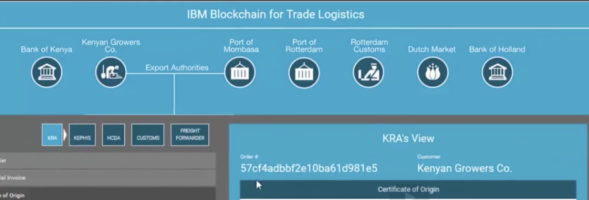
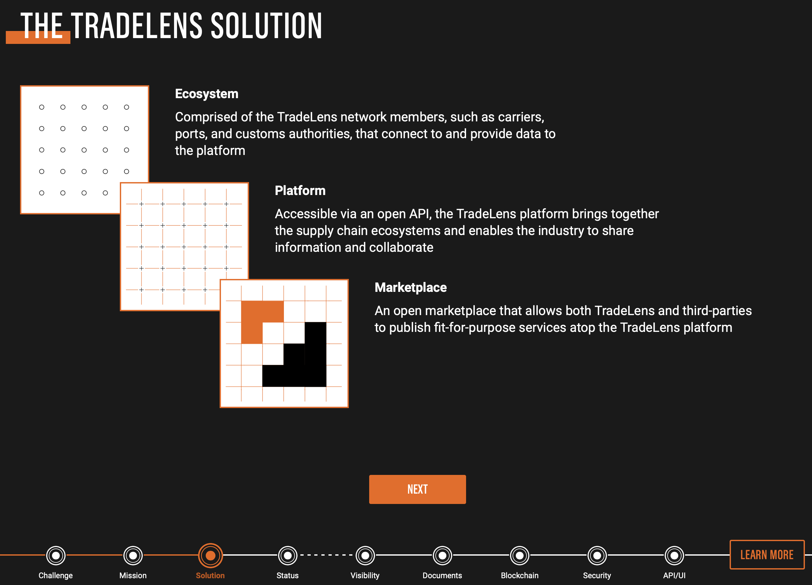

# Chapter 6 Blockchain Use Cases

- [Chapter 6 Blockchain Use Cases](#chapter-6-blockchain-use-cases)
- [A. Introduction](#a-introduction)
  - [1. Chapter Overview](#1-chapter-overview)
  - [2. Learning Objectives](#2-learning-objectives)
- [B. Blockchain in Practice](#b-blockchain-in-practice)
  - [3. Blockchain Use Case Categories](#3-blockchain-use-case-categories)
- [C. Enterprise Solutions](#c-enterprise-solutions)
  - [4. Enterprise Solutions Overview](#4-enterprise-solutions-overview)
    - [5. Global Supply Chains](#5-global-supply-chains)
  - [6. Video: Supply Chain - Maersk](#6-video-supply-chain---maersk)
  - [7. Farm to Table - Walmart](#7-farm-to-table---walmart)
  - [8. Video: Walmart](#8-video-walmart)
  - [9. Healthcare](#9-healthcare)
  - [10. Finance Markets](#10-finance-markets)
- [D. Public Sector Solutions](#d-public-sector-solutions)
  - [11. Public Sector Solutions Overview](#11-public-sector-solutions-overview)
- [E. Social Impact Solutions](#e-social-impact-solutions)
  - [12. Social Impact Solutions Overview](#12-social-impact-solutions-overview)
- [F. Platform Developer’s Solutions](#f-platform-developers-solutions)
- [G. End User Solutions](#g-end-user-solutions)
- [H. Future of Blockchain](#h-future-of-blockchain)
- [I. Knowledge Check](#i-knowledge-check)
- [J. Summary](#j-summary)
  - [Chapter Summary](#chapter-summary)

# A. Introduction

## 1. Chapter Overview

This final section will examine blockchains in action. We will see how blockchain is providing solutions for businesses, governments and social projects. Businesses fueled by blockchain solutions are developing new relationships for more efficient communication and trust among untrusting parties, fostering new business models.

- Governments
- 
Governments are realizing the best way to serve the population is to develop digital identity management systems where individuals hold their credentials and services can instantly be matched to those in need. We will discuss how governments are using blockchain to tackle document and workflow management issues creating better services for their citizens.

- developing countries

Next, we will discuss the impact blockchain is having in developing countries. We will look at examples of how philanthropy is offering new transparency and accountability to charity organizations with massive global benefits.

- new technologies and emerging breakthroughs 

Then, we will devote some time discussing new technologies and emerging breakthroughs developers are building. Either to enhance existing systems or offering services to help users manage blockchains, these new advances are like nothing we have seen before.

- individual's experience

Finally, we will see use cases designed to improve the individual's experience, decentralized gaming platforms and new marketplaces inventing new worlds to interact in. Blockchains are reshaping the way artists and musicians are benefiting from their creativity by having the royalties delivered directly to them, without agents and middlemen.

**Blockchain will be a part of everyone's future.**

## 2. Learning Objectives

By the end of this chapter, you should be able to:

- Discuss blockchain use cases in business enterprises.
- Discuss use cases in the public sector.
- Explain the relevance of blockchain in social impact projects.
- Discuss developing new technologies made possible by blockchain.
- Explain how blockchain will improve the human experience.

# B. Blockchain in Practice
## 3. Blockchain Use Case Categories

Blockchain technology promises sound extremely lofty. Let's take a look at how this technology is improving the way we trust each other and interact. It is showing a new path that will improve the lives of so many. 

We will see how identity management is key (no pun intended) to all the use cases we discuss. For our discussion, we will categorize use cases by who is developing solutions, starting with large enterprise solutions to smartphone and web browser applications powered by blockchain that put control back in the user's hands:

-  Enterprise solutions
   -  Businesses and organizations are implementing blockchain to overcome obstacles in transparency and trust forging new associations with global implications.
-  Public sector solutions
   -  Governments are using blockchain solutions to improve services that they provide to their citizens. Digital identity solutions, central bank digital currencies and transparent workflows are bringing efficiency to the public sector system with an end result that benefits citizens. With that, new laws are needed to regulate this technology.
-  Social impact solutions
   -  Social impact blockchain solutions address social and environmental challenges. Backed by the [17 United Nations Sustainable Development Goals](https://sdgs.un.org/goals) blockchain developers, investors, philanthropists, government agencies and foundations are developing solutions that tackle these global problems.
-  Platform developers' solutions
   -  Blockchain is a new technology constantly improving and changing. Developers are creating standards and new platforms to bring this technology into the mainstream.
-  End user solutions
   -  Everyday solutions emerge that put decentralized blockchains and all the benefits they promise in the hands of individuals from new decentralized marketplaces to new ways to express your music, art, and even let you trade property built inside a game.

# C. Enterprise Solutions

## 4. Enterprise Solutions Overview

Businesses fueled by blockchain solutions are developing new relationships for more efficient communication and workflows, fostering new business models. Problems with how we transact online, to the cost of doing business, are solved with blockchain. Let’s look at an enterprise supply chain solution built with blockchain.

### 5. Global Supply Chains

Supply chain data is not always visible or trusted. In recent times of disruption supply chains matter more than ever. Global supply chain and blockchain are working to secure systems to better handle these disruptions. The Covid pandemic shed light on the frailty of our supply chains which accelerated discussion over blockchain solutions.

Learn more about the collaboration between Maersk and IBM from the ["Digitizing Global Trade with Maersk and IBM"](https://www.ibm.com/blogs/blockchain/2018/01/digitizing-global-trade-maersk-ibm/) (or [pdf](5.Digitizing%20Global%20Trade%20with%20Maersk%20and%20IBM%20IBM%20Supply%20Chain%20and%20Blockchain%20Blog.pdf)) blog post by Michael White.

## 6. Video: Supply Chain - Maersk

[Youtube: IBM and Maersk demo: Cross-border supply chain solution on blockchain](https://www.youtube.com/watch?v=tdhpYQCWnCw&t=110s)

- shipping containers 1956
  - manual, paper-based process
  - today, 90% goods in global trade are carried by shipping
  - supply chain are slowed down by the complexity and huge point-to-point communication
- blockchain
  - IBM and Maersk are addressing this problem with a distributed permission platform accessible by the supply chain ecosystem designed to exchange event data and handle document workflows.
    -  create a global tamperproof system for digitizing trade workflow and tracking shipments end-to-end, eliminating frictions including costly point-to-point communications.
    -  track millions of container journeys per year  
    -  integrate with customs authorities on selected trade lanes.
    -  E.g. from Kenya to the port of Rotterdam, nearly 200 communications. Blockchain has been implemented to create trust and security in the digitized document workflow and improve the efficiency of global supply chains.
       -  
       -  More detials of steps: (see above video)
       -  
- advantages
  - Blockchain provides secure data exchange and a tamperproof repository for these documents and shipping events.
  - This system could significantly reduce delays and fraud saving billions of dollars annually.
  - And, according to the WTO, reducing barriers within the international supply chain could increase worldwide GDP by almost 5% and total trade volume by 15%.

The resulting solution is called [TradeLens](https://www.tradelens.com). You can take the TradeLens tour [here](https://tour.tradelens.com/challenge).

## 7. Farm to Table - Walmart

- Motivation:

  - Farms are complicated ecosystems with many moving parts, careful timing, and seasonal financing structures. However, after the food leaves a farm, it becomes part of a wide-reaching supply chain with a lot of parties. Buyers, sellers, distributors, and grocery chains all want to know where the food is along its journey. You also probably want to know where your food has been before you serve it on your dinner table.

- Solution:
  - The trend toward blockchain agriculture promises to make each step of growing and distributing food simpler. It will offer all parties involved a single source of truth for the agriculture supply chain.

To learn more, read [Hyperledger's case study "How Walmart Brought Unprecedented Transparency to the Food Supply Chain with Hyperledger Fabric".](https://www.hyperledger.org/learn/publications/walmart-case-study) (or [pdf file](7.Hyperledger_CaseStudy_Walmart_Printable_V4.pdf))

## 8. Video: Walmart

[Youtube: Walmart's food safety solution using IBM Food Trust built on the IBM Blockchain Platform](https://www.youtube.com/watch?v=SV0KXBxSoio)

- [IBM's Food Trust Solution](https://www.ibm.com/blockchain/supply-chain) building faith in food supply chains.
  - [IBM Blockchain Services for Supply Chain - Solution Brief](8.1.%20IBM%20Blockchain%20Services%20for%20Supply%20Chain%20Solution%20Brief.pdf)
  - [Forrrester's study on blockchain for supply chain](8.2.Forrester_study_on_blockchain_Emerge%20Stronger%20At%20A%20Time%20Of%20Uncertainty%3A%20Blockchain%20For%20Supply%20Chain.pdf)
- [Paramount's Farm to Table](https://www.farmtoplate.io) creates an inclusive blockchain supply chain solution [from the farm all the way to your plate.](https://www.producebluebook.com/2021/05/21/paramount-software-solutions-launches-farm-to-plate-blockchain-platform/#) 
  - [Paramount Software Solutions launches Farm to Plate blockchain platform](8.3.Paramount%20Software%20Solutions%20launches%20Farm%20to%20Plate%20blockchain%20platform%20%E2%80%93%20Produce%20Blue%20Book.pdf)
  - [Paramount resources](https://www.farmtoplate.io/resources/) Their website has many good resources
    - whitepaper
    - case study/PoC
    - ebook

## 9. Healthcare

Blockchain is transforming the healthcare industry. Some challenges the healthcare industry faces are counterfeit drugs, siloed data, health record management to name a few. Blockchain can solve these issues with interoperability, data integrity and security. Let's look at some solutions.

- Moderna 
  - Moderna uses blockchain to support smart COVID vaccine management. To learn more see "[Moderna, IBM Explore Blockchain Tech, AI to Support 'Smarter' Management of COVID-19 Vaccines](https://www.marketwatch.com/story/moderna-ibm-explore-blockchain-tech-ai-to-support-smarter-management-of-covid-19-vaccines-2021-03-04) (or [pdf](9.1.marketwatch.com-Moderna%20IBM%20explore%20blockchain%20tech%20AI%20to%20support%20smarter%20management%20of%20COVID-19%20vaccines.pdf))" article by Tomi Kilgore.
- SAP  
  - SAP has an existing solution unrelated to blockchain called Advanced Track and Trace for Pharmaceuticals (ATTP) which generates the unique identifiers. To further explore this solution read the following article by Nicky Morris "[SAP Leads Pharma Supply Chain Blockchain](https://www.ledgerinsights.com/sap-pharma-supply-chain/) (or [pdf](9.2.ledgerinsights.com-SAP%20leads%20Pharma%20Supply%20Chain%20blockchain.pdf))" and watch "[Verifying Pharmaceutical Products Using Blockchain](https://www.sap.com/assetdetail/2018/05/c48ee5c2-047d-0010-87a3-c30de2ffd8ff.html)" video.

- Pfizer
  - Pfizer has been using blockchain in transparent clinical trials. You can learn more about this project by reading the following blog post, "Clinical Trial Data Should Be Accessible and Transparent".

## 10. Finance Markets

Reduction of settlement times will improve the flow of money through fintech companies.

Swiss Exchange, SIX has a solution that solves the issue in the trade markets of long settlement times. The new blockchain platform runs parallel to the existing SIX platform, which involves three steps to complete a trade, often over several days. Two of those steps vanish in a blockchain distributed ledger, meaning a transaction can be completed in fractions of a second.

Trade finance is showing promise for blockchain solutions in letter of credits by making available financial mechanisms previously excluded for most people. In a paper from Andrea Frosinini, "Reshaping Trade Finance: Towards a “New” Letter of Credit", he supplied trade finance paired with blockchain that provides delivery and payment assurance to buyers and sellers, reducing operation and transactional cost and opening up market opportunities.

Voltron Trade Finance was co-founded by eight member banks including Bangkok Bank, BNP Paribas, CTBC, HSBC, ING, Natwest, SEB and Standard Chartered. The consortium has since grown to more than 50 banks and corporations. The platform is built on Corda blockchain, it solves the problem that most letters of credit are based on paper and take 5 to 10 days. By using blockchain technology, the letters of credit may be efficiently transacted in less than 24 hours. You can learn more about Voltron from the following two articles "Blockchain Based Letter of Credit Processed by HSBC on Voltron Trade Finance Platform" (by JD Alois) and "Trade Finance Solution Voltron Launches Open Platform on Corda Blockchain".

# D. Public Sector Solutions

## 11. Public Sector Solutions Overview

Blockchain benefits of security, efficiency and speed have government leaders research the far reaching implications that will improve lives and accelerate global blockchain solutions. Public sector can be categorized by, Public Administration, Public Service, Land and Community, and Government. According to a presentation by Bobbi Muscara, Saptarshi Choudhury and Sean O’Kelly, "Re-thinking Public Sector through Blockchain", all blockchain public sector project must consider in the design these four factors:

- Identity management for Governments
- Interactions (highly regulated transactions)
- Regulations
- Governance

One solution that we have already mentioned in Chapter 1 is Smart Dubai. Its goal is to become the happiest city on Earth. Watch these additional resources to learn more about the Smart Dubai initiative, "Smart Dubai's Paperless Strategy" and "Happy Cities Forum 2019".

Dutch Blockchain Coalition established three pillars of society working together to build a blockchain future:

Developing blockchain building blocks - digital identities
Realizing the conditions for utilizing blockchain
Developing and realizing the Human Capital Agenda
 

Wyoming has now enacted a total of 13 blockchain-enabling laws, making it the only US state to provide a comprehensive, welcoming legal framework that enables blockchain technology to flourish, both for individuals and companies. This effort was led by Caitlin Long.

# E. Social Impact Solutions

## 12. Social Impact Solutions Overview

The Blockchain for Social Impact Coalition (BSIC) is a not-for-profit organization that incubates, develops, and collaborates on blockchain products and solutions that can address social and environmental challenges across the United Nations Sustainable Development Goals. The aim is to inspire, federate, and create bridges between NGOs, and government agencies, foundations, impact investors, philanthropists and technologists.

 

Blockchain for Social Impacy

 

According to the "7 Ways Blockchain Can Be Used for Social Good" article by Kayla Matthews, areas that are seeing blockchain social impact projects are:

Philanthropy and remittances
Financial empowerment
Identity and land rights
Governance and democracy
Supply chain and environmental protections
 

Kiva logo

 

More than 1.7 billion people around the world are unbanked and can’t access the financial services they need. Kiva is an international nonprofit, founded in 2005 in San Francisco, with a mission to expand financial access to help underserved communities thrive. Kiva accomplishes this by crowdfunding loans and unlocking capital for the underserved, improving the quality and cost of financial services, and addressing the underlying barriers to financial access around the world. Through Kiva's work, students can pay for tuition, women can start businesses, farmers are able to invest in equipment and families can afford needed emergency care.

 

Kiva - how it works

 
 
# F. Platform Developer’s Solutions

# G. End User Solutions

# H. Future of Blockchain

Video: What Is the Future of Blockchain?

# I. Knowledge Check

# J. Summary

## Chapter Summary

In this chapter, we discussed:

- Blockchain use cases in an enterprise environment.
- Public sector and how blockchain is important in shaping citizens' futures.
- The relevance of blockchain in social impact projects.
- Developing new blockchain platforms emerging as the ecosystem evolves.
- Blockchain and how it will improve human experience.
