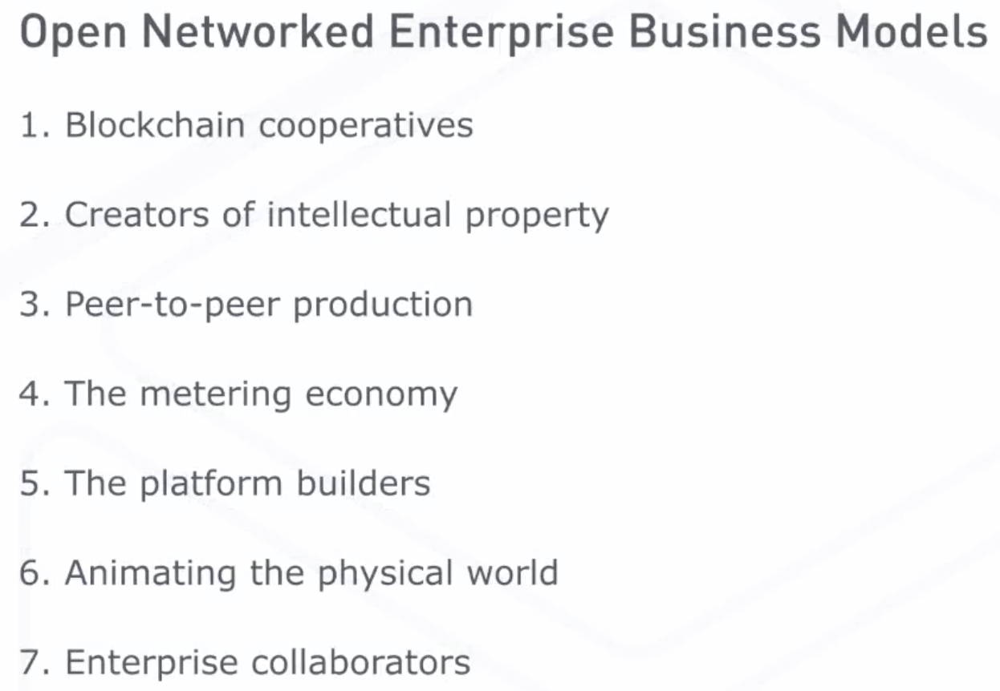

# Module 2 Distributed Business Entities

- [Module 2 Distributed Business Entities](#module-2-distributed-business-entities)
- [2.1 Distributed Business Entities](#21-distributed-business-entities)
  - [2.1.1 Module 2 Overview](#211-module-2-overview)
  - [2.1.2 Distributed Business Entities](#212-distributed-business-entities)
  - [2.1.3 The DAO: A Cautionary Tale](#213-the-dao-a-cautionary-tale)
  - [2.1.4 Read - Distributed Business Entities](#214-read---distributed-business-entities)
- [2.2 New Business Models](#22-new-business-models)
  - [2.2.1 New Business Models Part 1](#221-new-business-models-part-1)
  - [2.2.3 New Business Models Part 2](#223-new-business-models-part-2)
- [2.3 DApps](#23-dapps)
- [2.4 Strategic Approaches to Intellectual Property](#24-strategic-approaches-to-intellectual-property)
- [2.5 Module 2 Review & Evaluation](#25-module-2-review--evaluation)

# 2.1 Distributed Business Entities

## 2.1.1 Module 2 Overview

- how blockchain technology can affect current business models.

- Imagine what we can do with smart contracts, peer to peer payments systems, and digital platforms with built-in trust.

- define terms like the distributed application also known as a DApp

- differences between an autonomous agent and open networked enterprise and a distributed autonomous enterprise.

- the cautionary tale of the DAO
  - This was an investment fund that did some extraordinary things but ultimately **failed**.
  - It's an example of what can go wrong with the Smart Contract and the importance of effective blockchain governance.

- describe seven business models for open networked enterprises and how blockchain technology could improve each of these models. 

- identify some approaches to managing intellectual property using blockchain. 

- how blockchain based platforms can help distribute ownership of wealth. 
  - They can encourage innovation and provide new sources of capital for creators. 

## 2.1.2 Distributed Business Entities

New forms of business
- the new and very radical and very distributed forms of businesses that could be made possible by blockchain technology.
- These types of businesses need little or no traditional managers to create value for customers and owners. 
  - Millions of people could collaborate inventors like these and share in their profits. The result will distribute wealth to many instead of keeping it for the few at the top of a hierarchy.

how this could work

- Smart contracts 
  - can go from the simple to the complex. 
    - A Distributed Autonomous Enterprise has a high degree of automation and a high degree of complexity.
    - It consists of a set of autonomous agents that work together to create a suite of services—buying what they need, hiring or acquiring resources, and adapting to markets in real time.
  - simple
    - Simple contracts involve few or no people and only one exchange of value. 
      - Remember the soda machine. 
  - complex
    - Complex contracts call on more people and involve many exchanges making firms resemble networks. 
      - We call these open networked enterprises ONE.
      - ONE 
        - These open networked enterprises are good at coordinating resources anywhere in the world.
        - Companies could use smart contracts to program low-cost, self-enforcing agreements with new suppliers and partners. 
          - search
            - An automobile company could use blockchain search tools to check the trustworthiness of a distant maker parts
          - supply chain 
            - Expand this scenario to include finding a supply chain partner. Needs steel from China or rubber from Malaysia or maybe glass from Wichita, Kansas, no problem. 
          - house clearing 
            - Decentralized online clearing houses operating as distributed applications for each commodity will help you book the price quality and delivery dates with a few flexible months. You could have a detailed record of transactions showing exactly how companies lived up to their commitments. You could schedule goods to show up just in time, no warehouse required.
    - autonomous agents (blockchain meets AI)
      - Create smart contracts as autonomous agents, make them super smart having machine learning built into them, and pursuing our goals and making decisions on our behalf. 
      -  This is where blockchain meets artificial intelligence. 
         -  Artificial intelligence is not going to run on some massive supercomputer centralized in the world somewhere, it will be distributed in autonomous agents running on blockchains.
            -  magine a piece of software capable of learning and adapting roaming on this platform with its own wallet.
            -  It can purchase resources like electricity or power or computing processing power, while selling services to other entities. 
      - The software is an autonomous agent in that it can take end data from its environment and act on that data independently. 
      - The autonomous agents are more than just computer programs. They can modify how they do their work over time. 
        - virus
          - A good example of a bad autonomous agent is a computer virus. 
            - It has a single function to copy itself from machine to machine. 
            - Unleashing a virus on a blockchain could be difficult. 
              - It might have to pay other parties to interact with it, and the network would quickly identify its public key, crash its reputation score or not validate its transactions
      - More complex agents can make more complex transactions. They could acquire resources or produce value for their owner.
        - They could acquire resources or produce value for their owner. 
          - a cloud computing service 
            - renting servers from specific providers, 
            - an autonomous agent might figure out how to make a deal with any provider.
            - A more intelligent agent, an artificially intelligent agent could upgrade its own software adapting itself to new models like offering to pay users for the rental of their unused computers. It can begin to do things that it wasn't programmed to do. 
    - distributed autonomous enterprise DAE
      - form new busniess models
        - In the future, autonomous agents will collaborate forming all kinds of new business models, in what we're calling a distributed autonomous enterprise. 
          - Imagine a set of autonomous agents cooperating in a complex blockchain based ecosystem. 
            - They could be coded according to a clear mission statement and operating rules. 
            - People will give these agents computing power and capital. 
            - Together they'll create a suite of services and sell those services to other devices or to humans, or to human organizations. 
            - They'll buy what they need, hire or require resources like manufacturing or marketing resources, could be equipment or people or services, and they'll adapt in real time. 
            - This would be the ultimate distributed organization
              - Ultimately, it could have millions of shareholders who participated in a crowd funding campaign to create it. The shareholders having crafted the mission statement would vote to govern the entity, much of the day-to-day decision-making could be programmed. In theory, this entity could run without traditional managers or managers of any human kind. There would be no overpaid CEO or bloated bureaucracy. There would be no what's called moral hazard where managers do things that are not in the interest of the shareholders and stakeholders of a corporation. There would be no office politics, no red tape. Any human employees or partners would be paid under smart contracts. Smart contracts would run according to the best management practices. People would always know what they're supposed to be doing and have clear performance metrics which would be transparent. The enterprise would be able to apply customer feedback more quickly based on logic. Shareholders would get their share of profits based on real-time accounting and the rules of the crowdfunding campaign. It could be quarterly dividends or it could be hourly dividends.
ConsenSys
- have already issued shares in their firms using tokens in initial coin offerings. You could legally record the ownership of private corporations and transfer those shares to other people on a blockchain.
  - imagine an initial coin offering on a massive scale with a 100 million shareholders each contributing a few pennies. Investors at the bottom of the pyramid could own shares of a wealth creating venture anywhere in the world.
- no executives
  - In theory, we could design a corporation without executives, just shareholders, money, and software. 
    - Code and algorithms could replace the executive board with shareholders in control. 
    - entrepreneurs are already writing code in languages like Solidity and Script to perform business functions
    - Innovators are using code to give multi-signature control over funds, and people are buying equity into blockchain startups through blockchain-based crowdfunding campaigns as they're called ICOs.
    - DApps are already giving away two autonomous agents. 
    - The wallet for this distributed autonomous enterprise could require thousands of shareholders sign off on important transactions. 
  - challenges
    - There needs to be mechanisms to quickly achieve consensus, and we'd need mechanisms to determine legal liability for company actions, for someone who's contributed 10,000 of a vote. 
    - Could there be self-propagating criminal or terrorist organizations on a block-chain? Computer scientists Andreas Antonopoulos is in concern. He believes the network will manage the danger and deliver enormous benefits to society.

## 2.1.3 The DAO: A Cautionary Tale

- what could go wrong with smart contract
- what it means for effective blockchain governance

Startup Slock.it story:
- DAO, Decentralized Autonomous Organization
  - was in essence a decentralized investment fund. 
  - Its developers promised that it would operate with the iron will of unstoppable code.
- Child DAO
  - Users could purchase DAO tokens by sending ether to the DAO Smart contract, then token holders could vote on which projects to fund out of the proposals that were submitted. 
  - Token holders would get a share of the DAO's holdings. 
  - Anyone who disagreed with the funding decision could trigger a split function, moving their funds into a new child DAO. 
  - Curators
    - A group of prominent members of the ethereum community volunteer to serve as curators. Their job was vetting submissions, testing the code, and rejecting flawed or fraudulent proposals.
    - Curator problem
      - Some token holders thought the curators just audit the code of the chosen Smart contracts and verify the identities of the people behind them. 
      - Others thought they should be more proactive to promote the DAO success. 
      - The voting process itself was flawed and some curators called for moratorium to adjust the problem.
- Attack
  - However, there turned out to be a even more serious flaw in the DAO code, and ultimately, it would lead to the DAO's demise. 
  - An attacker used the flaw to drain funds by calling on the split function available to token holders. 
    - The attacker was able to, in essence, withdraw funds over and over without updating the account balance held in the DAO. 
    - The attacker funneled 漏斗 a third of the ether raised into a **child DAO**, where it had to sit for three weeks per the terms of the DAO. 
    - This was big money. The DAO at its peak had raised a $165 million in US dollar equivalent. The attack was spotted almost at once, but there was no way to stop it. 3.6 million ether was drained in a few hours. Almost a sixth of the total amount of ether available in the entire ethereum network at the time. 
- Respond
  - The ethereum community had to decide how to respond. 
    - They can do nothing and let the attacker keep the funds or they could change the protocol. 
    - The clock was ticking. In 21 days retrieving the funds would be impossible. 
  - fixes
    - Ethereum developers had two possible fixes, both tough choices. 
    - One was a **Soft fork**. Blacklisting the child DAO, so the funds could never be spent. 
      - The Soft fork was considered a form of transaction **censorship**, and a security review showed it would create a new **vulnerability**. 
    - The other was a **Hard fork**, transferring the stolen ether into a new withdrawal contract where token holders could claim their funds. 
      - So Hard fork was really the only solution, but it meant **admitting** the ethereum blockchain could be **altered** or appended. Developers, we need to convince a majority of the mining power on the network to install this new version. 
    - Both fixes were controversial.
- Ethereum Classic
  - The hope was that everyone would switch to this new protocol and leave the old one to die out. 
  - But there were dissenters. There were those who believed in the principle of **immutability**. 
    - They refused to move to the new ethereum. 
    - They argued only the unaltered blockchain was legitimate. 
  - So the ethereum blockchain split in two in its first year of existence, with significant mining power staying on to form what is now known as a **Ethereum Classic**. 

What can we learn from this? 
- effective blockchain governance requires both on-chain and off-chain mechanisms. 
  - The DAO showed the limitations of on-chain governance. Managed only by the rules coded into the network, and the Smart contracts that were running on top of it. 
  - People also influence its operation off-chain on discussion boards such as on Reddit. It took a combination of these efforts to address the DAO attack. 
- **The automation within the DAO couldn't replace the human side of governance**. Developers will introduce **changes** to a blockchain protocol to improve the networks function or to fix technical issues.
  - No wrong action:
    - DAO operated according to Smart contract code on the ethereum blockchain. The token holders and curators made the decision about the actions the DAO could take.
- But some updates have been motivated not by technical reasons but by economic ones. **Whether these interventions are legitimate**, still in question in the community. 

Another bug:
- Flaw:
  - Somebody exploited a flaw in the code running parodies multi-signature contracts freezing, at the time, hundreds of millions of dollars worth of ether in broken wallets. 
- Solve: 
  - There's no way to recover the funds without another **Hard fork**.
  - The consensus of the whole of ethereum network is necessary to make another protocol change.

Re-think blockchain
- These incidents force us to rethink blockchain governance.
- Internal on-chain governance is not enough. 
  - We can set specific rules and Smart contract code, but we can't guarantee that these rules will execute as intended, and events could make the rules obsolete. 
- So a mechanism is needed to **update a blockchain protocol**, and stake holders decide that it must be done. 
  - Both the bitcoin and ethereum communities created a series of procedures for members to follow. But they've been criticized for being too slow in for giving power to a small group of developers who decide which options to make available to the broader community. 
- There's also the question of **external regulation**. 
  - The DAO attack got the attention of regulators and lawyers. 
    - Who was liable for any wrongdoing caused by the DAO? 
    - The US Securities and Exchange Commission concluded the DAO had likely issued securities without a license.
  - Many jurisdictions have powerful means to enforce laws and regulations. 
    - People must comply with court orders or face seizure of their assets or even jail time. 
    - But the governance of a blockchain can't rely on these external mechanisms alone. 
    - A judge might order changes to a Smart contract to meet legal requirements or to right a wrong. 
    - The developers within the court's jurisdiction might be forced to comply. 
    - But the Smart contract would go on so long as a majority of miners in the blockchain network refuse to accept this fork.

## 2.1.4 Read - Distributed Business Entities

# 2.2 New Business Models

2 blockchain based business models

## 2.2.1 New Business Models Part 1

distributed models will disrupt centralized ones. 
- Why? 
  - because they innovate better, 
  - they create value at lower cost, and 
  - producers can share in the wealth. 

4 examples (total 7):
- 1 blockchain cooperative
  - It's formed by people coming together to meet common needs. 
    - **sharing economy** companies are large scale service aggregators and distributors
      - they aggregate services and they round up suppliers with excess capacity on a centralized platform. Then they resell them collecting fees, and creating valuable data about both sides of the exchange, the suppliers and the consumers. 
        - cars, lawn equipment, vacant rooms, handyman skills. 
        - local small businesses
        - Uber, Airbnb
        - Airbnb - hotels, 
        - Lyft and Uber - taxis and limousines. 
        - Zipcar hourly rates - rental car companies 
  - But blockchain technology can **displace** some of the matching and accounting functions performed by platforms like Uber. 
    - blockchain Airbnb, BAirbnb or 
    - blockchain Uber, call that one SUber or Blockchain Task Rubber. 
    - This is an opportunity to create a **true sharing economy**, where individuals and organizations work together as a cooperative and receive most of the value that they create.
- 2 for creators of intellectual property
  - don't get paid fairly.
    - Writers, musicians, artists, scientists, engineers. Other creators often don't get paid fairly. 
    - Publishers, record labels, art galleries, universities, and corporations have acquired these inventors to sign away their intellectual property rights as part of their employment deal. 
  - Blockchain can help.
    - Verisart
      - Consider the appraisal of fine art. The annual art market is worth $67 billion. It's a business controlled largely by expert middlemen with access to restricted databases. Finding who owns the art, where it's stored, and in what condition it is, isn't easy. 
      - The Bitcoin based startup, Verisart is creating a public database of art and collectibles. Its goal is to serve artists and collectors, as well as curators, historians, art appraisers, art insurers and so on. With Verisart, we can record and track the provenance of any physical or digital work of art. Users can use their mobile device to check works authenticity, its condition, its chain of custody. Verisart founder, Robert Norton, believes the art world will embrace this decentralized model and a decentralized ledger.
  - 3 peer-to-peer production
    - open source software and Wikipedia
      - Community members take part for fun to network or because of their beliefs. 
    - Blockchain technology can **improve** their efficiency and **reward** them for the value they create through incentives and reputation systems. 
      - linux, wikimedia, mozilla (firefox)
      - Peer production can also occur in the purely private sector. Sometimes a corporation acts as a curator. 
        - Reddit
          - Readers create the content on the Reddit discussion platform but they don't own the site. It's now one of the top ten websites in the United States in terms of traffic. 
        - IBM and linux
          - Companies can also tap into vast pools of external labor. So, IBM embraced the Linux community donating hundreds of millions of dollars worth of software. Why would they do that? Well, they save $900 million a year developing their own proprietary operating systems. IBM also got a platform on which it built a multi-billion dollar services business as well. 
      - Sustaining volunteer communities long-term can be challenging though. 
        - There's no economic incentive for good behavior. 
          - Incompetence and sabotage can cause problems, and trolls, post inflammatory, incorrect or off-topic messages sowing discord. 
        -  Blockchain technology discourages bad behavior in these communities. 
           -  Peers develop reputations for valuable contributions. 
           -  Members can ante up a small amount of money and see it increase or decrease based on their contributions because we have a transactional platform for that occur. 
              -  Peers could share in the values that they create for corporate-owned communities getting paid through smart contracts. 
           - solve Reddit
             - Consider Reddit, the community won't accept centralized control but it suffers from rude, uncivil members. 
               - Any of you who've been on Reddit know what I'm talking about.
             - Well, Reddit could benefit from moving to a model where great contributors are rewarded and bad behavior is penalized economically. 
             - Consensus is already working on a blockchain alternative to Reddit. The Consensus team thinks financial incentives can improve the quality of conversation without centralized control or censorship. 
  - 4 based on metering of asset usage.
    - Renting our excess capacity for all kinds of things on the Internet of Thing
      - WiFi hot spots, computing processing power, storage capacity, extra mobile minutes, or our remaining battery charge. 
      - All you need is a decentralized protocol for them to transact safely and securely. 
        - You decide how much access to allow and what to charge for those rights. Blockchain will meter time and energy usage and manage payments and transactions in real-time. Owners can pool their resources and then track will stands by their commitments, and those who don't will lower their reputation score and could even lose access if they don't do better.

## 2.2.3 New Business Models Part 2

5 the platform builders
- These are business models based on letting anyone use their technology platforms to create value. 
- prosumer
  - to describe consumers who produce.
    - They hack products to create something new. Blockchain technology supercharges prosumption. 
    - Nike
      -  What if Nike running shoes could record data on a distributed ledger? Nike and the shoe wearer could monetize the data with a smart contract.
         -  Nike gets valuable data. Companies can use the power of blockchain programming languages and payment systems to create open platforms, or industry members can partner to create a blockchain utility. 
     - car
       - is part of a blockchain-based network of things. Various parts of the vehicle can do transactions. 
       - Thousands of programmers and niche businesses could customize applications for your car. 

6 animating the physical world, making things come alive on a blockchain. 
- Manufacturing-intensive industries though can use blockchain to source, design, and build better physical goods like that airplane. 
  - Companies in lots of industries are tending to separate into networks of suppliers and partners.
  - Three-dimensional printing will move manufacturing closer to the user, bringing new life to mass customization. 
- The technology can also track the origin of goods and their movement through a supply network. Consider the food industry.

7 enterprise collaborators
- Commercial collaboration tools within a business are changing the nature of knowledge work and of management inside organizations
- old: 
  - Jive, IBM Connections, Microsoft Outlook, Salesforce Chatter, Google Apps, Emails
- new: 
  - blockchain Facebook but for the corporation
    - very user has a multi-functional wallet and a digital ID for the decentralized online world.
      - The wallet stores personal and professional data and valuables, including money, but you own and control it, not whosoever paying you for your work. 
    - stream
      - The system delivers a stream of valuable information like a colleague's patch of code, a Twitter feed from a conference you missed, a live stream of a client using your new product, photos of your competitors' booths at a industry expo, or help in completing a patent application. 
      - you or your firm will gladly pay for this stream.
      - There's advertising. But you, not Facebook, get rewarded for paying attention.
    - attention market
  - These collaborative platforms can help enterprises establish trust with their external partners. 

# 2.3 DApps
# 2.4 Strategic Approaches to Intellectual Property
# 2.5 Module 2 Review & Evaluation