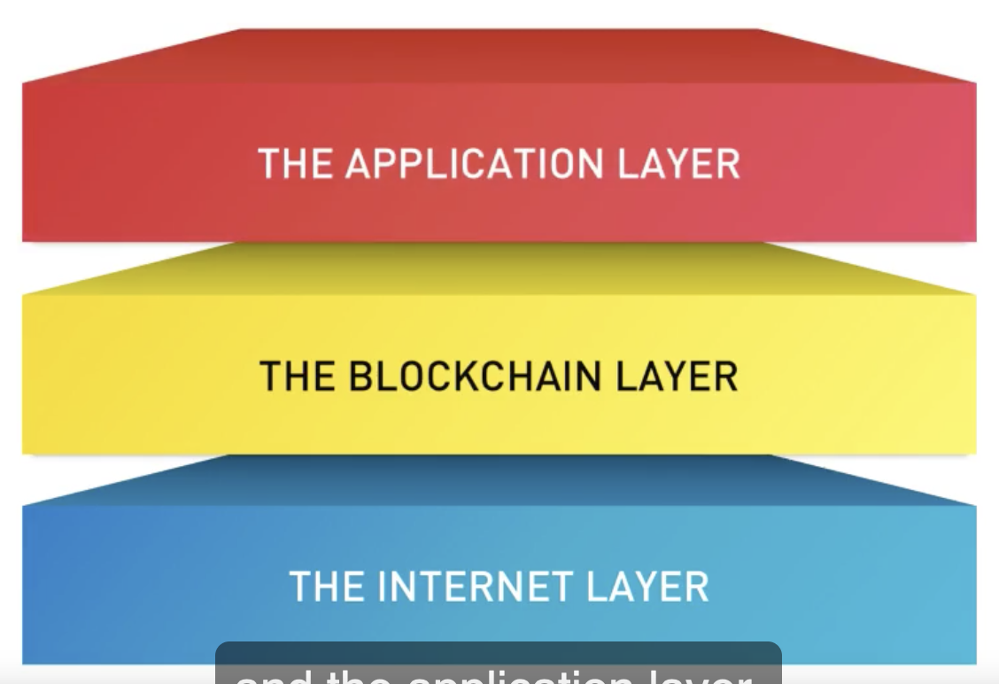

# Module 4 Leadership for Next Era

- [Module 4 Leadership for Next Era](#module-4-leadership-for-next-era)
- [Learning Objectives](#learning-objectives)
- [4.1 Blockchain Regulation](#41-blockchain-regulation)
  - [4.1.1 Video: Module 4 Overview](#411-video-module-4-overview)
  - [4.1.2 Video: Intro to Blockchain Regulation](#412-video-intro-to-blockchain-regulation)
  - [4.1.3 Video: Practitioner Perspective - Andreas Wallendahl: Regulation](#413-video-practitioner-perspective---andreas-wallendahl-regulation)
  - [4.1.4 Video: Fundamental Questions](#414-video-fundamental-questions)
  - [4.1.5 Video: Regulatory Principles](#415-video-regulatory-principles)
  - [4.1.6 Video: Practitioner Perspective - Hariton Korizis: Regulation](#416-video-practitioner-perspective---hariton-korizis-regulation)
- [4.2 Blockchain Governance](#42-blockchain-governance)
  - [4.2.1 Video: Regulation vs. Governance](#421-video-regulation-vs-governance)
  - [4.2.2 Video: Practitioner Perspective - Ana Trbovich: Regulation & Governance](#422-video-practitioner-perspective---ana-trbovich-regulation--governance)
  - [4.2.3 Video: The Blockchain Stack](#423-video-the-blockchain-stack)
  - [4.2.4 Video: Multiple Layers of Blockchain Governance](#424-video-multiple-layers-of-blockchain-governance)
  - [4.2.5 Video: A New Framework for Blockchain Governance](#425-video-a-new-framework-for-blockchain-governance)
  - [4.2.6 Video: Practitioner Perspective - Rob Carter: Governance](#426-video-practitioner-perspective---rob-carter-governance)
  - [4.2.7 Reading: Blockchain Governance](#427-reading-blockchain-governance)
- [4.3 Seven Conditions for Success](#43-seven-conditions-for-success)
  - [4.3.1 Video: Profile of a Blockchain Hotbed](#431-video-profile-of-a-blockchain-hotbed)
  - [4.3.2 Reading: Profile of a Blockchain Hotbed](#432-reading-profile-of-a-blockchain-hotbed)
- [4.4 Module 4 Review & Evaluation](#44-module-4-review--evaluation)
  - [4.4.1 Video: Recap of Module 4](#441-video-recap-of-module-4)
  - [4.4.2 Reading: Leadership for Transformation](#442-reading-leadership-for-transformation)
  - [4.4.3 Quiz: Blockchain Governance & Leadership](#443-quiz-blockchain-governance--leadership)

Blockchain alone is just a tool. In order for this technology to fulfill its long-term promise, humans must lead. Rather than relying on state-based institutions, blockchain must be primarily self-governed through collaborations of civil society, private sector, government, and stakeholders in non-state networks. In this module, we discuss the idea of blockchain governance networks and explain how they can support blockchain stewardship at three levels: The platform level, the application level, and the ecosystem level. As well, you will learn about the conditions that are necessary for a blockchain-based hub of innovation to succeed.

# Learning Objectives
- Explain the difference between regulation and governance
- Discuss some of the key issues, challenges, trade-offs, and future scenarios related to blockchain and regulation
- Identify the different layers comprising the blockchain technology stack and describe how these layers enable or constrain the governance of a blockchain system
- Describe ten types of governance networks
- Identify seven conditions for success of a blockchain-based hub of innovation

# 4.1 Blockchain Regulation

## 4.1.1 Video: Module 4 Overview

- human lead
  - It's humans that build value, creating businesses and solve social problems. Technology doesn't do that. Humans need to lead for this technology to fulfill its long-term promise.
- self-governed
  - Blockchains must be self-governed through collaborations of civil society, private sector, governments and stakeholders in non-state networks or networks that are not controlled by nation states. 
  - State-based institutions can't lead through regulations alone. 
- difference 
  - between regulation and government 
  - and governance
- education people
  - Blockchain expertise lies with developers and users, not with government bureaucrats and regulatory bodies. 
  - So we need to educate the full field of stakeholders from governments to individuals, on the scope of this disruption and about the block chains ability to unleash capability across different sectors
- key issues, the trade offs and the scenarios related to blockchain and regulation
  - current regulations
    - some apply to blockchain use
    - most don't apply
      - there's no framework in place to fill the gap
  - regulation
    - how the regulation of the Internet of information was governed
    - how we might regulate and govern blockchain on a global scale
  - tech stack
    - different layers of the block chain technology stack that need governance
  - block chain governance networks
    - how they can support blockchain leadership and stewardship at three levels
      - platform level
      - application level
      - ecosystem level

## 4.1.2 Video: Intro to Blockchain Regulation

- at attempts to regulate the Internet previously and also financial markets
- not simple
  - It's still no simple task to regulate the Internet. It sits at the intersection of computing and communications, and it's global.
    - free internet
      - Some of the early Internet pioneers insisted the Internet couldn't be regulated because of its openness and its international and global reach
      - A more mainstream group of users agreed the Internet was free from state regulation, but they recognized the value of self-regulation.
    - In reality, 
      - the Internet didn't develop in a fully regulation free zone.
- Regulators
  - Regulators should watch what happens next and still the lessons relevant to blockchain technologies and applications.
- second era of the Internet
  - blockchain, the second era of the Internet, is also fundamentally different from the first era.
    - first era enabled people and organizations to communicate, copy, and manage information.  
    - second era deals much more with very fundamental things, assets like money, securities, intellectual property, our identities, cultural assets like music, or votes
- cannot had=nd-off
  -  So the old view, hands-off the Internet, doesn't apply the same way to hands-off blockchain because it's dealing with assets at the core of our economy. 
- push
  -  Blockchain community needs to push governments before it's too late. 
     -  legal systems may not be able to assert any control over the borderless, decentralized activities taking place on distributed ledgers
      -  push for 
         -  adoption of a set of global blockchain **rights**, 
         -  guiding government's approach to regulation. 
      -  Global Blockchain Rights  
         - 1 unrestricted access to blockchain applications, 
            -  unless those applications violate our overall social contract. 
         - 2 balance between your right to distribute and to access information, 
         - 3 balance between your right to privacy and to protect your data. 
         - 4 legitimate need for governments to restrict the flow of information, provided it's infrequent and the reasons are transparent. 
         - 5 the enforcement of contractual rights 
           - must also be enshrined because international commerce depends on such confidence. 
         -  These rights must also keep in mind civil societies wide-ranging a variety of standards for measuring torches, libelist, and defamatory acts. 

- there's no single regulatory model we can apply to both powerful incumbents wading into blockchain and to the smaller development groups and startups. 

## 4.1.3 Video: Practitioner Perspective - Andreas Wallendahl: Regulation

## 4.1.4 Video: Fundamental Questions

- identify the most relevant legal and regulatory questions to ask and develop a framework for Blockchain regulation
- 3 responses
  - When regulators face an industry in a state of high uncertainty, they have three possible responses
    - make new laws
    - observe
    - periodically issue reports, guidance, and even threats
  - which best
    - need informed questioning
      - basic question
        - whether the Blockchain and/or the various activities that are growing using this technology should be self-regulated, government regulated, or unregulated
      - critical question
        - does this technology raise unique legal issues?
        - what exactly are we trying to regulate?
          - Cryptocurrencies don't meet the strict definition of legal tender 法定货币 in our view. 
          - virtual currency as "a digital representation of value
            - The Financial Action Task Force, an inter-governmental body established in 1989
            - If cryptocurrencies function that way in practice, should they be regulated as money or at least in a similar way? 
              -  now
                 -  United States, Bitcoin and its peers are considered commodities under the US Commodities Exchange Act
                    -  Lots of ICOs released tokens with features falling outside the definition of a virtual currency. 
                       -  membership 
                 -  US Securities and Exchange Commission, the SEC, thinks their securities should be regulated by security's rules
 -  Regulators can decide of current laws do or should apply to Blockchain technologies as they assess whether an application is a new medium or a new activity.
 -  Howey Test
    -  an investment contract or security
       -  Four factors called the Howey Test define an investment contract or security as "
          -  1 an investment of money 
          -  2 in a common enterprise 
          -  3 with an expectation of profits 
          -  4 to be derived solely from the efforts of others.
-  Premature rule-making can create confusion for merging industries, particularly when poorly thought out rules result in multiple judicial challenges.
-  Global commerce is no stranger to regulating goods and service disclosures, fraud and canceled transactions. So, moving to a Blockchain ecosystem, relying on smart contracts doesn't change that. 

## 4.1.5 Video: Regulatory Principles

- general principles to guide blockchain regulation development. 
  - We must always identify the rationale for regulation as a starting point. 
- a guiding principle must be to pair regulations with the evolution of distributed ledger technology the best we can
- With technology evolving as unpredictably as blockchain, stiff regulations are obsolete as quickly as they're issued. Regulation development should track with the technology's development.
- We need to distinguish upfront between regulation of the blockchain, regulation of applications running on distributed ledgers, and regulation of the ecosystem overall.
- the overall rule of regulatory threats is likely to be limited. It still can't serve, in the long-term, to allow regulators to do informally what they lack formal authority to undertake. Threats made without the proper authority are nothing more than abuses of power. 
- Regulatory sandbox aren't always appropriate and should be used carefully. But when conducted responsibly, they can be a helpful tool for observing how innovators might use highly disrupted and unpredictable technologies
- regulators must acknowledge that, often, they just don't know whether a blockchain application will lead to an ultimately net-positive or even negative outcome. Forecasting is difficult and, in some cases, it's impossible. So, flexibility is key.

## 4.1.6 Video: Practitioner Perspective - Hariton Korizis: Regulation

# 4.2 Blockchain Governance

## 4.2.1 Video: Regulation vs. Governance

- Regulations are laws designed to control behavior. 
- Governance when it's done right, is really about stewardship, collaboration, and incentivizing work on common interests to achieve common goals

- For millennia, states have had a monopoly on money. They produce it, control it, grant it value based on various metrics. Now, we can see how value can be created by individuals and groups working on a distributed, global, peer-to-peer network, and that value creation could include money. Value creation and control aren't exclusive to any central authority. 
- Experience proves governments should approach technology regulations cautiously, and act as collaborators with other sectors in society rather than having the "heavy hand of the law." 
- a multi-stakeholder solution  starts with education
- regulatory disruption. 
  - Disruptive innovations typically do challenge regulators. 
  - The faster a technology evolves or the greater the degree of disruption to business, to life, liberty, investing and so on, the more challenging it is for regulators to understand what if anything needs to be regulated.
- It's also important to experiment and to test potential regulations
  - continuing ed, 
  - data collection, 
  - feedback loops, 
  - peer review projects, 
  - pilots, 
  - sandboxes 
  - other ways of gathering stakeholder input
- We should embrace the diverse personality of blockchain as an invitation for regulatory bodies to collaborate instead of fighting turf wars. 
- If new regulations do turn out to be the way to go, think about these points: 
  - When to intervene if at all. 
  - Waiting may or may not bring better information. 
  - Try to think about the possible drawbacks of waiting. 
  - Regulations can come in the form of a rule, an adjudication, guidance etc. 
  - Weigh the costs and benefits of each configuration and figure out which best accommodates the uncertainties of the innovation in question
  - Regulator actions can be permanent, they can be temporary, or they can be conditional. 
  - Different innovations will call for different interventions with different durations.
## 4.2.2 Video: Practitioner Perspective - Ana Trbovich: Regulation & Governance

## 4.2.3 Video: The Blockchain Stack

We'll look at a framework for analyzing the Internet applications, on which the Blockchain is built.

-  three main layers.
   -  Blockchain applications ultimately operate on internet applications and protocols. Each new layer of the stack, inherits the protocols and rules of the layer below, including the lower layers and governance. 
   -  The Internet layer, 
      -  TCP-IP
      -  Net neutrality is a foundational principle of the Internet.
   -  the Blockchain layer, 
      -  Each Blockchain network implements its own protocols, its own consensus algorithms, and fork choices.
   -  and the application layer.
      -  The application layer is also made up of its own multiple layers. It includes, two specific components. The DApp frameworks and then the DApps themselves. 
      -  There are two ways to alter the operation of a DApp. 
         -  The first, is changed the state of the Blockchain to overwrite the code of the DApp.
            -  the hack of the DAO
         -  The second change, is to a small piece of the code the DAPp lies on, like a smart contract library or proxy contract. 
   - 
- To summarize, Blockchain applications exist in a larger ecosystem and not in a vacuum.

## 4.2.4 Video: Multiple Layers of Blockchain Governance

We'll look at the multiple layers of governance and the possible effects on the blockchain ecosystem.

- The two distinct governance structures on blockchain, are 
  - governance by the infrastructure and 
  - governance of the infrastructure.
- These mechanisms can be either endogenous or exogenous to a particular community depending on that communities viewpoint. 
  - Endogenous rules consist of all the rules, the social norms, the customs and other governance structures developed or endorsed from within that community. 
  - Exogenous rules are all other rules influencing the activities of community, but originating from outside that community. 
- 3 layers
  - Each layer designed and run by different people with different purposes and from separate communities, who might converse with one another. 

## 4.2.5 Video: A New Framework for Blockchain Governance

## 4.2.6 Video: Practitioner Perspective - Rob Carter: Governance

## 4.2.7 Reading: Blockchain Governance

Recommended Readings

De Filippi, P., & McMullen, G. (2018, June). Governance of Blockchain Systems: Governance of and by Distributed Infrastructure (Big Idea White Paper). COALA + Blockchain Research Institute.

[Governance-Blockchain-Research_Institute.pdf](4.2.7-Blockchain-Research_Institute.pdf)
PDF File

Tapscott, D. (2018, August). 2018 Blockchain Regulation Roundtable: Addressing the Regulatory Challenges of Disruptive Innovation (Summary of Proceedings). Blockchain Research Institute.

[2018_Blockchain_Regulation_Roundtable.pdf](4.2.7_2018_Blockchain_Regulation_Roundtable.pdf)
PDF File

# 4.3 Seven Conditions for Success

## 4.3.1 Video: Profile of a Blockchain Hotbed

- Profile of a Blockchain Hotbed
  - an environment supportive of incubators and entrepreneurship
  - a community of corporate leadership
  - proximity to educational institutions
  - a strong investment climate
  - government support
  - a fair regulatory environment

## 4.3.2 Reading: Profile of a Blockchain Hotbed

Recommended Reading

Tapscott, D., Carter, H. & Rundle, J. (2018). The Networked hotbeds of Blockchain: Creating Global Hubs for the Internet’s Second Era (Big Idea Whitepaper). Blockchain Research Institute.

[Tapscott_The Networked Hotbeds of Blockchain_Blockchain Research Institute.pdf](4.3.2.Tapscott_The-Networked-Hotbeds-of-Blockchain_Blockchain-Research-Institute.pdf)
PDF File

# 4.4 Module 4 Review & Evaluation

## 4.4.1 Video: Recap of Module 4

## 4.4.2 Reading: Leadership for Transformation

Recommended Reading

Tapcott, D. (2012). 7 Imperatives for highly successful business revolutionaries. INSEAD Convocation Speech.  Retrieved from http://dontapscott.com/2012/07/seven-imperatives-for-highly-successful-business-revolutionaries-2012-insead-convocation/

For Further Interest

Tapscott, D., & Tapscott, A. (2018). Governance and Leadership for the New Era. In Blockchain Revolution: How the Technology Behind Bitcoin and Other Cryptocurrencies is Changing the World (pp. lxiv-lxxiv). Penguin. 
 

## 4.4.3 Quiz: Blockchain Governance & Leadership