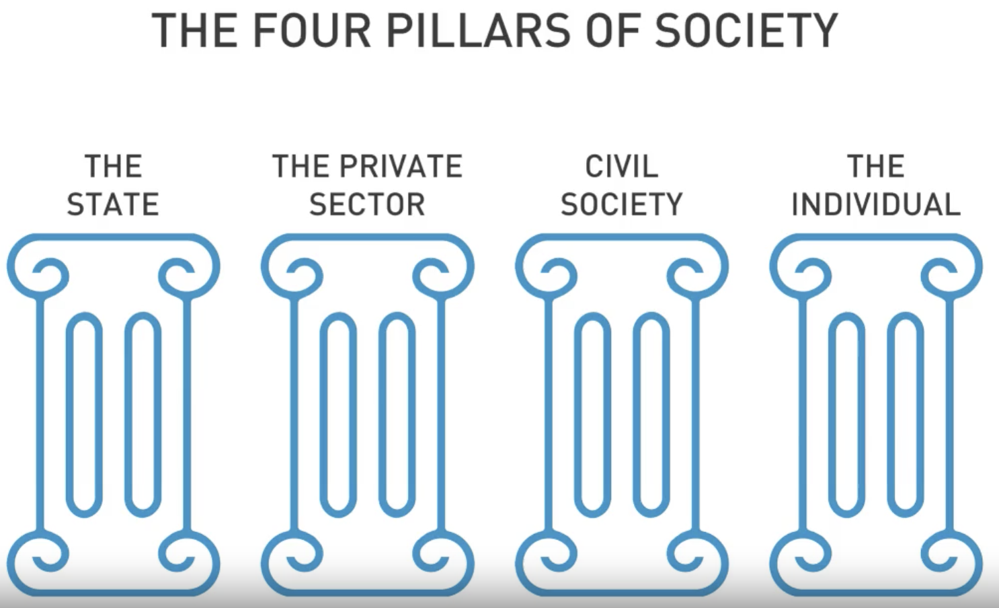
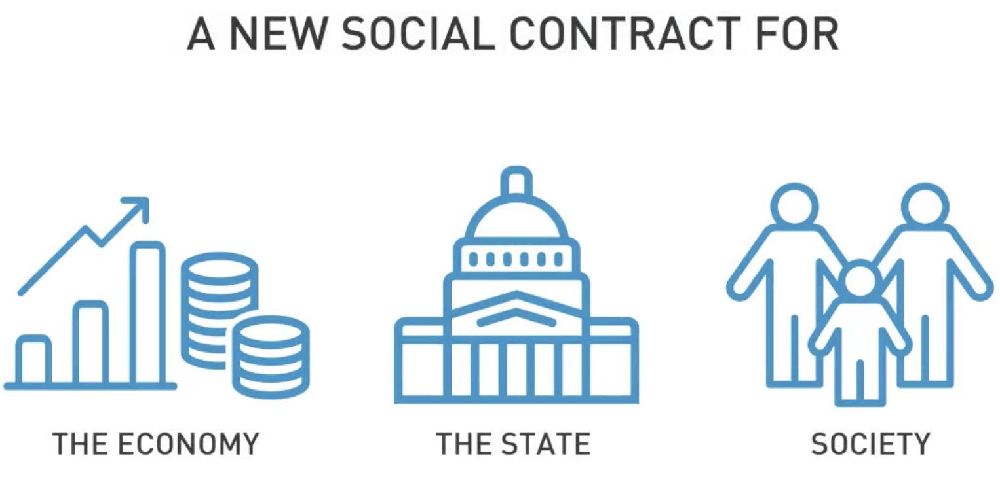
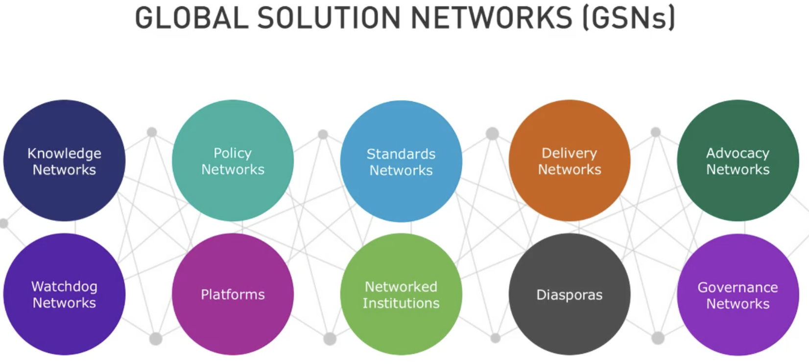

# Module 5 Blueprint for a New Social Contract

As the digital revolution unfolds, it is driving profound changes in the global economy, labor markets, old institutions, and society as a whole. To realize the potential of the blockchain revolution, we need business leaders to come to the table as responsible and active participants in a new social contract for both their own long-term interests as well as in the interest of a healthy society and economy. In this module, you will explore possible directions for a new social contract—i.e. the agreements, laws, and behaviors that people, companies, civil society, and their governments adhere to. The aim of this module is not to provide a definitive strategy for instituting and enforcing a new social contract, but rather to catalyze investigation, debate, and action.

- [Module 5 Blueprint for a New Social Contract](#module-5-blueprint-for-a-new-social-contract)
- [Learning Objectives](#learning-objectives)
- [5.1 The Current Social Contract is Breaking](#51-the-current-social-contract-is-breaking)
  - [5.1.1 Video: Module 5 Overview](#511-video-module-5-overview)
  - [5.1.2 Video: The Current Social Contract is Breaking](#512-video-the-current-social-contract-is-breaking)
- [5.2 Drivers for Change](#52-drivers-for-change)
  - [5.2.1 Video: Drivers for Change](#521-video-drivers-for-change)
  - [5.2.2 Video: Four Pillars of Society](#522-video-four-pillars-of-society)
  - [5.2.3 Reading: Drivers for Change](#523-reading-drivers-for-change)
- [5.3 Blueprint for a New Social Contract](#53-blueprint-for-a-new-social-contract)
- [5.3.1 Video: Intro to a New Social Contract](#531-video-intro-to-a-new-social-contract)
- [5.3.2 Video: Rethinking Work](#532-video-rethinking-work)
- [5.3.3 Video: The Pre-distribution of Wealth](#533-video-the-pre-distribution-of-wealth)
- [5.3.4 Video: Distributed Power](#534-video-distributed-power)
- [5.3.5 Video: Collaborative Institutions](#535-video-collaborative-institutions)
- [5.4 Module 5 Review](#54-module-5-review)
- [5.4.1 Video: Recap of Module 5](#541-video-recap-of-module-5)
- [5.4.2 Discussion Prompt: Toward a New Social Contract](#542-discussion-prompt-toward-a-new-social-contract)
- [5.4.3 Video: Course Wrap-up](#543-video-course-wrap-up)
- [5.5 Blockchain and Business: Course Assignment](#55-blockchain-and-business-course-assignment)
- [5.5.1 Video: Mihai Alisie on Business Models](#551-video-mihai-alisie-on-business-models)
- [5.5.2 Peer-graded Assignment: Problem Solving with Blockchain](#552-peer-graded-assignment-problem-solving-with-blockchain)
- [5.5.3 Review Your Peers: Problem Solving with Blockchain](#553-review-your-peers-problem-solving-with-blockchain)
- [5.5.4 Video: Mihai Alisie on What's next for AKASHA?](#554-video-mihai-alisie-on-whats-next-for-akasha)

# Learning Objectives

- Explain what a “social contract” is
- Identify problems with the current social contract (e.g. structural unemployment, growing inequality, asymmetrical power)
- Describe the promise and possibilities of blockchain technology to support the creation of a new social contract

# 5.1 The Current Social Contract is Breaking

## 5.1.1 Video: Module 5 Overview

- digital revolution is unfolding
  - The digital revolution is unfolding and it's driving profound changes in the global economy. It's changing our labour markets, social institutions, and the health of our biosphere. 

- gap between haves and have-nots

- But the gap between haves and have-nots is widening. 
  - There are problems. 
    - Growing inequality, economic inequality only worsens these problems. 
    - We have extreme weather, climate change beginning to displace whole populations. 
- Now we need 
  - Now we need to refocus creating value for all stakeholders and not just now but in the long-term. 
- solution: business can  lead
  - Business can lead this effort by rethinking the firm and rethinking work. 
    - We can help distribute power more fairly among stakeholders not just shareholders. 
  - We need business leaders to come to the table and to realize the potential of blockchain. We need them to take part in writing and upholding nothing less than a new social contract. 
  - It's not just for their own long-term interest, it's in the interest of all stakeholders, their workers, their customers, and suppliers, and the communities within which they operate. It's not just for their shareholders and their top executives. 
- this module
  - So in this module, we'll look at **possible directions for a new social contract**. 
  - Social contract refers to the agreements, the laws and the behaviors that people adhere to in their companies, their social circles, and their governments. 
  - Our goal is not to map out the be-all and end-all strategy for creating and rolling out a new social contract with blockchain technology as a platform. Instead, we want to create a conversation. We'd like you to think about the challenges, contribute your ideas to the discussion forum and debate the issues. What actions can you take to get the ball rolling?

## 5.1.2 Video: The Current Social Contract is Breaking

- We contract with each other for security and stability in an otherwise dog-eat-dog world
- Progress hasn't just stopped, it's reversed, at least in the United States, but also in a number of other developed countries.

# 5.2 Drivers for Change

## 5.2.1 Video: Drivers for Change
- Drivers for Change
  - the forth insudtrial revolution
    - Technologies has done more than disrupt the social contract; it's starting to challenge what it means to be a human being.
  - globalization
  - demographic upheaval
  - climate change
  

## 5.2.2 Video: Four Pillars of Society

- the private sector
  - In the past, the private sector has been a major participant in functioning democracies, until that tricky period when the greater good became less of a priority than the bottom line
- the state
  - Without worldwide support through technology, no such breakthroughs will be possible, let alone sustainable. 
- civil society
  - Both the state and the private sector have at various times and in various ways, worked either to strengthen or weaken civil society and its institutions, depending on the time or the mood of the moment. A social contract for the digital age with provisions to respect and hear the voice of the very society granting it validity, is essential.

## 5.2.3 Reading: Drivers for Change

Recommended Readings

Freedman, J., & Lind, M. (2013, December 19). The Past and Future of America’s Social Contract. The Atlantic. Retrieved from:  https://www.theatlantic.com/business/archive/2013/12/the-past-and-future-of-americas-social-contract/282511/ 

[pdf](5.2.3.theatlantic.com-The%20Past%20and%20Future%20of%20Americas%20Social%20Contract.pdf)

Tapscott, D. (2018, January). A Declaration of Interdependence: Toward a New Social Contract for the Digital Economy (rev. January 21, 2019) (pp. 5-11; 33-36). Blockchain Research Institute.

[Tapscott_Declaration of Interdependence_New Social Contract_Blockchain Research Institute.pdf](5.2.3_Tapscott_Declaration-of-Interdependence_New-Social-Contract_Blockchain-Research-Institute.pdf)
PDF File
 

# 5.3 Blueprint for a New Social Contract

# 5.3.1 Video: Intro to a New Social Contract

we test the main assumptions of a new social contract and the new assumptions we need to make. We'll explore some of these new assumptions and sessions to come.
Play video starting at ::35 and follow transcript0:35
We'll do all this under three broad umbrellas. The economy, state and society.

We'll do all this under three broad umbrellas. The economy, state and society.

- assumptions 
  - 1 we need full-time jobs and full-time employment, to provide wealth and benefits like healthcare.
  - 2 that government is responsible for the unemployed, the poor, the sick, the disabled, and the elderly
  - 3 business and labor are pillars of prosperity.
    - with the rise of shareholder and management power came the age of imbalance- not just an imbalance of power between corporations and workers, but an imbalance between quarterly incentives and long term capital investment.
  - 4 politicians act in the public interest. 
    - Democratic institutions increasingly bow to campaign funders, not voters in the communities they represent. Leaders react to polls, not people and not to science and independent research. 
    - And a new social contract can guide a high-performance government with modern technology to distribute and enforce citizen rights.
  - 5 there was evidence-based debate, compromise, and collaboration across political parties. 
    - Internet holds an endless supply of opinions, some well-researched and reasoned, and others spun out of fears, half-truths, and misunderstandings. And still others are just plain lies. The free flow of content is both a boon and a curse, because it supports free speech on the one hand; but it spreads rumors quickly on the other.
    - we need to rethink how we cultivate an informed society. How do we inform ourselves when the old ways of doing that are collapsing?
  - 6 Mother Earth will take care of herself.
    - Just as digital technologies contributed to the breakdown of the old social contract, they have an important role to play as we create the new.

# 5.3.2 Video: Rethinking Work
-  we need to change how we think about economic opportunity as we enter this Fourth Industrial Revolution
-  Rethinking Work
   -  1 a guaranteed job be backed up by a Universal Basic Income or UBI 
      -   let's ensure everyone has a level of income security regardless of their status or position. There would be no discrimination, everyone will get one, and therefore no stigma attached. 
      -   
  -   2 A portable safety net
      -   Universal Basic Income and a portable safety net together could reestablish economic security, kind of inspired way back by the New Deal. Such bold programs, and all the accounting for them, wouldn't be possible without distributed ledger technology to track individual counts over lifetimes with transparency. 

# 5.3.3 Video: The Pre-distribution of Wealth

- The Pre-distribution of Wealth
  - 1 providing universal, high speed, broadband Internet access
  - 2 personal ownership of personal information.
  - Both concepts are now possible through blockchain technologies.

- Traditional wealth redistribution is a process of taxing the rich and giving it to the poor through costly bureaucracies managing lots of social programs.
- there are lots of ways to leverage universal Internet access, hand-in-hand with blockchain and other technologies, to regain control of our data and reclaim the wealth associated with it.

# 5.3.4 Video: Distributed Power

- Growth in value over the last quarter century has gone almost entirely to those who already hold great wealth and power.
- Blockchains are the technology platforms for distributed power
- Our new social contract must recognize business as an important economic and social pillar, but it must also recognize the private sector's responsibilities beyond the bottom line. 
- The social contract must include the state's support of responsible business practices, fair competition, and reasonable taxation. It must support the rights of consumers, suppliers, and labor.

# 5.3.5 Video: Collaborative Institutions

- The state needs to step up and support funding for education and health care as part of this new social contract. This is essential infrastructure for our modern economy and for a strong and healthy democratic society.

- Students and their parents will begin claiming rights to student data.
- Distributed ledgers serve a set of principles; collaboration, openness, and integrity. They increase security, privacy, and our ability to audit our health data. It increases the interoperability of systems housing our information.
- Businesses are called upon to contribute both concepts and solutions, while governments bring data, ideas, and usually play an important implementation role.

# 5.4 Module 5 Review

# 5.4.1 Video: Recap of Module 5

# 5.4.2 Discussion Prompt: Toward a New Social Contract

# 5.4.3 Video: Course Wrap-up

This is a sweeping course, and we've covered a lot of ground in our time together. 

- We've looked at 
  - how blockchain will bring about a profound change, and 
  - the ways companies grade value, 
    - including core functions like, 
      - marketing and accounting. 
  - The technology will change the deep structures of the firm and encourage innovation and decentralization of operations. 
- We've looked at 
  - four kinds of transaction costs in business, and 
  - how blockchain reduces each kind of costs. 
- We've compared 
  - Internet search engines with blockchain-based search. 
- We've looked at 
  - the factors business leaders should consider when defining their corporate boundaries as boundaries become more porous. 
    - There are four types of blockchain-based organizations we discussed; 
      - The distributed application or DAP. 
      - Secondly, the autonomous agent, 
      - the open network enterprise, and 
      - fourth, the distributed autonomous enterprise. 
- That was a trip into the future bed. 
  - We walked through seven new business models and how blockchain technology could support each one. 
  - We also looked at managing intellectual property on the blockchain. 
  - We discussed how blockchain will change each role in the executive suite. 
    - Not just the Chief Executive Officers job, but also the work of finance, marketing, human resources, accounting, and operation. 
- We closed big picture, but the challenges of regulating blockchain technology. 
  - We went through each layer of the blockchain stack, and how each helped or hindered the governance or stewardship of blockchain. 
  - We studied 10 types of governance networks, and the conditions conducive to innovation and attracting wealth and innovators. 
  

# 5.5 Blockchain and Business: Course Assignment

# 5.5.1 Video: Mihai Alisie on Business Models

# 5.5.2 Peer-graded Assignment: Problem Solving with Blockchain

In this assignment, you will be performing an analysis of the following case study:

[Carter_Social Media on the Blockchain_Blockchain Research Institute (1).pdf](5.5.2.Carter_Social-Media-on-the-Blockchain_Blockchain-Research-Institute-_1_.pdf)
PDF File
The goals of this assignment are twofold:  First, it will offer you an example of a real-life problem that was solved using blockchain technology.  Second, it will encourage you to reflect on the solution as well as the implications of blockchain technology on the organization and its customers.

Read the attached case and then answer the questions below. There are six questions in total. In each of your responses, you are expected to:

Analyze the case material,

Reflect on what you have learned throughout this course,

Synthesize your analysis and reflection into a thoughtful response.

# 5.5.3 Review Your Peers: Problem Solving with Blockchain

# 5.5.4 Video: Mihai Alisie on What's next for AKASHA?