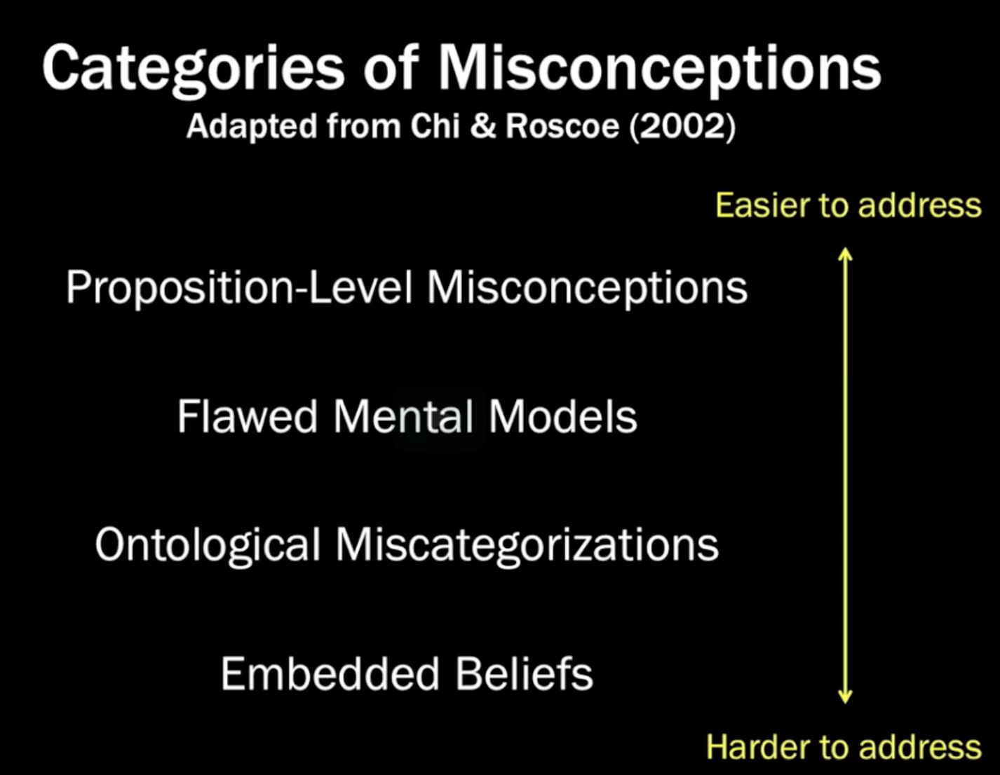
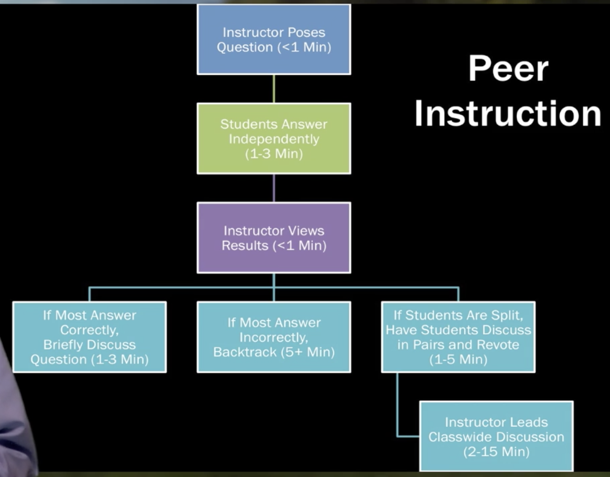
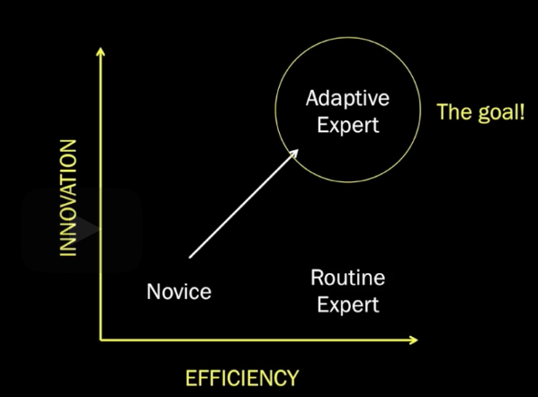
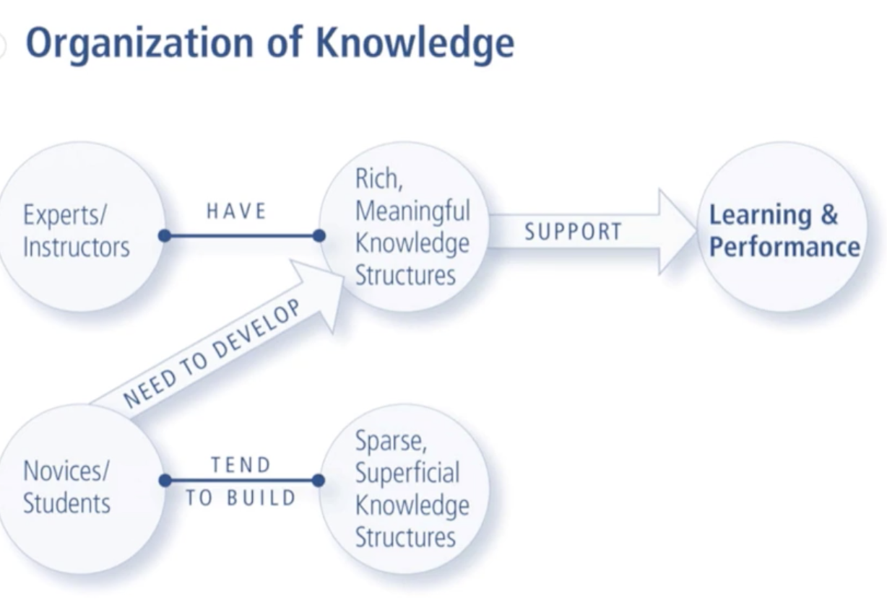
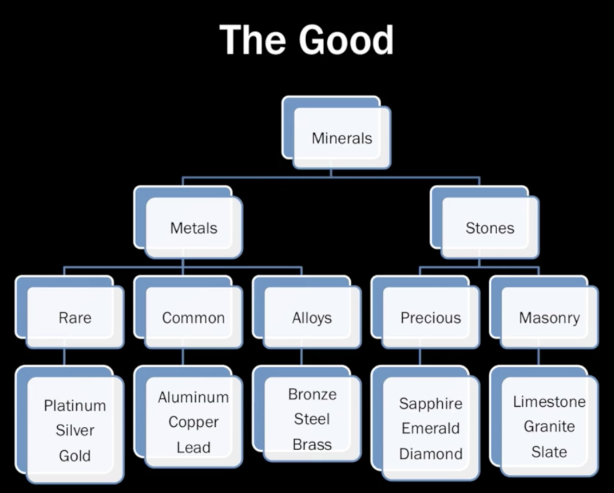
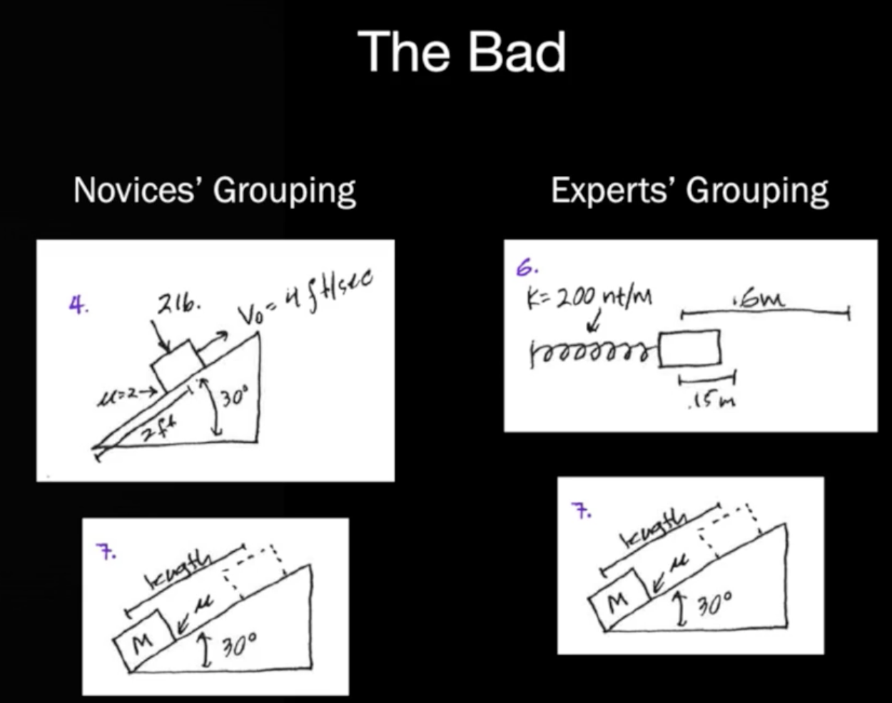
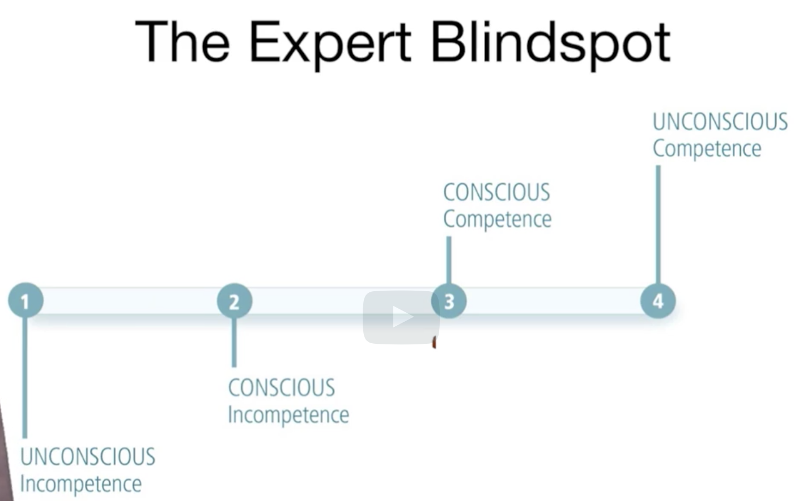
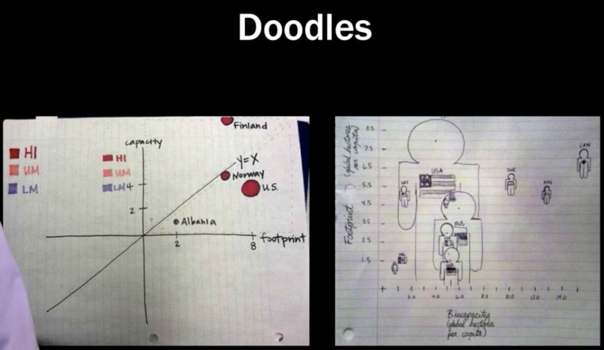

# Cornell CIRTL.1x (Fall 2022) An Introduction to Evidence-Based Undergraduate STEM Teaching

## [edx.org](https://learning.edx.org/course/course-v1:CornellX+CIRTL.1x+3T2022/block-v1:CornellX+CIRTL.1x+3T2022+type@sequential+block@4db151e97cf141c8be4072fdfb1b8fd8/block-v1:CornellX+CIRTL.1x+3T2022+type@vertical+block@c4737c753fd24bca8e445c06fd3acb84)

## 1. Principles of learning

## 1.1. Prior knowledge

- Categories of misconceptions
  - 

- Activate prior knowledge
  - the knowledge needs to be activated in order to be useful
  - How to activate
    - 

- Adaptive Expertise
  - 

## 1.2. Knowledge Organization
  - webs interconnecting knowledge - That's how the brain works.
  - 
    - 
    - 
  - Concept map
    - identify these key concepts and put them on a page somewhere
    - draw lines between those concepts and label the lines with the relationship between those concepts.
  - Other strategies
    - outlines
    - sign posts
    - open-end questions

## 1.3. Practice and feedback
- tradition class VS flipped class
  - traditional class
    - students would get their first exposure to the, to the concepts during class, usually by lecture, and then work through those ideas and apply them in different ways, after class, through problem sets and homework and things like that.
  - flipped class
    - In the flipped classroom, you kind of shift that order around, 
    - so that students' first exposure comes before class, either by reading the textbook or watching instructional videos, and then they do the kinds of things that used to be in their homework, 
    - but they do them in class with each other, so they can get feedback from each other and from their instructor, usually through some group work or cooperative learning activities.
    - And really, I think one of the things that the flipped classroom discussion does is it highlights the important role of practice and feedback in the learning process and takes that from something that happens outside of class where students are on their own, and moves it to a more central location in the learning process.
- focus on the whole process
  - they don't have a strong grasp of the process, and just focus on the, final answer. That's not going to give you help at all.
- teach others is good to learn
  - 
- practice and feedback
  - some researchers in the field say that it is not teaching that causes learning, but it's actually the learners themselves who cause their own learning
- best feedback
  - What is the best feedback?
    - Well, it's about finding out where the students are and then targeting the next level where they can go to.
  - But first, you need to know where they are. 
-  instructional strategies for providing this kind of practice and feedback to students.
   -  data visualization, interpreting data visualization, creating data visualizations has an increasingly important component of statistics.
      -  
- peer feedback
  - it's not always possible for one instructor to provide individualized feedback to every student in the class. So, sometimes it's more practical and also useful to have students practice during class, but then receive feedback from their peers
- all stakes
  - ideally what we want is all of our students getting a chance to practice and getting feedback.
  - spending class time on practice and feedback and these active learning techniques end up preparing the students better for what follows then covering a lot of material.
## 1.4. Motivation
- The Affective Domain
- Motivation Matters
- Motivating Students to Learn
  - cognitive domain - how we think
  - affective domian - how we feel

# 3: Learning Objectives
## 3.1 Learning Goals vs. Objectives
- Backwards Design
- Course Scale Goals vs. Topic Level Objectives