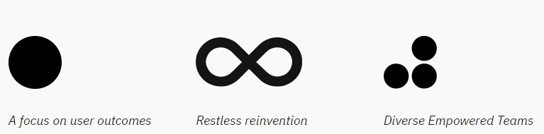
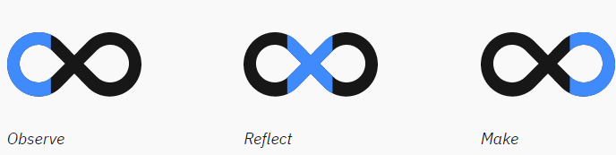
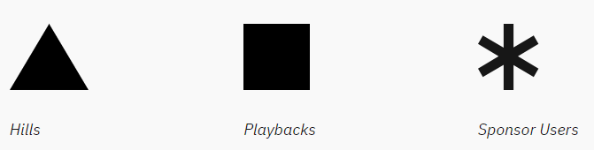

# Enterprise Design Thinking Framework by IBM

# 1. The Enterprise Design Thinking Framework

What is design thinking?
- a human-centered, iterative method for problem solving

Who can use design thinking?
- Anyone

What makes Enterprise Design Thinking different?
- it’s more effective for enterprise teams and their problems

Take a minute to explore the vocabulary of Enterprise Design Thinking.

## The Principles

The Principles guide your day-to-day work. They ensure you’re keeping your user in mind, collaborating with a diverse team, and continuously trying to improve your solutions.

- A focus on user outcomes
  - Drive business by helping users achieve their goals.
- Restless reinvention
  - Stay essential by treating everything as a prototype.
- Diverse Empowered Teams
  - Move faster by working together and embracing diversity.

## The Loop

Understand the present and envision the future in a continuous cycle of observing, reflecting, and making.

- Observe
  - Immerse yourself in the real world with design research. Interview users, watch them work, and test your ideas with the people who matter most to inform your decision-making and understanding.
- Reflect
  - Come together and look within to synchronize your movements, synthesize what you’ve learned, and share your “aha” moments with each other. Decide together and move forward with confidence.
- Make
  - Give concrete form to abstract ideas. The earlier you make the faster you learn. Put your ideas out there before they’re complete and improve them as you go.

## The Keys
Scalable practices for enterprise team alignment

- Hills
  - Align your team around the meaningful user outcomes you want to achieve. Hills are statements of intent written as user enablements. They follow a format of Who, What, and Wow.
    - Who: Who is your user? Refer to them by name.
    - What: What will your user be able to do that they couldn’t before? Start with a verb and avoid solutions.
    - Wow: What differentiates you from the competition? This is measurable.
- Playbacks
  - Stay aligned by regularly exchanging feedback. Playbacks are story-based presentations that share insights, ideas, and updates to a user experience.
- Sponsor Users
  - Invite users into the work and stay true to real-world needs. Sponsor Users are external clients, future clients, or end users that represent your target user, who regularly contribute domain expertise to your team. Relationships with Sponsor Users are typically formalized with an agreement that covers confidentiality and our right to use their feedback.

Design thinking [poster](EDT_poster.pdf) and [wallpaper](EDT_wallpaper.jpg).
