# Module 2 Perform IS auditing

- [Module 2 Perform IS auditing](#module-2-perform-is-auditing)
- [1 Practitioner's Sharing](#1-practitioners-sharing)
  - [1.1 Interview the Practitioner - Financial Auditing vs IS Auditing?](#11-interview-the-practitioner---financial-auditing-vs-is-auditing)
  - [1.2 Interview the Practitioner - Qualities to become an IS auditor](#12-interview-the-practitioner---qualities-to-become-an-is-auditor)
- [2 IS Auditing Procedure](#2-is-auditing-procedure)
  - [2.1 General IS Audit Procedures](#21-general-is-audit-procedures)
  - [2.2 Compliance Testing and Substantive Testing](#22-compliance-testing-and-substantive-testing)
  - [2.3 Practice Quiz: Are some steps missing in the IS audit procedure of this company?](#23-practice-quiz-are-some-steps-missing-in-the-is-audit-procedure-of-this-company)
  - [2.4 Evidence](#24-evidence)
  - [2.5 Reading:  ISACA Outlines Five Steps to Planning an Effective IS Audit Program](#25-reading--isaca-outlines-five-steps-to-planning-an-effective-is-audit-program)
- [3 Module 2 Quiz](#3-module-2-quiz)


# 1 Practitioner's Sharing
## 1.1 Interview the Practitioner - Financial Auditing vs IS Auditing?

- Financial auditing
  - listed companies need to reviewed by financial auditors at least once a year
- Difference
  - Financial auditing
    - offer opinions base on the financial figures in financial reports
      - read the annual report from different listed company
      - focusing on the balance sheet and also the P&L 损益报表profit&loss
  - IS auditing
    - Audit the systems and control procedure to ensure the reliability and intergrity
    - Audit IT assets to ensure they cannot be assessed by unauthorized people
    - Give assurance to the management
    - Perform gap analysis
    - Provide recommendations 
    - Provide IT advisory

(the subtitle script is worth to read if want to understand the different better)

## 1.2 Interview the Practitioner - Qualities to become an IS auditor

- Information System knowledge
- Business knowledge
- Communication skills
- Different expertise are appreciated
- Be prepared to receive  comprehensive trainings

# 2 IS Auditing Procedure
## 2.1 General IS Audit Procedures

- 3 parts 7 steps
  - 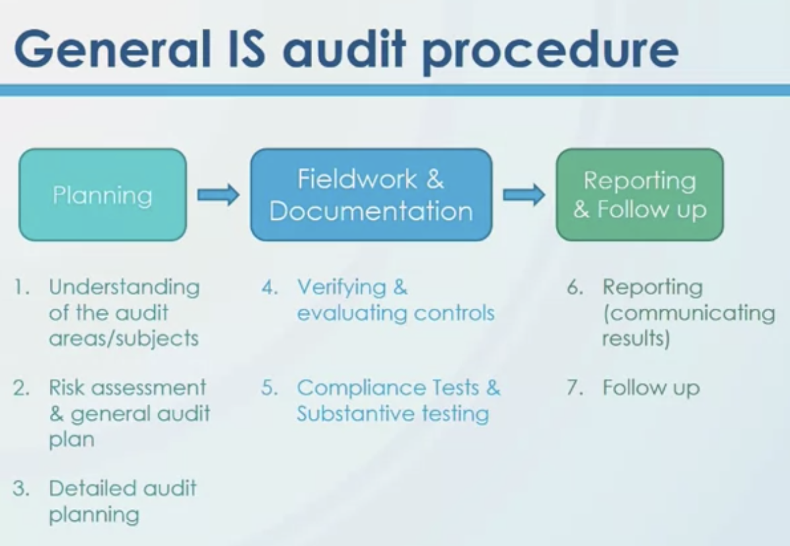
  - Step 1 Understanding of the audit areas/subjects
    - 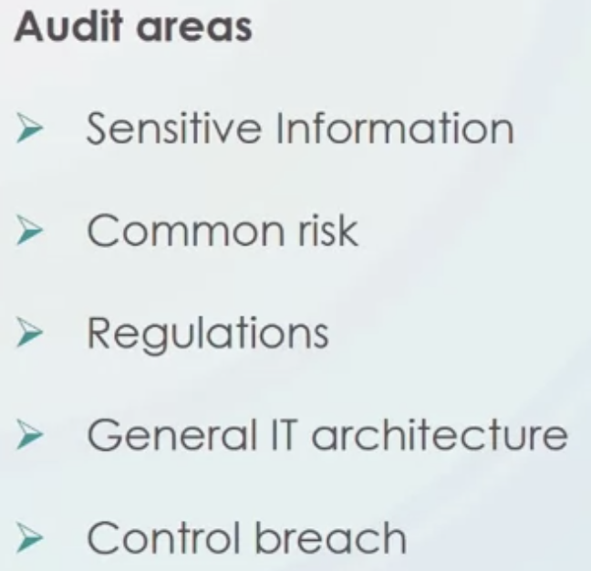
    - 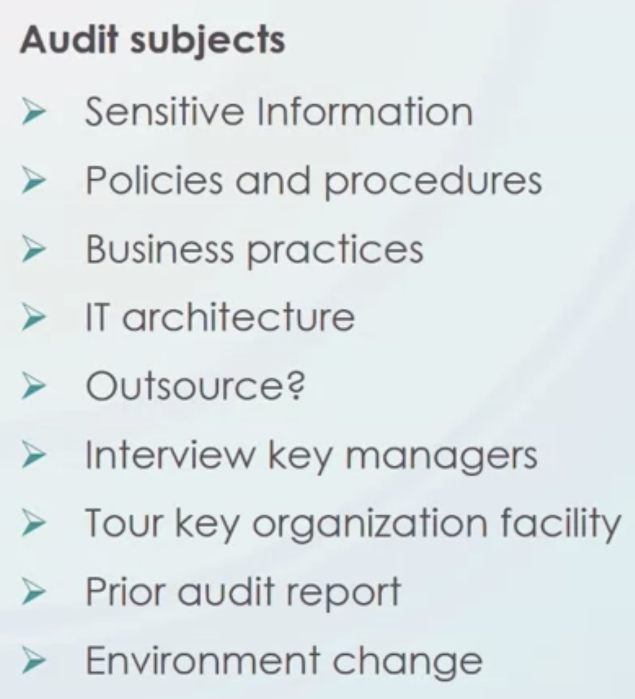

## 2.2 Compliance Testing and Substantive Testing

- What is compliance testing?
  - Determine whether employees follow policies & procedures of senior management and laws & regulation from regulators.
- Example of IT compliance
  - Policy: change password 1-3 months
  - Compliance testing: Check if employees follow this policy
- Classical case that leads to new  policy
  - Bank account balance
    - 123.45
  - Actual Bank account balance
    - 123.456789
  - 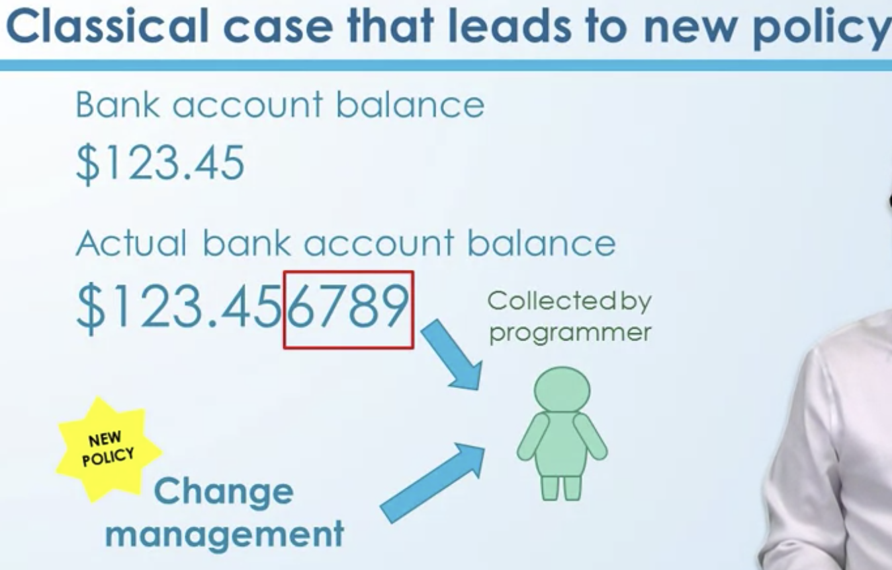
  - 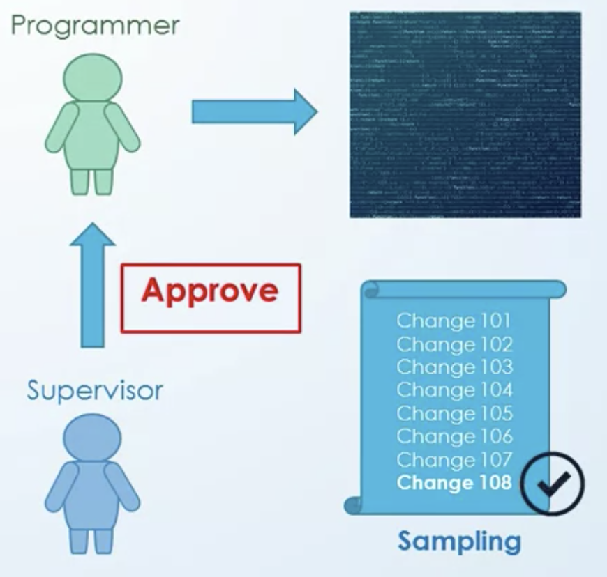
  - 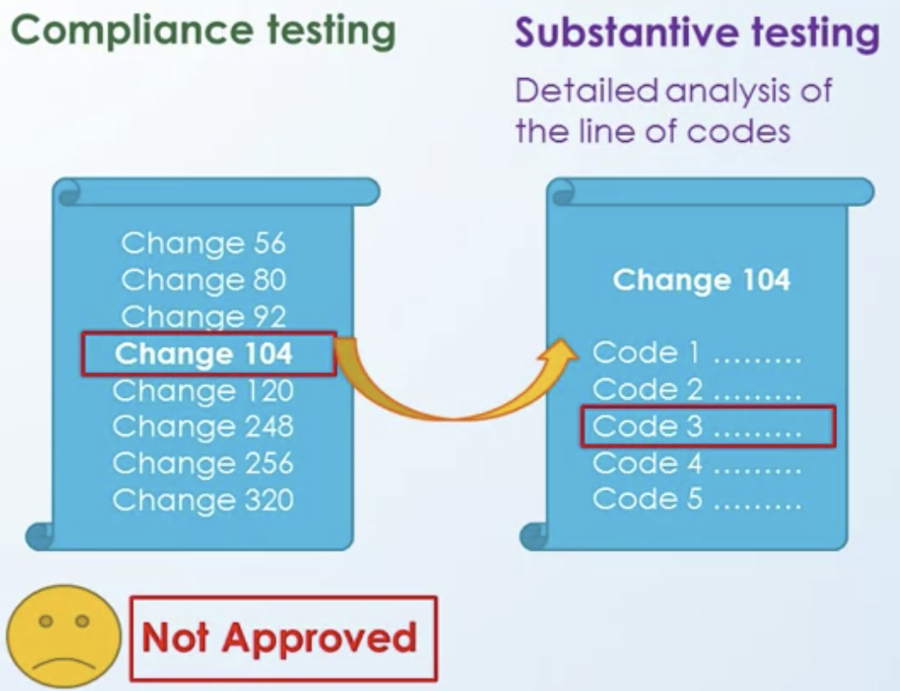
  - In normal situation, usually if compliance testing pass, we don't have to do substantive testing,
  - We do substantive testing in two different situations. 
    - One is employees, organizations do not follow policies and procedures or regulations. 
    - Second thing is this, we don't have enough controls. That means controls are weak or we don't have controls at all.

## 2.3 Practice Quiz: Are some steps missing in the IS audit procedure of this company?


1.Question 1
Instruction:

This is the audit procedure set by Company A's IS auditor.

As a practice, would you comment what aspects are missing from the audit procedure?

The audit procedure by Company A’s IS auditor:
```
Created an audit plan and schedule 
Elaborated on plan's details
Preliminary review
On-site evaluation of the area  
Conducted the company's risk analysis
Verified it with extensive substantive tests
Cross-checked by comprehensive compliance tests
```

Answer:
```
Must collect information about the company and the industry first  
Compliance tests do not validate substantive tests  
Missing verification of existing control appropriateness  
Missing audit report writing and presentation      
```

## 2.4 Evidence
- 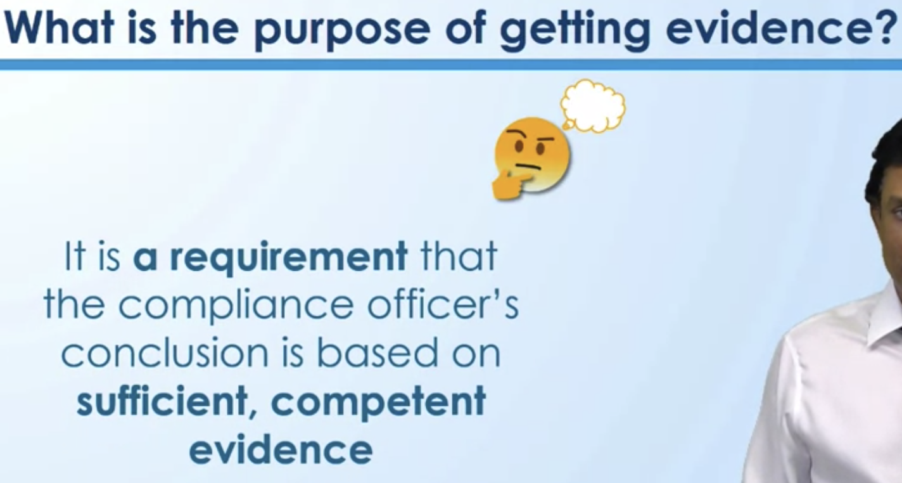
- 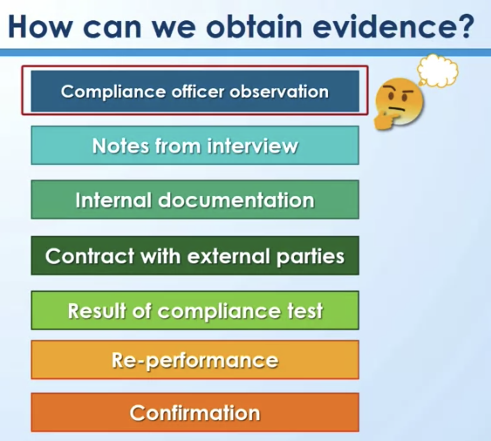
- 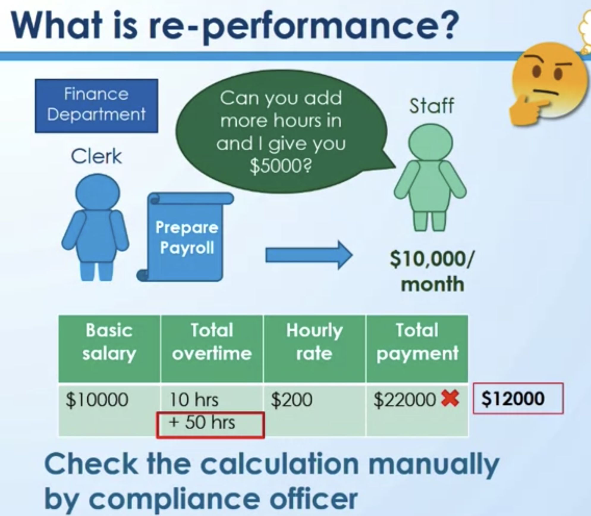
- 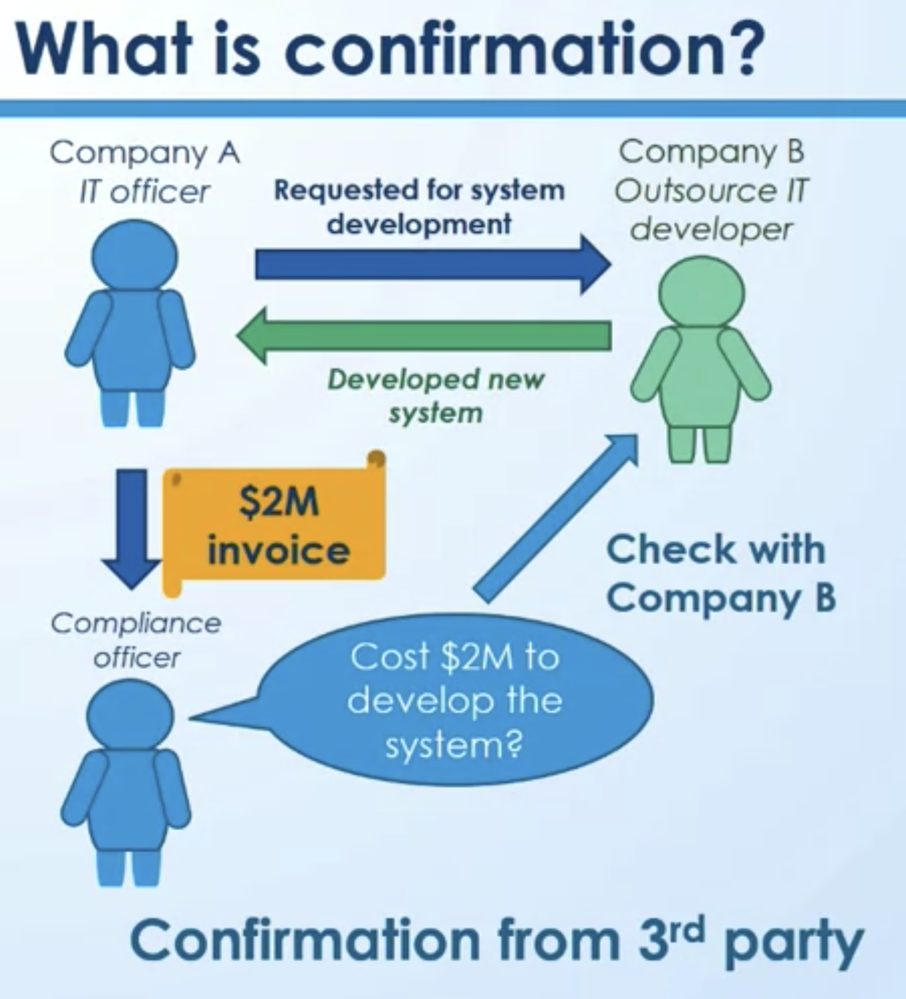
- 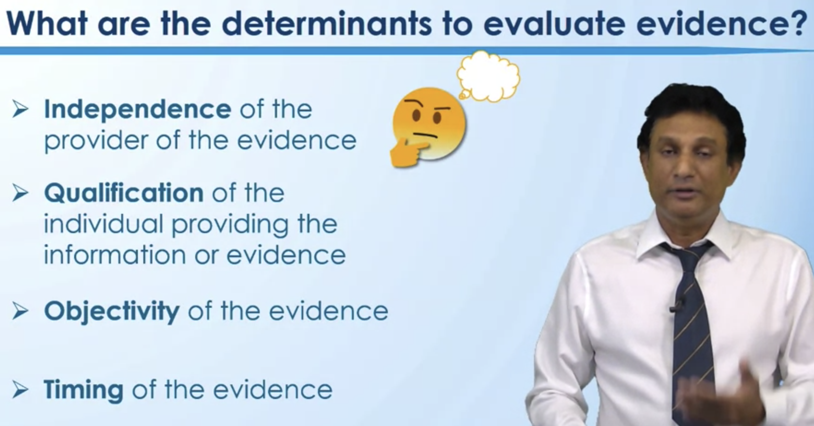
- 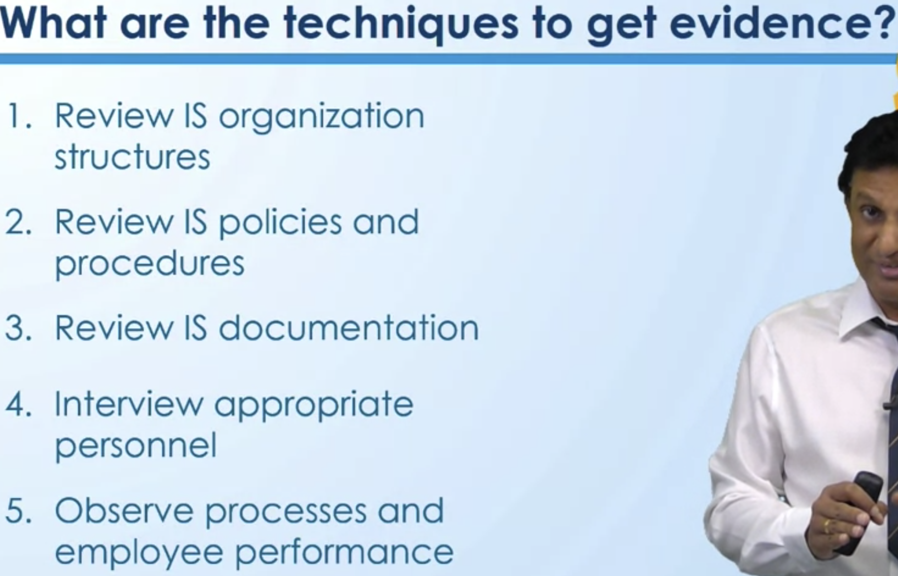

## 2.5 [Reading:  ISACA Outlines Five Steps to Planning an Effective IS Audit Program](coursera.org-ISACA%20Outlines%20Five%20Steps%20to%20Planning%20an%20Effective%20IS%20Audit%20Program.pdf)

[Information Systems Auditing Tools and Techniques: Creating Audit Programs.](IS-Auditing-Tools-and-Techniques-Creating-Audit-Programs.pdf)


# 3 Module 2 Quiz