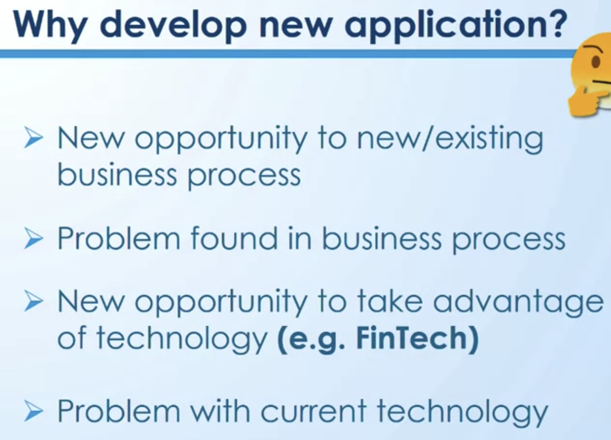
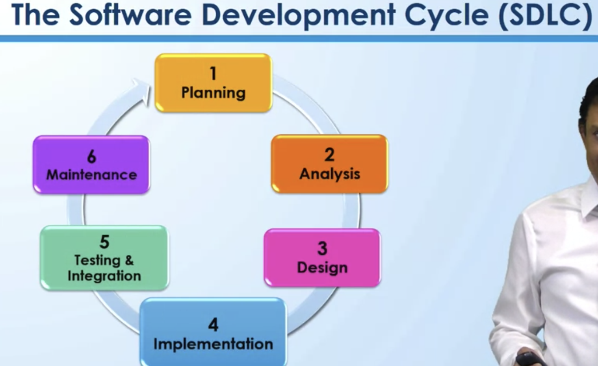
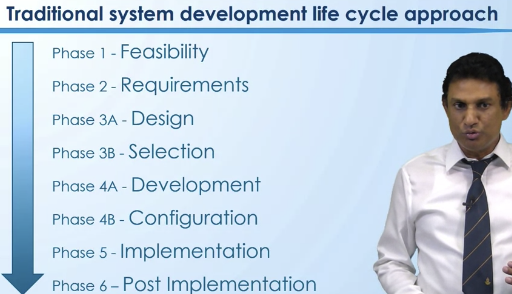
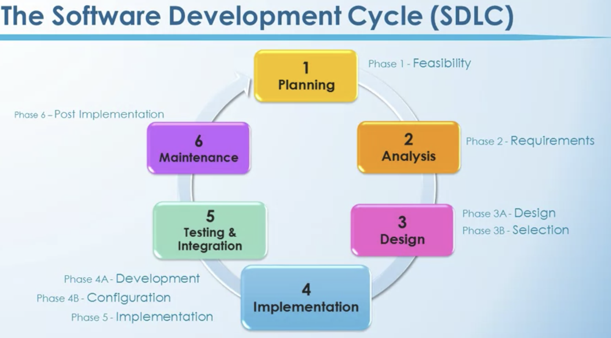

# Module 3 Business Application Development and the Roles of IS Auditors

- [Module 3 Business Application Development and the Roles of IS Auditors](#module-3-business-application-development-and-the-roles-of-is-auditors)

# 1. Business Application Development Process Phase 1 & 2
## 1.1 Reading:  Introduction: What is business application development process / Systems Development Life Cycle (SDLC)?

Introduction:

When developing information systems, organizations typically adopt Systems Development Life Cycle (SDLC).

The aim of adopting SDLC is to make sure the information systems are built accurately to meet users' requirements. In addition, SDLC ensures that information systems are built in a reasonable quality with adequate documentation to facilitate systems maintenance. 

To review your understanding about SDLC or to get familiar with what SDLC does, browse the following website. It is going to be useful for the subsequent videos primarily related to how IS auditors play their cruicial role in SDLC to ensure the information systems' integrity

https://www.guru99.com/software-development-life-cycle-tutorial.html

## 1.2 Video: 3.1 Feasibility and Requirements

Our main focus is going to be, 
- how does IS Auditing play a role in system development process itself? 
- What are the major requirements or major considerations of IT auditors of system development? 
- Most importantly, how can controls be implemented into system development itself? 

# 2. Business Application Development Process Phase 3 & 4
## 2.1 Video: 3.2 Design and Selection

## 2.2 Video: 3.3 Development and Configuration

## 2.3 Video: 3.4 Configuration - Input/Output Controls

# 3. Business Application Development Process Phase 5 & 6
## 3.1 Video: 3.5 Implementation

## 3.2 Video: 3.6 Case studies: System Changeover Scenarios

## 3.3 Video: 3.7 Post-implementation Review

# 4. Risks of Business Application Development
# 4.1 Video: 3.8 Risks Associate with Application Development

# 5. Summary: Role of IS auditors in Business Application Development
# 5.1 Video: 3.9 Role of IS Auditor in SDLC

# Module 3 Quiz