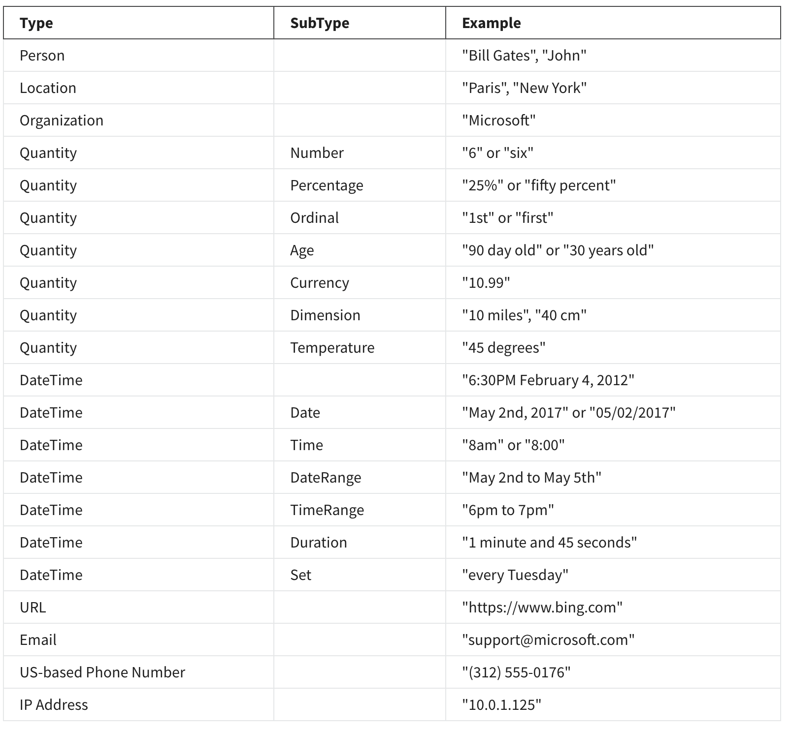

# Microsoft Azure AI Fundamentals AI-900 Exam Prep 4/5

# Natural Language Processing in Microsoft Azure

- [Microsoft Azure AI Fundamentals AI-900 Exam Prep 4/5](#microsoft-azure-ai-fundamentals-ai-900-exam-prep-45)
- [Natural Language Processing in Microsoft Azure](#natural-language-processing-in-microsoft-azure)
  - [Course summary](#course-summary)
  - [Module Overview](#module-overview)
      - [Module 1: Text and Speech Processing with Microsoft Azure AI Services](#module-1-text-and-speech-processing-with-microsoft-azure-ai-services)
      - [Module 2:  Work with Language in Azure AI](#module-2-work-with-language-in-azure-ai)
      - [Module 3:  Explore conversational AI](#module-3-explore-conversational-ai)
  - [Module 1: Text and Speech Processing with Microsoft Azure AI Services](#module-1-text-and-speech-processing-with-microsoft-azure-ai-services-1)
      - [Learning Objectives](#learning-objectives)
  - [1.1 Introduction to Explore Natural Language Processing](#11-introduction-to-explore-natural-language-processing)
  - [1.2 Analyze Text with the Text Analytics service](#12-analyze-text-with-the-text-analytics-service)
    - [1.2.1 What is Text Analytics?](#121-what-is-text-analytics)
    - [1.2.2 Get started with Text Analytics on Azure](#122-get-started-with-text-analytics-on-azure)
    - [1.2.3 Exercise - Analyze text with the Text Analytics Service](#123-exercise---analyze-text-with-the-text-analytics-service)
    - [1.2.4 Reading: Entity recognition](#124-reading-entity-recognition)
  - [1.3 Recognize and synthesize speech](#13-recognize-and-synthesize-speech)
    - [1.3.1 Recognize and synthesize speech](#131-recognize-and-synthesize-speech)
    - [1.3.2 Get Started with Speech on Azure](#132-get-started-with-speech-on-azure)
    - [1.3.3 Exercise - Use the Speech service](#133-exercise---use-the-speech-service)
    - [1.3.4 Reading - Additional resources](#134-reading---additional-resources)
  - [Module 2:  Work with Language in Azure AI](#module-2-work-with-language-in-azure-ai-1)
      - [Learning Objectives](#learning-objectives-1)
  - [2.1 Translate text and speech](#21-translate-text-and-speech)
    - [2.1.1 What is literal and semantic translation?](#211-what-is-literal-and-semantic-translation)
    - [2.1.2 Get Started with Translation in Azure](#212-get-started-with-translation-in-azure)
    - [2.1.3 Exercise - Translate text and speech](#213-exercise---translate-text-and-speech)
  - [2.2 Create a Language Model with Language Understanding](#22-create-a-language-model-with-language-understanding)
    - [2.2.1 What is Language Understanding?](#221-what-is-language-understanding)
    - [2.2.2 Getting Started with Language Understanding](#222-getting-started-with-language-understanding)
  - [Module 3:  Explore conversational AI](#module-3-explore-conversational-ai-1)
      - [Learning Objectives](#learning-objectives-2)

## Course summary 
In this course you’ll learn to: 

- Identify features of common Natural Language Processing workload scenarios 

- Identify Microsoft Azure tools and services for Natural Language Processing workloads  

- Identify common use cases for conversational AI  

- Identify Microsoft Azure services for conversational AI  

## Module Overview 
#### Module 1: Text and Speech Processing with Microsoft Azure AI Services 
In this module, you will analyze text with the Text Analytics service and recognize and synthesize speech using Microsoft Azure Cognitive Services. The Text Analytics service is a part of the Azure Cognitive Services offerings that can perform advanced natural language processing over raw text. 

#### Module 2:  Work with Language in Azure AI 
Automated translation capabilities in an AI solution enables closer collaboration by removing language barriers. 

In this module, you will use the Translator Text and Speech cognitive services in Microsoft Azure for text and speech translation, enabling both real-time and batch-process translation. 

#### Module 3:  Explore conversational AI 
In this module you will Explore conversational AI to Build a Bot with QnA Maker and Microsoft Azure Bot Service. 

## Module 1: Text and Speech Processing with Microsoft Azure AI Services 

In this module, you will learn how to use the Text Analytics service for advanced natural language processing over raw text for sentiment analysis, key phrase extraction, named entity recognition, and language detection. You will also learn how to recognize and synthesize speech by using Azure Cognitive Services.

#### Learning Objectives
- 1 use the Text Analytics service for text analysis, 
- 2 describe speech recognition and synthesis and 
- 3 use the Speech cognitive service in Microsoft Azure.  

## 1.1 Introduction to Explore Natural Language Processing

- Natural language processing NLP
  - supports applications that can see, hear, speak with and understand users. 
- Azure NLP
  - text analytics, 
  - translation and 
  - language understanding services

## 1.2 Analyze Text with the Text Analytics service

### 1.2.1 What is Text Analytics?

- Analyzing text 
  - is a process where you evaluate different aspects of a document or phrase in order to gain insight into the content of that text.

- text analytics service
  - a cloud based service that provides advanced natural language processing of raw text for 
    - **sentiment** analysis. 
    - **key phrase** extraction, 
    - **named entity** recognition and 
    - **language** detection
- **techniques** frequently used to build text analyzing software include
  - **statistical analysis** of terms used in the text 
  - **frequency analysis**
    - n-grams
      - bi-gram: 2 word phase
      - tri-gram: 3 word phase
  -  **stemming** or limitization algorithms
     - to normalize words before counting them
       - power powered and powerful are interpreted as being the same word
   - Applying **linguistic structure rules** to analyze sentences  
     - breaking down sentences into **tree** like structures, such as a noun phrase, which itself contains noun verbs and adjectives and so on
   - encoding words and terms as **numeric features**. 
     - can be used to train a machine learning model
     - to perform sentiment analysis in which a document is classified as positive or negative
   - creating **vectorized models** 
     - that capture semantic relationships between words by assigning them locations in n dimensional space
- text analytics cognitive service 
  - can help simplify application development by 
    - using **pretrained models** that can determine the language of a document or text.
  - Application example
    - analyze sentiment 
      - around a product
    - search
      - extract key phases from documents to help summarize the main subject
    - identify
      - extract brand information

### 1.2.2 Get started with Text Analytics on Azure

- Text Analytics Service
  - a part of Azure cognitive services
- To use
  - A text analytics resource
    -  if you only plan to use the text analytic service or if you want to manage access and billing for the resource separately from other services.
 -  A cognitive services resource.
    -   if you plan to use the text analytics service in combination with other cognitive services and you want to manage access and billing for these services together.

- Ability
  - 1. language detection capability
    - to identify the language in which text is written
      - You can submit multiple documents at a time for analysis
      - For each documents submitted to it, the service will detect 
        - language name
          - english
        - ISO 6391 language code
          - en
        - a score indicating and level of confidence
    - example
      - a review with english mix with french 
        - return english en 0.9
        - The language detection service will focus on the predominant language in the text.
          -  algorithm to determine the predominant
             -  length of phrases or 
             -  total amount of text
          -  confidence score maybe less than one as a result of the mixed language text.
     -  ambiguous content
        -  only punctuation :-
           -  return unknown unknown NaN
  - 2. evaluate text and returns sentiment scores and labels for each sentence
     -  useful for detecting positive and negative sentiment
     -  Using the pre-built machine learning classification model, 
        -  the service evaluates the text and 
        -  returns a sentiment score in the range of 0-1,
           -  closer to one being a positive sentiment
           -  close to the middle of the range, 0.5 are considered neutral or indeterminate
              -  0.5 might indicate that the sentiment of the text is indeterminious. 
                 -  This could result from texts that does not have sufficient context or insufficient phrasm to discern a sentiment.
                 -   wrong language code was used
                     - french text but tell the mdoel it is english
   - 3. key phrase extraction 
     - is the concept of evaluating the texts on a document or documents, and then identifying the main talking points of the documents.   
     - to summarize the main points
       - not only can you use sentiment analysis to determine that the review is positive, you can use the key phrases to identify important elements of the review.
   - 4. entity recognization
     -  provide the text analytic service with unstructured text and it will return a list of entities in the text that it recognizes.
        -  An entity is essentially an item of a particular type or a category, or subtype

### 1.2.3 Exercise - Analyze text with the Text Analytics Service

[Exercise](./1.2.3.Analyze_text_with_the_Text_Analytics_Service.pdf)

[output](./output.md)

[Quiz](1.2.3.quiz.md)

### 1.2.4 Reading: Entity recognition
You can provide the Text Analytics service with unstructured text and it will return a list of entities in the text that it recognizes. The service can also provide links to more information about that entity on the web. An entity is essentially an item of a particular type or a category; and in some cases, subtype, such as shown in this table. 

## 1.3 Recognize and synthesize speech

### 1.3.1 Recognize and synthesize speech

- Will learn
  - how to recognize and synthesize speech using Microsoft Azure Cognitive Services
  - to accept vocal commands and provide spoken responses

- AI system must support **two capabilities**; 
  - speech **recognition**, 
    - the ability to detect and interpret spoken inputs 
      - aking the spoken word and converting this into data that can be processed often by transcribing this into a text representation
      - poken words 
        - a recorded voice in an audio file, or 
        - live audio from a microphone
    - how
      - Speech patterns are analyzed in the audio to determine recognizable patterns that are mapped to words.
        - acoustic model
          - converts the audio signal into phonemes, representations of specific sounds
        - language model
          - maps phonemes to words
          - usually using a statistical algorithm that predicts the most probable sequence of words based on the phonemes
  - speech **synthesis**, 
    - the ability to generate spoken output.
      - vocalizing data usually by converting text to speech
    - requires the following information
      - The text to be spoken and 
      - the voice to be used to vocalize the speech
    - how
      - tokenize the text to break it down into individual words and assigns phonetic sounds to each word
      - then breaks the phonetic transcription into prosodic units such as phrases clauses or sentences to create phonemes that will be converted to audio formats
      - These phonemes are then synthesized as audio by applying a voice which will determine parameters such as pitch and timbre and generating an audio waveform that can be output to a speaker or written to a file

### 1.3.2 Get Started with Speech on Azure

- Azure Speech Cognitive Service
  - capabilities
    - speech recognition and 
    - speech synthesis 
  - APIs
    - Speech-to-Text API 
      - perform **real-time** or **batch** transcription of audio into a text format 
      - model
        - based on the Universal Language Model that was trained by Microsoft
        - model is optimized for two scenarios, conversational and dictation
        - create and train your own custom models
      - real time
        - listening for incoming audio from a microphone or other audio input source, such as an audio file
        - streams the audio to the servers
        - return transcribed text
      - batch transcription
        - recordings
        - run in an asynchronous manner because the batch jobs are scheduled on a best effort basis.
    - Text-to-Speech API
      - convert text input to audible speech
        - be played directly through a computer speaker, or written to an audio file.
      - can specify the voice to be used to vocalize the text
        - can personalize your speech synthesis solution and give it a specific character
        - or includes multiple predefined voices
  - Needed resource
    - Speech Resource
      - if you only plan to use the speech service, or if you want to manage access and billing for the resource separately from other services.
    - Cognitive Services Resource,
      - if you plan to use the speech service in combination with other cognitive services and you want to manage access and billing for these services together. 

### 1.3.3 Exercise - Use the Speech service

[Exercise](./1.3.3.exercise.pdf)

[quiz](1.3.3.quiz.md)

[test-pre](1.3.3.test_pre.md)

### 1.3.4 Reading - Additional resources

Here are additional resources that provide you with an opportunity to view the languages supported by the Speech-to-text and 
Text-to-speech services and to see additional documentation about the Speech service. 

Speech-to-text - supported languages.

https://docs.microsoft.com/en-us/azure/cognitive-services/speech-service/language-support#speech-to-text

Text-to-speech  - supported languages.

https://docs.microsoft.com/en-us/azure/cognitive-services/speech-service/language-support#text-to-speech

Service documentation about the Speech service

https://docs.microsoft.com/en-us/azure/cognitive-services/speech-service/

## Module 2:  Work with Language in Azure AI 

In this module, we'll introduce you to the Language Understanding service, and show how to create applications that understand language.

Automated translation capabilities in an AI solution enables closer collaboration by removing language barriers 

In this module, you will use the Translator Text and Speech cognitive services in Microsoft Azure for text and speech translation, enabling both real-time and batch-process translation. 

#### Learning Objectives
- Perform text and speech translation using Azure Cognitive Services
- Describe Language Understanding
- Describe key features of language understanding, such as intents and utterances.
- Build and publish a natural-language machine-learning model

## 2.1 Translate text and speech

### 2.1.1 What is literal and semantic translation?

- **Literal translations**
  - Early attempts at machine translation applied literal translations
  - each word is translated to the corresponding word in the target language
  - issues
    - 1. there may not be an equivalent word in the target language.
    - 2. literal translation can change the meaning of the phrase or not get the context correct
  - The need
    - Artificial intelligence systems must be able to understand not only the words, but also the semantic context in which they're used.
    - The grammar rules, formal versus informal, and colloquialisms all need to be considered.

### 2.1.2 Get Started with Translation in Azure

- Azure services
  - 1. translator text service
    - text-to-text translation
    - integrate into 
      - your applications, websites, tools, and solutions
    - model
      - uses a **neural machine translation or NMT** model for translation
        - which analyzes the semantic context of the text and renders a more accurate and complete translation as a result. 
    - language
      - more than 60 languages
      - you must specify the language **from** and **to** using ISO 639-1 **language codes**
        - you're translating from and the language you are translating to using ISO 639-1 language codes, such as en for English, fr for French and zh for Chinese. 
        - one **from** and multiple **to** languages
          - to simultaneously translate a source document into multiple languages
      - cultural **variants** of languages
        - by extending the language code with the appropriate 3166-1 Cultural Code, for example, en-US for US English, en-GB for British English or fr-CA for Canadian French
    - Result fine tune
      - The translator Text API offers some optional configuration to help you fine-tune the results that are returned,
        - including profanity filtering and selective translation
      - **profanity filtering**
        - default
          - Without any configuration, the service will translate the input text without filtering out profanity, although profanity levels are typically culture-specific
        - control
          - Using profanity-filtering, you can control profanity translation by either marking the translated text as profane or by omitting it in the results.
      - **selective translation**
        - you can tag content so that it isn't translated
  - 2. speech service
    - speech-to-text and speech-to-speech translation
    - The speech service includes the following **APIs**:
      - Speech-to-text, 
        - used to transcribe speech from an audio source to texts formats.
      - Text-to-speech, 
        - used to generate spoken audio from a text source, 
      - speech translation, 
        - used to translate speech in one language to text or speech in another. 
        - to translate spoken audio 
          - from streaming source, such as a microphone or audio file, and 
          - return the translation as text or an audio stream.
            - This enables scenarios such as real-time closed captioning for speech or simultaneous two-way translation of spoken conversation
    - Language
      - one **from** multile **to**
        - you can specify one source language and one or more target languages to which the source should be translated
      - support 60+ languages
      - The **source** language must be specified using the extended language and culture **code** format, such as es-US for American Spanish. 
      - **target** language must be specified using a **two- character language code** such as en for English or de for German.
- Needed resources to use above services

  - translator text service and speech  resource types
    - if you want to manage access and billing for each service individually
  - cognitive services resource
    - provides access to both services through a single Azure resource (a single endpoint and authentication key)

### 2.1.3 Exercise - Translate text and speech

[2.1.3 Exercise](2.1.3.exercise.pdf)

[2.1.3.quiz](2.1.3.quiz.md)

## 2.2 Create a Language Model with Language Understanding

### 2.2.1 What is Language Understanding?

- **language understanding service**
  - **explain** what it is
  - **identify** key features 
    - such as intense and utterances and 
  - **build** and **publish** a natural language machine learning model

- Turing test 
  - in 1950. The british mathematician Alan Turing 
  - hypothesizes that if a dialogue is natural enough, you may not know whether you're conversing with the human or a computer
- scenarios
  - customer support applications, 
  - reservation systems and 
  - home automation 
  - among others
- understand what is being said
  - be able to accept language as input, either in text or audio format
  - but also to be able to interpret the semantic meaning of the input
- LUIS on Azure
  - language understanding is supported through the language understanding intelligence service or LUIS, more commonly known as language understanding.
  - Need to consdier **three core concepts**
    - **utterances**, 
      - An utterance is an example of something a user might say and which your application must interpret
        - For example, when using a home automation system, a user might use the following utterances, switch the fan on or turn on the light.
    - **entities** and 
      - An entity is an **item** to which an utterance refers. 
        - For example, fan and light in the following utterances, switch the fan on or turn on the light.
    - **intense**
      - An intent represents the **purpose** or **goal** expressed in the user's utterance.
        - the intent is to turn the device on
          - So in your language understanding application, you might define a **turn on intent** that is related to these utterances
- A language understanding **application** defines a model consisting of intents and entities.
  - **Utterances** are used to ***train the model to identify*** 
    - the most likely **intent** and 
    - the **entities** to which it should be applied based on a given input. 
  - Example the home assistant application 
    -  **utterances** are hello, hi, hey and good morning
       -  intent should be a concise way of grouping the utterance tasks
       -  the intent is *greeting*
    -  utterances are switch the fan on, turn the light on and turn on the light. 
       -  intent: turn on 
       -  entities: devices mentioned, fan, light
    -  utterances are what is the weather for today? Give me the weather forecast. What is the forecast for paris? What will the weather be like in Seattle tomorrow? 
       -  entities are today - Date or time, paris - location, Seattle - location and tomorrow - Date or time,
       -  intent is to check weather
    -  utterances such as what is the meaning of life? is this thing on?
       - intent: a group with the **none intent**
       - You should consider always using the **none** intent to help handle utterances that do not map any of the utterances you've entered. 
         - The none intent is considered a fallback and is typically used to provide a generic response to users when the requests don't match any other intent
         - in the language understanding application, *the none intent is created but left empty on purpose*. 
         - The **none intent is a required intent and cannot be deleted or renamed**, fill it with utterances that are outside of your domain.
  - Train
    - After defining the entities and intense with sample utterances in your language understanding application, you can **train the language model to predict intents and entities from user input**, even if it doesn't match the sample utterances exactly. You can then use the model from a client application to retrieve predictions and respond appropriately.

### 2.2.2 Getting Started with Language Understanding

## Module 3:  Explore conversational AI 

In this module, you will learn how to use Conversational AI ito create artificial intelligence workloads that deals with dialogs between AI agents and human users.

#### Learning Objectives
- Identify common use cases for conversational AI
- Identify Azure services for conversational AI