# Deploy a website to Azure with Azure App Service


- [Deploy a website to Azure with Azure App Service](#deploy-a-website-to-azure-with-azure-app-service)
  - [What you'll learn](#what-youll-learn)
  - [Comparing Azure Static Web Apps vs Azure WebApps vs Azure Blob Storage Static Sites](#comparing-azure-static-web-apps-vs-azure-webapps-vs-azure-blob-storage-static-sites)
  - [Module 1. Prepare a development environment and host a web application](#module-1-prepare-a-development-environment-and-host-a-web-application)
    - [6.1.1 Prepare your development environment for Azure development](#611-prepare-your-development-environment-for-azure-development)
    - [6.1.1.1 Flexible](#6111-flexible)
    - [6.1.1.2 Supported IDE](#6112-supported-ide)
    - [6.1.2 Host a web application with Azure App Service](#612-host-a-web-application-with-azure-app-service)
    - [6.1.2.1 Create a web app in the Azure portal](#6121-create-a-web-app-in-the-azure-portal)
    - [6.1.2.2 Exercise - Create a web app in the Azure portal](#6122-exercise---create-a-web-app-in-the-azure-portal)
    - [6.1.2.3 Prepare the web application code](#6123-prepare-the-web-application-code)
    - [6.1.2.4 Exercise - Write code to implement a web application](#6124-exercise---write-code-to-implement-a-web-application)
      - [Below my steps work!!!](#below-my-steps-work)
    - [6.1.3 Deploy code to App Service](#613-deploy-code-to-app-service)
    - [6.1.4 Quiz, Test Prep](#614-quiz-test-prep)
  - [Module 2. Publish a web app to Azure with Visual Studio](#module-2-publish-a-web-app-to-azure-with-visual-studio)
    - [6.2.1 Deploy and manage an ASP.NET Core web application](#621-deploy-and-manage-an-aspnet-core-web-application)
      - [Step 1 Install Visual Studio](#step-1-install-visual-studio)
      - [Step 2 Exercise - Create a new ASP.NET Core app](#step-2-exercise---create-a-new-aspnet-core-app)
      - [Step 3 Use Visual Studio to publish your ASP.Net core web application to an Azure App Service Plan](#step-3-use-visual-studio-to-publish-your-aspnet-core-web-application-to-an-azure-app-service-plan)
      - [Step 4 Exercise - Publish an ASP.NET app from Visual Studio](#step-4-exercise---publish-an-aspnet-app-from-visual-studio)
      - [Step 4 Make Changes](#step-4-make-changes)
    - [6.2 Quiz and Test prep](#62-quiz-and-test-prep)
  - [Module 3. Stage and scale apps](#module-3-stage-and-scale-apps)
  - [Module 4. Organize resources in Microsoft Azure](#module-4-organize-resources-in-microsoft-azure)
  - [Module 5. Course Practice Exam](#module-5-course-practice-exam)


## What you'll learn

In this course, you will see how web apps in Azure allow you to publish and manage your website easily without having to work with the underlying servers, storage, or network assets.


- Use deployment slots to streamline deployment and roll back a web app in Azure App Service 
- Implement and deploy a web app to Azure App Service 
- Use the publishing features of Visual Studio 2019 to deploy and manage an ASP.NET Core web application hosted on Azure 
- Deploy and run a containerized web app with Azure App Service 

## Comparing Azure Static Web Apps vs Azure WebApps vs Azure Blob Storage Static Sites 

HTML:
https://devblogs.microsoft.com/devops/comparing-azure-static-web-apps-vs-azure-webapps-vs-azure-blob-storage-static-sites/

PDF: [file](./Comparing%20Azure%20Static%20Web%20Apps%20vs%20Azure%20WebApps%20vs%20Azure%20Blob%20Storage%20Static%20Sites%20-%20Azure%20DevOps%20Blog.pdf)


## Module 1. Prepare a development environment and host a web application

Set up your development environment with several popular IDEs. Use Azure App Service to build and host web applications in the programming language of your choice without managing infrastructure. Create a website through the hosted web app platform in Azure App Service.

### 6.1.1 Prepare your development environment for Azure development

you will 
- learn how to set up your development environment with several popular IDEA


### 6.1.1.1 Flexible
- Azure deployment model is flexible, 
  - for example, 
    - you can develop in Visual Studio, 
    - commit your code to GitHub, 
    - build with Azure DevOps, and 
    - then deploy to Azure.

- Or you could use a different IDE integrated development environment
  - like Eclipse or IntelliJ IDEA. Develop on Linux and deploy directly from your development machine to the cloud.

### 6.1.1.2 Supported IDE
- Eclipse and IntelliJ IDE
  - Popular for Java
  - Conect your Java application to Azure
  - The Azure Toolkit for Eclipse/IntelliJ provides templates and features to streamline Azure integration with your Java applications.
  - Eclipse/IntelliJ is a versatile development environment featuring an extensible plugin architecture 
  - support languages other than Java. 
    - Eclipse
      - C plus plus, Python, C, and Ruby
    - IntelliJ 
      - JavaScript, Scala, Ruby
  - Windows, Linux, and Mac OS
  - Azure Toolkit
    - provides templates and functionality that you can use to easily create, develop, test, and deploy Cloud applications to Azure from Eclipse. 
    - The toolkit includes integration templates for Docker containers, HDInsights, Azure documentation, Azure Cache for Redis, Storage Account Operations, and virtual machine management.

  - Popular for Java
  - connecting your Java applications to Azure
  

- Visual Studio Code
  - lightweight
  - Windows, Linux, and Mac OS
  - hundreds of programming languages
    - including Git integration, and is designed to connect to Azure Cloud Services. However, 
  - non compiler
    - Visual Studio Code doesn't include a compiler. Code compilation for specific languages and scenarios is added via extensions. 
  - extensions
    - there are extensions that provide features such as Docker support, subscription management, tooling for the Azure CLI, database access, and Azure Storage API integration. 
- Visual Studio
  - Visual Studio has a full set of tools and features that are specifically targeted at developing applications with Microsoft Azure.
  - These features provide support for Microsoft Azure development, debugging, and deployment tools that are tightly integrated with the IDE.   
  - Windows, Linux, and Mac OS
  - workloads 
    - Workloads are collections of libraries and components that define an area of functionality that can be installed. Instead of installing an individual component where you must know and remember the dependencies between each, you can use workloads to do themed installations
    - base installation 
      - base installation of Visual Studio comes with no tools or libraries for Azure development. For that, you'll need to include the Azure development workload, which includes the Azure SDKs, tooling, and template projects. 
    - you'll specify the Azure Development workload
  - Visual Studio for Mac is a natively designed and developed IDE for Mac OS. It lets you build solutions for mobile apps on Android and iOS, the web and.NET Core.

[6.1.1.3 Quiz](quiz.md)

### 6.1.2 Host a web application with Azure App Service

Hosting your web application using Azure App Service makes deploying and managing a web app much easier when compared to managing a physical server


You will 
- use the Azure portal to create an Azure App Service web app, 
- use developer tools to create the code for a starter web application, and 
- deploy your code to App Service.


### 6.1.2.1 Create a web app in the Azure portal

- Step 1 Create Azure App Service app
  - The first step in hosting your web application is to create a web app, an App Service app inside your Azure subscription
  - Several ways
    - Azure Portal
    - Azure Common line interface CLI
    - Script
    - IDE
- Azure App Service - Paas
  - is a fully managed web application hosting platform. 
  - The platform as a service, PaaS, offered by Azure allows you to focus on designing and building your app while Azure takes care of the infrastructure to run and scale your applications.
- Azure portal
  - you can create a staging deployment slot where you can push your code to **test** on Azure. 
  - Once you are happy with your code, you can easily swap the staging deployment slash with the **production** slash. 
  - You do all this with a few simple mouse clicks in the Azure portal.
- Azure Portal CI
  - Azure portal provides out of the box continuous integration and deployment with 
    - Azure DevOps, 
    - GitHub, 
    - Bitbucket, 
    - a local GIT repository or 
    - FTP on your development machine
- Scale
  - Baked into the web app is the ability to scale up or down or scale out
- web-based application that is supported by Azure
  - ASP.NET Core, 
  - Node.js, 
  - Java, 
  - Python
- a wizard to create a web app
  - needed info
    - a valid and active Azure subscription, 
    - a valid resource group, 
    - the name of the web app. 
      - This name becomes part of the app's URL, so it must be unique among all Azure App Service web apps, 
    - and publish
      - as code 
      - or as a ready to run Docker image
        -  Docker registry 
    - runtime stack field 
      - if choose "as code"
      - no need if choose "docker image"
      - support
        - Node.js, 
        - Python, 
        - Java, 
        - and.NET
    - Operating systems
      - windows
      - linux
    - Region
    - App service plan
      - monitoring tab 
        - where you have the option to enable application insights
      - An App Service plan is a set of virtual server resources that run App Service apps. 
        - size (sku or pricing tier)
        - performance characteristics
        - App Service features


### 6.1.2.2 Exercise - Create a web app in the Azure portal

[exercise](./6.1.2.2.Exercise%20-%20Create%20a%20web%20app%20in%20the%20Azure%20portal%20-%20Training%20%7C%20Microsoft%20Learn.pdf)

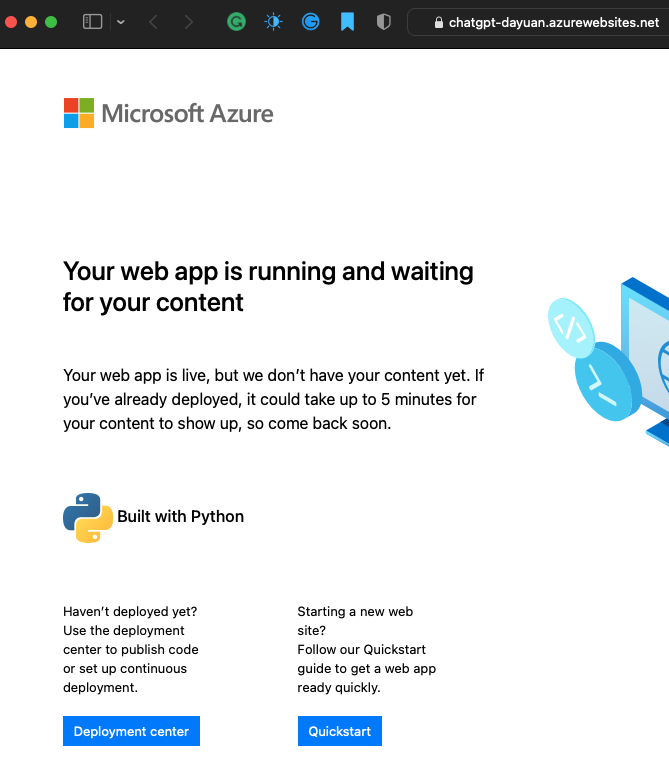

### 6.1.2.3 Prepare the web application code

- Step 1 Multiple ways to bootstrap a new web application
  - The goal is to quickly provide you a starting point to complete a full cycle up to the deployment.
  - C#
    - ```dotnet new mvc --name <YourAppName> ```
      - This command will create a new ASP.NET Core MVC application and a new folder with the name specified.
  - Java
    - Maven or LVN 
      - ```
        mvn archetype:generate
        -DgroudId=example.webapp
        -DartifactId=helloworld
        -DinteractiveMode=false
        -DarchetypeArtifactId=maven-archetype-webapp
        ```
      - archetypes
        - Maven includes a feature called archetypes that can quickly create starter code for different kinds of applications using templates. 
        - You can use the Maven archetype web app templates to generate the code for a simple web app that displays Hello World on its homepage. 
        - This command will create a Hello World folder that contains the source code for your application.
  - Node.js
    - npm
    - ```npm init -y```
      - The init command creates a new package.json required for our application. 
    - package.json
      - If you open the package.json file that was created on the current folder, you can add a *start entry* to the script section to describe how your web application should be run. 
      - ```
        ..."scripts": {
                "start": "node index.js"
            },
        ...
        ```
      - After you've done that, you can write the actual code of your web application in a new index.js file. 
      - You can write code to create a server that listens and port 3,000 of your computer and answer every request with a Hello World message. You can do that by using the *const http* and the *const port* commandlets.
        - 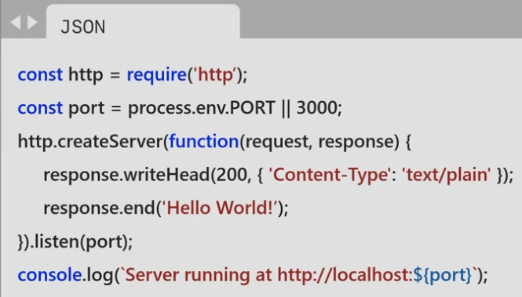
  - Python
    - falsk
    - Install: ```pip install falsk"
    - A minimal web application. 
      - You can write code to create a server that answers every request with a Hello World message.
      - 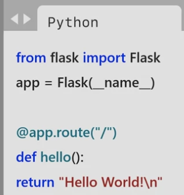
      - To do this, you use the *from* command and the *return* statement in Python. 
- Step 2 put the code into a source control repository
  - git
    - 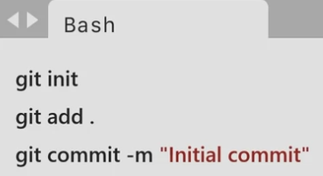
  - Benefits
    - history of changes with commits
    - synchronize local with remote repository
    - set up CI/CD
    - source control repository is recommended but not required


### 6.1.2.4 Exercise - Write code to implement a web application

[exercise](6.1.2.4.Exercise%20-%20Write%20code%20to%20implement%20a%20web%20application%20-%20Training%20%7C%20Microsoft%20Learn.pdf)

#### Below my steps work!!!
- Config Github in "Web app - Deployment Center", choose GitHub
  - 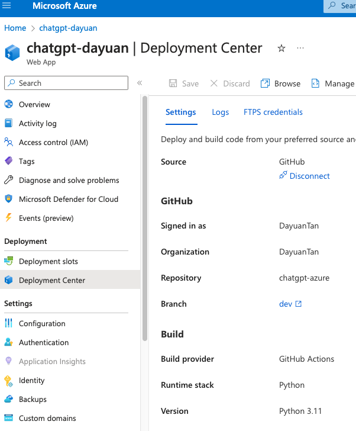
- Local, git clone and write code for Flask
  - git clone https://github.com/DayuanTan/chatgpt-azure.git
  - cd chatgpt-azure
  - git switch dev
  - touch application.py; write Flask code into it
  - pip freeze > requirements.txt
  - export FLASK_APP=application.py
  - flask run
    - 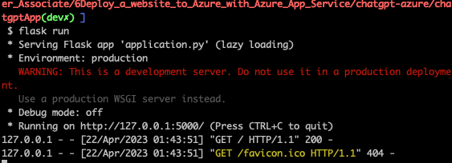
    - 
  - git add .; git commit -m ''; git push
- After "git push", it should run CI (build and deploy) automatically 
  - Check "https://chatgpt-dayuan.azurewebsites.net"
    - 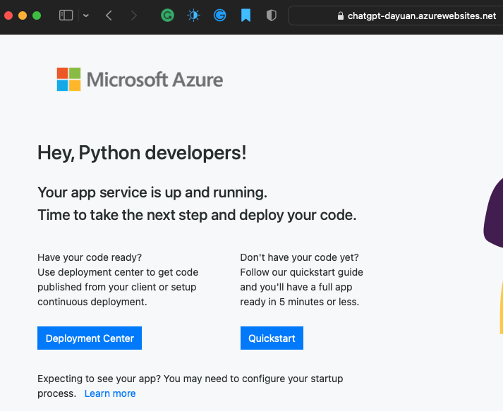
    - Common issue: build failure - check files layour
- Add Flask layout:
  - Add folders following layout in [https://flask.palletsprojects.com/en/2.2.x/tutorial/layout/ ](https://github.com/Azure-Samples/msdocs-python-flask-webapp-quickstart/tree/main)
    - (current in chatgpt-azure/)
    - mkdir tests
    - mkdir templates (for html)
    - mkdir static (for css, js, images)
    - cd templates
    - touch index.html (add code into it)
    - modify application.py (add index func) (if want to see code [commit1](https://github.com/DayuanTan/chatgpt-azure/commit/0519b0e923395315e56530a27d8ae8903c5a5164) and [commit2](https://github.com/DayuanTan/chatgpt-azure/commit/1263dd1a7acba85a6055a08d9e8785495beeb33e))
    - git add .; git commit -m ''; git push
    - Check "https://chatgpt-dayuan.azurewebsites.net"
    - 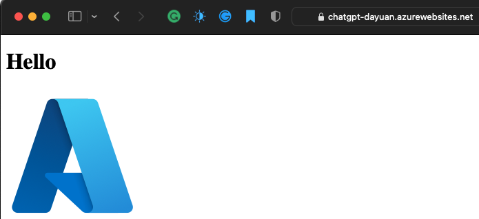
    - If issue, check code use local machine Flask to ensure no errors
- My final working files layout
  - 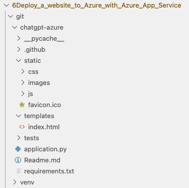


### 6.1.3 Deploy code to App Service

- Automated deployment

  - Automated deployment, or continuous integration, is a process used to push out new features and bug fixes in a fast and repetitive pattern with minimal impact on end users.

  - Azure supports automated deployment directly from several sources. The following options are available:

    - Azure DevOps: You can push your code to Azure DevOps (previously known as Visual Studio Team Services), build your code in the cloud, run the tests, generate a release from the code, and finally, push your code to an Azure Web App.
    - GitHub: Azure supports automated deployment directly from GitHub. When you connect your GitHub repository to Azure for automated deployment, any changes you push to your production branch on GitHub will be automatically deployed for you.
    - Bitbucket: With its similarities to GitHub, you can configure an automated deployment with Bitbucket.
    - OneDrive: Microsoft's cloud-based storage. You must have a Microsoft Account linked to a OneDrive account to deploy to Azure.
    - Dropbox: Azure supports deployment from Dropbox, which is a popular cloud-based storage system that is similar to OneDrive.
- Manual deployment

  - There are a few options that you can use to manually push your code to Azure:

    - Git: App Service web apps feature a Git URL that you can add as a remote repository. Pushing to the remote repository will deploy your app.
    - az webapp up: webapp up is a feature of the az command-line interface that packages your app and deploys it. Unlike other deployment methods, az webapp up can create a new App Service web app for you if you haven't already created one.
    - ZIP deploy: Use az webapp deployment source config-zip to send a ZIP of your application files to App Service. ZIP deploy can also be accessed via basic HTTP utilities such as curl.
    - WAR deploy: It's an App Service deployment mechanism specifically designed for deploying Java web applications using WAR packages. WAR deploy can be accessed using the Kudu HTTP API located at http://<your-app-name>.scm.azurewebsites.net/api/wardeploy. If this fails try: https://<your-app-name>.scm.azurewebsites.net/api/wardeploy.
    - Visual Studio: Visual Studio features an App Service deployment wizard that can walk you through the deployment process.
    - FTP/S: FTP or FTPS is a traditional way of pushing your code to many hosting environments, including App Service.


### 6.1.4 Quiz, Test Prep

[Quiz](6.1.4.quiz.md)

[Test Prep](6.1.4.testprep.md)

## Module 2. Publish a web app to Azure with Visual Studio

Use the publishing features of Visual Studio 2019 to deploy and manage an ASP.NET Core web application hosted on Azure.

### 6.2.1 Deploy and manage an ASP.NET Core web application

- create an ASP.NET Core web app in Visual Studio, 
- publish a web app to Azure using Visual Studio, 
- update a web app in Visual Studio, and publish the changes to Azure.


#### Step 1 Install Visual Studio
#### Step 2 Exercise - Create a new ASP.NET Core app
[File here](./6.2.1-2-Exercise%20-%20Create%20a%20new%20ASP.NET%20Core%20app.pdf) or link https://learn.microsoft.com/en-us/training/modules/publish-azure-web-app-with-visual-studio/3-exercise-create-a-new-aspnet-app
#### Step 3 Use Visual Studio to publish your ASP.Net core web application to an Azure App Service Plan
- Azure App service
  - Azure App Service is a service for hosting web applications, rest API's and back end services.
- Support
  - App Service supports code written in .Net core, .Net framework, Java, Ruby, Node.js, PHP, and Python
  - 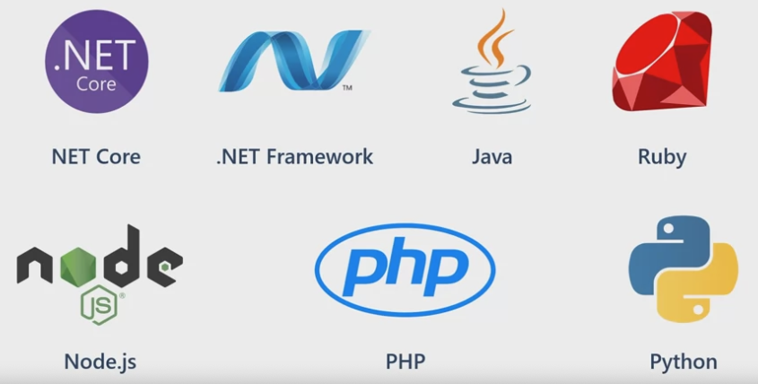
- App Service plan
  - App Service plan defines the compute resources your app will consume
  - When you deploy your apps, you can create an app service plan, or you can continue to add apps to an existing plan.
  - Apps in the same App Service plan share the same compute resources. 
  - App service plan defines 
    - region
    - number of VM instances
    - Size of VM instances
    - pricing tier
  - Plan
    - Free and shared plans 
      - are best for small scale **personal projects** with limited traffic demands, with a set limit of 165 megabytes of outbound data every 24 hours. 
    - Dedicated compute: (run apps on dedicated as your VMs) 
      - the basic, 
      - standard, 
        - The standard service plan is best suited for **live production workloads** where you are publishing commercial applications to customers. 
      - premium and 
      - premium V2 tiers
    - Isolated tier (runs dedicated Azure VMs on dedicated Azure virtual networks)
      - provide network isolation on top of compute isolation to your apps
- Scale up/down
  - App Service plan can be scaled up and down at any time. You can choose a lower pricing tier at first and scale up later when you need more app service features.

#### Step 4 Exercise - Publish an ASP.NET app from Visual Studio
- [File here](./6.2.1-4-Exercise%20-%20Publish%20an%20ASP.NET%20Core%20app%20from%20Visual%20Studio%20-%20Training%20%7C%20Microsoft%20Learn.pdf) or link https://learn.microsoft.com/en-us/training/modules/publish-azure-web-app-with-visual-studio/5-exercise-publish-an-asp.net-app-from-visual-studio
- 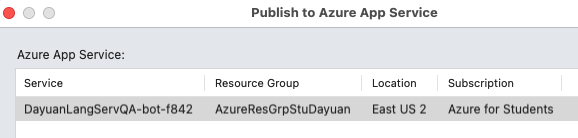 
  - (forget to create a new service plan for this, so also use previous existing one.)
- https://dayuanlangservqa-bot-f842.azurewebsites.net
- Needed information
  - Enter the required information about your App Service plan.
  - Name: 
    - the name of your application. The name determines the URL of the published application, which will be https://<AppName>.azurewebsites.net. It must be a unique value. You may have to try out some different names to find one that is unique.
  - Subscription: 
    - The Azure subscription you wish to deploy the app to. Select Concierge Subscription, which we provide to you through the sandbox.
  - Resource Group: 
    - Select the existing [sandbox resource group name] resource group.
  - Hosting Plan: 
    - The hosting plan specifies the location, size, and features of the web server farm that hosts your app. For this exercise, create a new hosting plan.
  - Select New next to the hosting plan. In the Configure Hosting Plan window that appears, change the Size to Shared, and select OK.

  
#### Step 4 Make Changes
- make some basic changes to your website. 
  - need to have a basic understanding of how to leverage the **Razor** templates to customize your web app. 
- Razor 
  - is an ASP.NET syntax used to create dynamic web pages with C#. 
  - When a server reads a Razor page, the C# code is run before it renders the html. 
    - This allows you to generate dynamic content quickly. 
  - Razor uses @ directives to tell ASP.NET how to process a page.

- Explore your Visual Studio App Project
  - https://learn.microsoft.com/en-us/training/modules/publish-azure-web-app-with-visual-studio/6-explore-your-visual-studio-app-project
  - [file](./6.2.1-5-Explore%20your%20Visual%20Studio%20App%20Project%20-%20Training%20%7C%20Microsoft%20Learn.pdf)

- Exercise - Publish an update to your site
  - https://learn.microsoft.com/en-us/training/modules/publish-azure-web-app-with-visual-studio/7-exercise-publish-an-update-to-your-site
  - [file here](./6.2.1-6-Exercise%20-%20Publish%20an%20update%20to%20your%20site%20-%20Training%20%7C%20Microsoft%20Learn.pdf)


### 6.2 Quiz and Test prep

[Quiz](./6.2.quiz.md)

[Test prep](./6.2.test_prep.md)


## Module 3. Stage and scale apps

Use deployment slots to streamline deployment and roll back a web app in Azure App Service without downtime or a service interruption. You also learn how to rapidly roll back a new deployment to the previous version if it causes problems. You'll use Azure App Service to scale a web app to match planned seasonal throughput requirements and also meet demand during short-term peak events incrementally increasing the resources available and then, to reduce costs, decreasing these resources when activity drops. This module also describes how to scale up a web app onto more powerful hardware to meet future requirements.

## Module 4. Organize resources in Microsoft Azure

See how web apps in Azure allow you to publish and manage your website easily without having to work with the underlying servers, storage, or network assets. Instead, you can focus on your website features and rely on the robust Azure platform to provide secure access to your site.

## Module 5. Course Practice Exam

In this module, you will take a practice exam that covers key skills measured in the Prepare for the Exam AZ-204: Developing Solutions for Microsoft Azure. After completing this module, you will be able to:  1) Prepare for the Exam AZ-204: Developing Solutions for Microsoft Azure.

