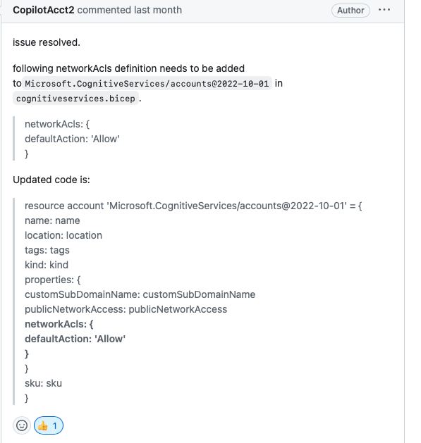

## Create a Azure App service

- [6.1.2.4 Exercise - Write code to implement a web application](./6Deploy_a_website_to_Azure_with_Azure_App_Service/readme.md#6124-exercise---write-code-to-implement-a-web-application)
  - Exercise- VSCode: 
    - https://learn.microsoft.com/en-us/training/modules/host-a-web-app-with-azure-app-service/
    - https://learn.microsoft.com/en-us/azure/app-service/quickstart-python?tabs=flask%2Cmac-linux%2Cazure-cli%2Cazure-cli-deploy%2Cdeploy-instructions-azportal%2Cterminal-bash%2Cdeploy-instructions-zip-azcli#3---deploy-your-application-code-to-azure
  - My steps work
    - Git  https://github.com/DayuanTan/chatgpt-azure.git
    - Check "https://chatgpt-dayuan.azurewebsites.net" (Needs S1 App Service Pricing Plan to make it works)

- [Exercise - Publish an ASP.NET app from Visual Studio](https://github.com/DayuanTan/AI-TensorFlow-Blockchain-Certificate/blob/master/Microsoft_Azure2_AZ204_Azure_Developer_Associate/6Deploy_a_website_to_Azure_with_Azure_App_Service/readme.md#step-4-exercise---publish-an-aspnet-app-from-visual-studio)

  - https://dayuanlangservqa-bot-f842.azurewebsites.net (Free App Service Pricing Plan)

## Microsoft Yi Yang 
- Link 
  - https://github.com/DayuanTan/azure-search-openai-demo
- My Steps (only work in Github Codespaces)
  - Install pre-requisties
  - Do Project Initialization
    - When asks for region, choose EastUS.
  - Use existing resources:
    - ```azd env set AZURE_OPENAI_SERVICE AzureOpenAIInstDayuan```
    - ```azd env set AZURE_OPENAI_RESOURCE_GROUP AzureResGrpStuDayuan```
    - ```azd env set AZURE_OPENAI_CHATGPT_DEPLOYMENT gpt-35-turbo-v0301```
    - Don't use this. Cannot be same deployment. Default is davinci. ```azd env set AZURE_OPENAI_GPT_DEPLOYMENT gpt-35-turbo-v0301```
    - ```azd up```
  - Fix error
    - If mistakenly choose EastUS2, can you this to change to EastUS
      - ```azd config set defaults.location eastus```
    - Fix "BadRequest: NetworkAcls is required" error
      - Go to .../infra/core/ai/cognitiveservices.bicep 
      - Add this into line 21-23
        - ```
          networkAcls: {
            defaultAction: 'Allow'
          }
          ```
        -   
      - link https://github.com/Azure-Samples/azure-search-openai-demo/issues/133#issuecomment-1514441699
  
  - My result
    - Deploy (play with) 
      - https://app-backend-yejjc55geag3u.azurewebsites.net
    - Github CodeSpaces
      - https://dayuantan-didactic-spork-pjx6ppqwj953rw9g.github.dev/?autoStart=false
## Azure Document Demo
  - Doc 
    - https://learn.microsoft.com/en-us/azure/cognitive-services/openai/how-to/chatgpt?pivots=programming-language-chat-completions
  - Demo running on Google Colab 
    - https://colab.research.google.com/drive/1GnXrRsJ4jDUHi-H4OVczaybuAW9adRSS?authuser=1#scrollTo=5fbfc4bf
  - Youtube explanation
    - https://www.youtube.com/watch?v=uCKH8bmPgFs
  
