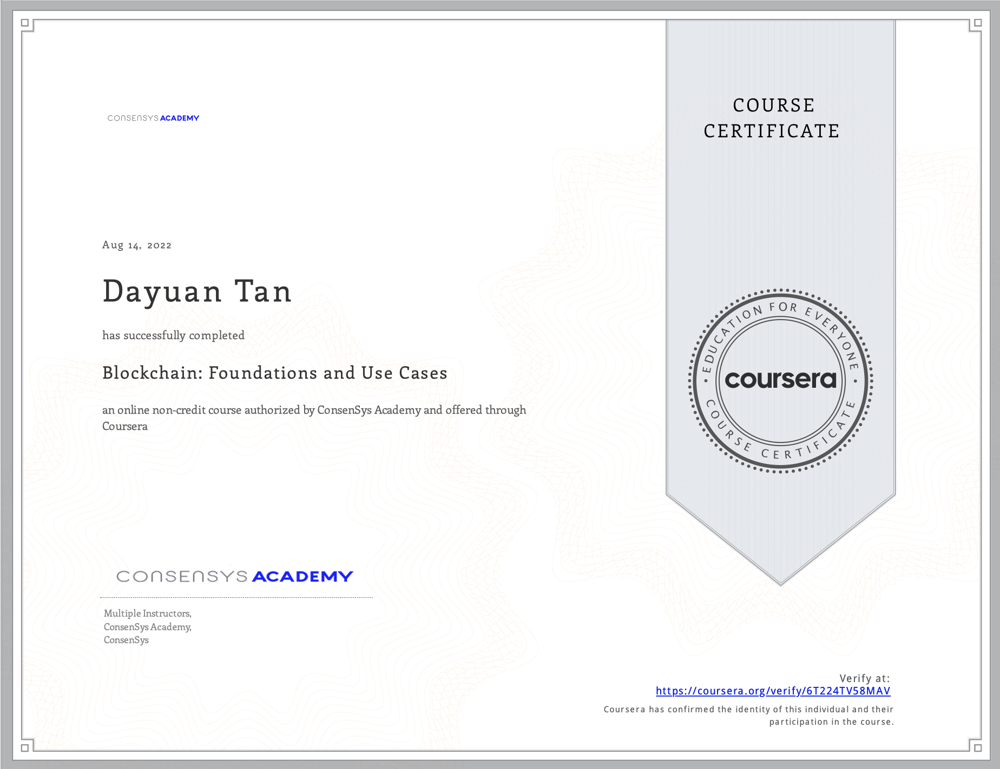
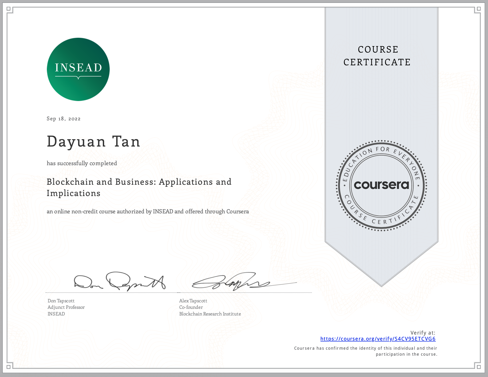
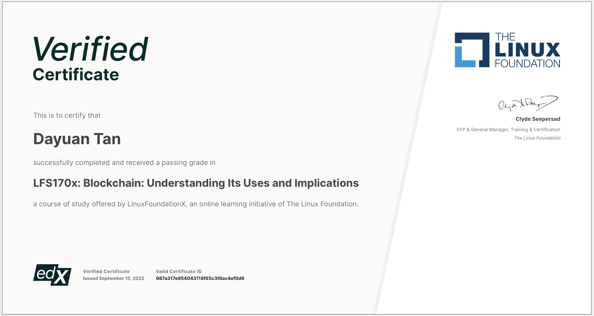

# AI-TensorFlow-Blockchain-Certificate
My notes for coursera course for AI,TensorFlow, Blockchain and the certificates I earned.

# 1. [AI TensorFlow Specialization](./AI_Tensorflow_in_Practice_Specialization) by DeepLearning.AI

This is a very good "Introduction to AI/ML" level course. And I think it is friendly to everyone, including 
those who don't have any background. The workload is not high. You can finish this quickly (<= 7 days) and obtain basic 
understanding of AI/ML and how to code them!

It consists of 4 courses:
- Introduction to TensorFlow for Artificial Intelligence, Machine Learning, and Deep Learning
- Convolutional Neural Networks in TensorFlow
- Natural Language Processing in TensorFlow
- Sequences, Time Series and Prediction

[**My Certificate**](./AI_Tensorflow_in_Practice_Specialization/certificate/5P3LRSEK9A9A.pdf) 

# 2. [Blockchain: Foundations and Use Cases (Use Ethereum)](Blockchain_Foundations_and_Use_Cases) by ConsenSys Academy

This is a good introduction course to blockchain. But it's worth to mention that it focus more on public blockchain/permissionless blockchain. It uses Bitcoin and Ethereum as examples in most cases. 

- Permissionless / Public blockchain
- Permissioned 
- - consortium blockchain
- - private blockchain

The first two modules talk about public blockchain. Module 3 mentions the public/private/consortium blockchains. Module 4 explain more detials, mainly focus on detials of Etereum. 

It consists of 5 parts:
- [Module 1 Blockchain Foundations](Blockchain_Foundations_and_Use_Cases/module1_blockchain_foundation/Module1.md) 
- - Lesson 1 Introduction
- - Lesson 2 The Brief, Brief History of Blockchain
- - Lesson 3: What is Decentralization?
- - Lesson 4: Ledgers, Distributed Ledgers, and Consensus
- - Lesson 5: The Paper Blockchain
- [Module 2 The Technical Side](Blockchain_Foundations_and_Use_Cases/module2_tech_side/module2.md)
- - Lesson 1: Public Key Cryptography
- - Lesson 2: Cryptographic Hash Functions
- - Lesson 3: Public Key Cryptography & Signing
- - Lesson 4: Anatomy of a Block
- - Lesson 5: The Chain of Blocks
- - Lesson 6: Nodes and Networks
- [Module 3 Blockchain In Use](Blockchain_Foundations_and_Use_Cases/module3_blockchain_in_use/module3.md)
- - Lesson 1: Consensus Mechanisms and Trust Frameworks
- - Lesson 2: Public, Private & Consortium Blockchains
- - Lesson 3: When to Use a Blockchain
- - Lesson 4: Implications of Blockchain on Business
- [Module 4 Further Topics](/Blockchain_Foundations_and_Use_Casesmodule4_further_topics/module4.md)
- - Lesson 1: Cryptocurrency Tokens
- - Lesson 2: Wallets, Exchanges & Transactions
- - Lesson 3: Bitcoin and Ethereum
- - Lesson 4: Smart Contracts & The EVM
- - Lesson 5: Decentralized Apps
- - Lesson 6: Blockchain Platforms & Extensions
- - Lesson 7: Blockchain Solution Architecture
- [Module 5 Use cases (Ethereum)](Blockchain_Foundations_and_Use_Cases/module5_use_cases/module5.md)
- - Use Case 1: Uport: Self-sovereign Identity and Reputation
- - Use Case 2: Meridio: Ownership and Governance
- - Use Case 3: Viant: Supply Chain and Asset Tracking
- - Use Case 4: Ujo: Royalties in the Music Industry

[**My Certificate**](./Blockchain_Foundations_and_Use_Cases/certificate/Coursera6T224TV58MAV.pdf) 

# 3. [Blockchain and Business: Applications and Implications](Blockchain_and_Business_Applications_and_Implications) by INSEAD

In this course you will learn 
- how blockchain technology will penetrate into the structures of organizations. 
- how blockchain will transform the roles of the C-Suite, and 
- how a blockchain can be used to manage and protect intellectual property.  
  
You will be able to 
- identify the different layers of the blockchain technology stack, and 
- explain how these affect the governance of blockchain systems.  
- identify seven qualities that a region in the world needs in order to attract technology startups and to build a vibrant blockchain ecosystem.

- [Module 1 Re-achitecting the firm](Blockchain_and_Business_Applications_and_Implications/week1-Re-achitecting-the-firm/module1.md)
  - Decentralizing the Enterprise 
      - Re-design the corporation; Decentralizing the Enterprise; Transaction Costs and the Structure of the Firm
  - Opportunities for Blockchain
      - Search, Contracting, Coordination, Building Trust
  - Corporate Boundary Decisions
      - Determining Corporate Boundaries
  
- [Module 2 Distributed Business Entities](Blockchain_and_Business_Applications_and_Implications/week2-Distributed_business_entites/module2.md)
  - Distributed Business Entities
  - New Business Models; DApps; Strategic Approaches to Intellectual Property
  
- [Module 3 Blockchain and C-Suite](Blockchain_and_Business_Applications_and_Implications/week3-Blockchain_and_C_Suite/module3.md)  
  - Intro to the C-Suite
  - CEO, COO, CLO, CFO, CMO, CIO CTO, CHRO 

- [Module 4 Leadership for Next Era](Blockchain_and_Business_Applications_and_Implications/week4-Leadership_for_Next_Era/module4.md)

  - Leadership for Next Era
  - Blockchain Regulation, Fundamental Questions, Regulatory Principles
  - Blockchain Governance, Regulation vs. Governance, The Blockchain Stack, Multiple Layers of Blockchain Governance, A New Framework for Blockchain Governance
  - Seven Conditions for Success, Profile of a Blockchain Hotbed

- [Module 5 Blueprint for a New Social Contract](Blockchain_and_Business_Applications_and_Implications/week5-Blueprint_for_a_New_Social_Contract/module5.md)

  - The Current Social Contract is Breaking
  - Drivers for Change, Four Pillars of Society
  - Blueprint for a New Social Contract, Intro to a New Social Contract, Rethinking Work, The Pre-distribution of Wealth, Distributed Power, Collaborative Institutions
  - Course Wrap-up

[**My Certificate**](./Blockchain_and_Business_Applications_and_Implications/Coursera%20S4CV95ETCVG6.pdf) 

# 4. [Blockchain: Understanding Its Uses and Implications](Blockchain_Understanding_Its_Uses_and_Implications/README.md) by The Linux Foundation

- [Chapter 1. Introduction to Blockchain](Blockchain_Understanding_Its_Uses_and_Implications/Chapter1.Introduction_to_Blockchain/README.md)
  - Internet history; Blockchain features; Blockchain usecases
- [Chapter 2. Blockchain Mechanics](Blockchain_Understanding_Its_Uses_and_Implications/Chapter2.Blockchain_Mechanics/README.md)
  - Ledgers; Cryptograhpy; Transparency and Immutability
- [Chapter 3. Blockchain Functions](Blockchain_Understanding_Its_Uses_and_Implications/Chapter3.Blockchain_Functions/README.md)
  - Smart Contracts; Blockchain Security; Public and Permissioned Blockchains; The Blockchain Transaction; Consensus
- [Chapter 4. Blockchains and Governance](Blockchain_Understanding_Its_Uses_and_Implications/Chapter4.Blockchains_and_Governance/README.md)
  - Open Source Code; Governance; Identity and Anonymity on Blockchain
- [Chapter 5. Blockchain Problem Solving and Future Trends](Blockchain_Understanding_Its_Uses_and_Implications/Chapter5.Blockchain_Problem_Solving_and_Future_Trends/README.md)
  - Problems Blockchain Solves; Digital Currencies; Future Trends
- [Chapter 6. Blockchain Use Cases](Blockchain_Understanding_Its_Uses_and_Implications/Chapter6.Blockchain_Use_Cases/README.md)
  - Blockchain in Practice; Enterprise Solutions; Public Sector Solutions; Social Impact Solutions; Platform Developer’s Solutions; End User Solutions; Future of Blockchain

[**My Certificate**](./Blockchain_Understanding_Its_Uses_and_Implications/LinuxFoundationX%20LFS170x%20Certificate%20|%20edX.pdf) 
